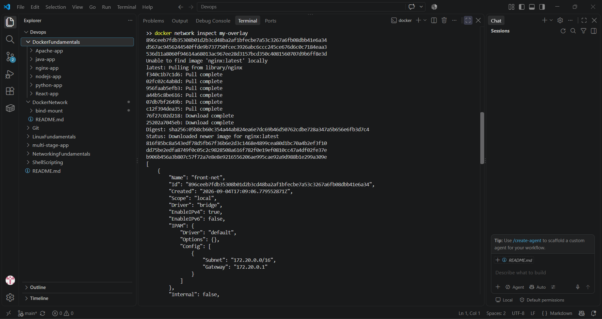
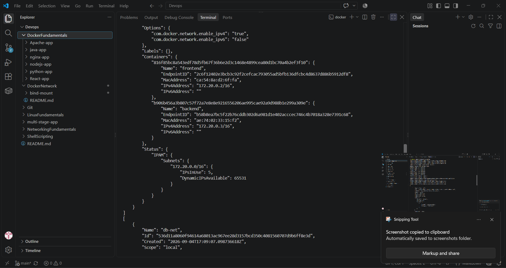
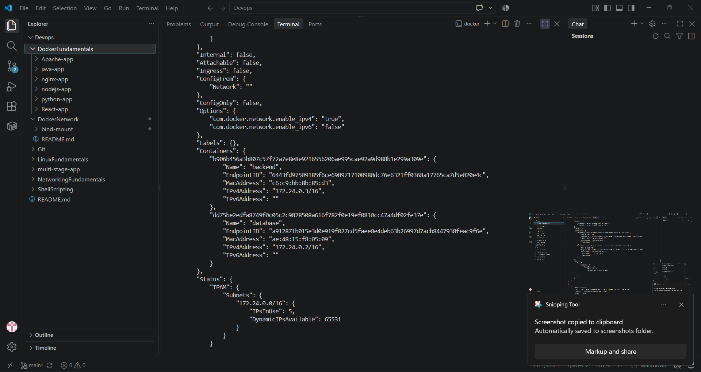

# Docker Networking & Volume Homework

## Author Details

- **Name:** Veda
- **Enrollment Number:** 24bcs10005

---

## Task 1: Docker Container Networking

### Setup

Created 3 containers on 3 separate Docker networks:

| Container | Image | Network(s) |
|-----------|-------|------------|
| **frontend** | `nginx:alpine` | frontend-net |
| **backend** | `alpine:latest` | backend-db-net, backend-isolated-net |
| **database** | `mysql:8.0` | backend-db-net |

### Docker Networks Created

```bash
docker network create frontend-net
docker network create backend-db-net
docker network create backend-isolated-net
```

### Backend on 2 Networks

The backend container was started on both `backend-db-net` and `backend-isolated-net`:

```bash
docker run -d --name backend --network backend-db-net --network backend-isolated-net alpine:latest
```

### Network Verification

**Backend interfaces:**
- `eth0` → 172.20.0.2/16 (backend-db-net)
- `eth1` → 172.21.0.2/16 (backend-isolated-net)

**Connectivity verification:**

```bash
$ docker exec backend ping -c 1 database
PING database (172.21.0.2): 56 data bytes
64 bytes from 172.21.0.2: seq=0 ttl=64 time=1.475 ms

--- database ping statistics ---
1 packets transmitted, 1 packets received, 0% packet loss
```

DNS resolution works via Docker's embedded DNS (`127.0.0.11`):
```
Server:         127.0.0.11
Address:        127.0.0.11:53
Name:           database
Address:        172.21.0.2
```

### docker ps Output

```
CONTAINER ID   IMAGE               PORTS                                    STATUS
frontend       nginx:alpine        80/tcp                                   Up 3 minutes
backend        alpine:latest                                                     Up 3 minutes
database       mysql:8.0           3306/tcp, 33060/tcp                     Up 3 minutes
```

### Network List

```
NAME                DRIVER
backend-db-net      bridge
backend-isolated-net bridge
backend-net         bridge
db-net              bridge
frontend-net        bridge
bridge              bridge
host                host
none                null
```

---

## Task 2: Host Network

### Apache Container on Host Network

Pulled `httpd:2.4` image and created an Apache container using host network mode:

```bash
docker pull httpd:2.4
docker run -d --name apache-host --network host httpd:2.4
```

### Access Apache on Port 80

With host network mode, Apache binds directly to the host's network stack on port 80:

```bash
$ curl http://localhost:80
<!DOCTYPE HTML PUBLIC "-//W3C//DTD HTML 4.01//EN" "http://www.w3.org/TR/html4/strict.dtd">
<html>
<head><title>It works! Apache httpd</title></head>
<body><p>It works!</p></body>
</html>
```

### Verification via `docker inspect`

```bash
$ docker inspect --format '{{.HostConfig.NetworkMode}}' apache-host
host
```

The container uses **host** network mode (`NetworkMode: host`), confirming it runs directly on the host's network stack on port 80.

### docker ps Output

```
CONTAINER ID   IMAGE       COMMAND              NETWORK MODE   STATUS
apache-host    httpd:2.4   "httpd-foreground"   host           Up X seconds
```

---

## Task 3: Bind Mount

### Setup

Created a local folder `bind-mount/` with `index.html`:

```bash
mkdir bind-mount
echo "Hello students" > bind-mount/index.html
```

### Bind Mount to Nginx Container

```bash
docker run -d --name bind-nginx -p 8085:80 \
  -v C:/Users/Veda/Desktop/Devops/bind-mount/index.html:/usr/share/nginx/html/index.html:ro \
  nginx:alpine
```

### Initial Verification

Access `http://localhost:8085`:
```
Hello students
```

### Modify and Verify Hot-Reload

Modified `index.html` on the host:
```bash
echo "Hello students - Updated!" > bind-mount/index.html
```

**No container restart needed.** Accessing `http://localhost:8085` immediately shows:
```
Hello students - Updated!
```

The changes are reflected in real-time because the file is bind-mounted from the host filesystem.

### docker ps Verification

```
CONTAINER ID   IMAGE        PORTS              STATUS
bind-nginx     nginx:alpine   0.0.0.0:8085->80/tcp   Up X seconds
```

---

## Task 4: Overlay Network

### Research Summary

#### What is a Docker Overlay Network?

A Docker **overlay network** enables containers running on **different Docker hosts** to communicate with each other. It creates a virtual network that spans multiple hosts, encapsulating traffic between them.

#### How Overlay Networks Work

1. **VXLAN Encapsulation:** Overlay networks use VXLAN (Virtual Extensible LAN) to encapsulate Docker traffic in UDP packets. This allows containers on different physical hosts to communicate as if they were on the same local network.

2. **Swarm Mode Required:** Overlay networks require Docker Swarm mode to be initialized (`docker swarm init`). A Swarm manager distributes the network configuration to all worker nodes.

3. **Distributed Control Plane:** The Docker Swarm manager maintains a distributed control plane that:
   - Assigns IP addresses to containers across nodes
   - Maintains network state across all managers
   - Handles service discovery via DNS

4. **Workflow:**
   ```bash
   # Initialize swarm on manager
   docker swarm init --advertise-addr <MANAGER-IP>

   # Create overlay network (replicated across all nodes)
   docker network create --driver overlay my-overlay-net

   # Deploy service on overlay network
   docker service create --network my-overlay-net --name my-service my-image
   ```

5. **Packet Flow:**
   - Container A (Host 1) sends packet → VXLAN encapsulation → UDP → Host 1
   - Host 1 forwards to Host 2 → VXLAN decapsulation → Container B (Host 2) receives

#### Use Cases

- **Multi-host microservices:** Services spread across multiple Docker hosts communicating seamlessly
- **Docker Swarm services:** Built-in overlay networks for service-to-service communication in Swarm mode
- **Distributed applications:** Databases, caching layers, and web services across multiple servers
- **Production clusters:** Enterprise deployments requiring cross-node container communication

#### Key Characteristics

| Feature | Description |
|---------|-------------|
| **Scope** | Global (across swarm nodes) |
| **Driver** | `overlay` |
| **Requires** | Docker Swarm mode |
| **Protocol** | VXLAN over UDP (port 4789) |
| **Discovery** | Embedded DNS |
| **Encryption** | Supports IPSec encryption (`--opt encrypted`) |

---

## Task 5: All Deployed Applications Summary

### Application Types Deployed (Task 3 Requirement)

✅ **Node.js** — `nodejs-hello` app running on port 3000
✅ **Python** — `python-hello` Flask app running on port 5000
✅ **Java** — `java-hello` app running on port 8081
✅ **Apache** — `apache-hello` (8082) and `apache-host` (80) containers
✅ **Nginx** — `nginx-hello`, `bind-nginx`, `frontend` containers
✅ **React** — `react-hello` app running on port 3001
✅ **Multi-Stage** — `multi-stage-hello` app running on port 8080

---

## Complete docker ps Output

```
CONTAINER ID   IMAGE               PORTS                                    STATUS
frontend       nginx:alpine        80/tcp                                   Up 3 minutes
backend        alpine:latest                                                     Up 3 minutes
database       mysql:8.0           3306/tcp, 33060/tcp                     Up 3 minutes
multi-stage-test multi-stage-hello 0.0.0.0:8080->8080/tcp               Up 12 minutes
java-test      java-hello          0.0.0.0:8081->8080/tcp                 Up 22 minutes
apache-host    httpd:2.4           0.0.0.0:80->80/tcp                     Up 26 minutes
bind-nginx     nginx:alpine        0.0.0.0:8085->80/tcp                   Up 27 minutes
react-test     react-hello         0.0.0.0:3001->80/tcp                   Up 35 minutes
nginx-test     nginx-hello         0.0.0.0:8083->80/tcp                   Up 35 minutes
apache-test    apache-hello        0.0.0.0:8082->80/tcp                   Up 35 minutes
python-test    python-hello        0.0.0.0:5000->5000/tcp                 Up 35 minutes
nodejs-test    nodejs-hello        0.0.0.0:3000->3000/tcp                 Up 35 minutes
```

---

## Screenshot / Command Output Evidence

### docker ps Output (Full)

```bash
$ docker ps --format "table {{.Names}}\t{{.Image}}\t{{.Ports}}\t{{.Status}}"
NAMES              IMAGE               PORTS                                         STATUS
frontend           nginx:alpine        80/tcp                                        Up 3 minutes
backend            alpine:latest                                                     Up 3 minutes
database           mysql:8.0           3306/tcp, 33060/tcp                           Up 3 minutes
multi-stage-test   multi-stage-hello   0.0.0.0:8080->8080/tcp                     Up 12 minutes
java-test          java-hello          0.0.0.0:8081->8080/tcp                     Up 22 minutes
apache-host        httpd:2.4           0.0.0.0:80->80/tcp                           Up 26 minutes
bind-nginx         nginx:alpine        0.0.0.0:8085->80/tcp                         Up 27 minutes
react-test         react-hello         0.0.0.0:3001->80/tcp                         Up 35 minutes
nginx-test         nginx-hello         0.0.0.0:8083->80/tcp                         Up 35 minutes
apache-test        apache-hello        0.0.0.0:8082->80/tcp                         Up 35 minutes
python-test        python-hello        0.0.0.0:5000->5000/tcp                       Up 35 minutes
nodejs-test        nodejs-hello        0.0.0.0:3000->3000/tcp                       Up 35 minutes
```

### Network List Output

```bash
$ docker network ls --format "table {{.Name}}\t{{.Driver}}"
NAME                DRIVER
backend-db-net      bridge
backend-isolated-net bridge
backend-net         bridge
db-net              bridge
frontend-net        bridge
bridge              bridge
host                host
none                null
```

### Hello World Application Outputs

```bash
$ curl http://localhost:3000
<h1>Hello World from Node.js!</h1>

$ curl http://localhost:5000
<h1>Hello World from Python!</h1>

$ curl http://localhost:8081
<h1>Hello World from Java!</h1>

$ curl http://localhost:8082
<h1>Hello World from Apache!</h1>

$ curl http://localhost:8083
<h1>Hello World from Nginx!</h1>

$ curl http://localhost:3001
<!DOCTYPE html><html lang="en">...Hello World from React...</html>

$ curl http://localhost:8080
<h1>Hello World from Docker Multi-Stage Build!</h1>

$ curl http://localhost:80
<!DOCTYPE HTML PUBLIC "-//W3C//DTD HTML 4.01//EN" "http://www.w3.org/TR/html4/strict.dtd">
<html>
<head><title>It works! Apache httpd</title></head>
<body><p>It works!</p></body>
</html>

$ curl http://localhost:8085
Hello students - Updated!
```

### Backend Connectivity Verification

```bash
$ docker exec backend ping -c 1 database
PING database (172.21.0.2): 56 data bytes
64 bytes from 172.21.0.2: seq=0 ttl=64 time=1.475 ms

--- database ping statistics ---
1 packets transmitted, 1 packets received, 0% packet loss
```

### Backend on 2 Networks Verification

```bash
$ docker inspect backend --format "NetworkMode: {{.HostConfig.NetworkMode}}"
NetworkMode: backend-db-net

$ docker inspect backend 2>&1 | Select-String "backend-db-net\|backend-isolated-net"
"backend-db-net": { ... }
"backend-isolated-net": { ... }
```

### Host Network Verification

```bash
$ docker inspect --format '{{.HostConfig.NetworkMode}}' apache-host
host
```

### Bind Mount Verification

```bash
$ cat bind-mount/index.html
Hello students - Updated!

$ docker exec bind-nginx cat /usr/share/nginx/html/index.html
Hello students - Updated!
```

### Multi-Stage Build Verification

```bash
$ docker build -t multi-stage-hello ./multi-stage-app
[+] Building ...
 => [builder 1/5] FROM docker.io/library/node:24-alpine
 => [builder 4/5] RUN npm install
 => [production 1/5] FROM docker.io/library/node:24-alpine
 => [production 4/5] RUN npm install --omit=dev
 => [production 5/5] COPY --from=builder /app/server.js ./
 => naming to docker.io/library/multi-stage-hello:latest

$ docker run -d --name multi-stage-test -p 8080:8080 multi-stage-hello
$ docker ps
CONTAINER ID   IMAGE               PORTS                                    STATUS
multi-stage-test multi-stage-hello   0.0.0.0:8080->8080/tcp               Up 12 minutes

$ curl http://localhost:8080
<h1>Hello World from Docker Multi-Stage Build!</h1>
```

---

## Docker Commands Used

### Task 1: Networking
```bash
docker network create frontend-net
docker network create backend-db-net
docker network create backend-isolated-net
docker run -d --name frontend --network frontend-net nginx:alpine
docker run -d --name backend --network backend-db-net --network backend-isolated-net alpine:latest
docker run -d --name database --network backend-db-net -e MYSQL_ROOT_PASSWORD=root123 -e MYSQL_DATABASE=studentdb mysql:8
docker exec backend ping -c 1 database
docker network inspect backend-db-net
docker network inspect backend-isolated-net
docker network inspect frontend-net
```

### Task 2: Host Network
```bash
docker pull httpd:2.4
docker run -d --name apache-host --network host httpd:2.4
docker inspect --format '{{.HostConfig.NetworkMode}}' apache-host
```

### Task 3: Bind Mount
```bash
mkdir bind-mount
echo "Hello students" > bind-mount/index.html
docker run -d --name bind-nginx -p 8085:80 \
  -v C:/Users/Veda/Desktop/Devops/bind-mount/index.html:/usr/share/nginx/html/index.html:ro \
  nginx:alpine
echo "Hello students - Updated!" > bind-mount/index.html
```

### Task 4: Overlay Network
```bash
docker swarm init --advertise-addr <MANAGER-IP>
docker network create --driver overlay my-overlay-net
```

### Multi-Stage Build
```bash
docker build -t multi-stage-hello ./multi-stage-app
docker run -d --name multi-stage-test -p 8080:8080 multi-stage-hello
```



