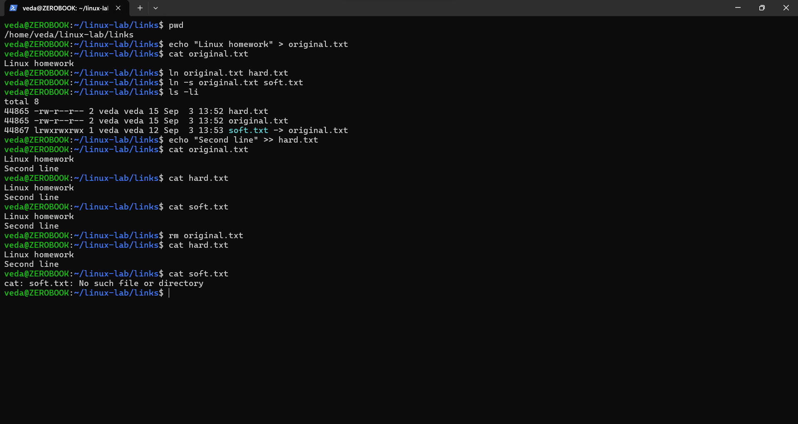

# Linux Fundamentals & System Administration Lab

**Course:** SST DevOps & Cloud [SWE]  
**Student Name:** Neerasa Veda Varshit  
**Enrollment Number:** 24bcs10005  
**Environment:** Windows 11 Home (ZEROBOOK) / WSL2 Ubuntu 24.04 LTS (`veda@ZEROBOOK`)  
**Repository:** `NEERASA-VEDA-VARSHIT/Devops` / `LinuxFundamentals`

---

## Overview

This repository section documents the Linux system administration exercises executed in the local environment, covering:
1. **File System Links:** Hard links vs. Symbolic (Soft) links and inode behavior.
2. **User & Group Administration:** Creating users (`adduser`), group membership, and account lifecycle.
3. **Service Management:** Inspecting active systemd service units with `systemctl`.
4. **System Logging & Auditing:** Querying kernel boot logs, user audit events, and daemon logs with `journalctl`.

---

## Task 1: Inode Mechanics — Hard Links vs. Soft (Symbolic) Links

**Objective:** Demonstrate the difference between hard links and symbolic links in Linux filesystems, verifying inode allocation, reference counting, and target deletion behavior.

### Theoretical Background
- **Hard Link (`ln target linkname`):** Creates an additional directory entry pointing directly to the existing filesystem inode. Both file names share the exact same inode number and permissions. Deleting the original file does not delete the file data; the inode reference count is decremented, and data persists until link count reaches 0.
- **Symbolic Link (`ln -s target linkname`):** Creates a new, distinct inode of type `l` containing a pointer path to the target. If the target file is removed, the symlink becomes a broken / dangling link.

### Terminal Commands Executed:
```bash
# Verify current working directory
pwd

# Create original source file
echo "Linux homework" > original.txt
cat original.txt

# Create hard link and symbolic link
ln original.txt hard.txt
ln -s original.txt soft.txt

# Inspect inode numbers, link counts, and permissions
ls -li

# Append data via hard link
echo "Second line" >> hard.txt

# Verify content propagation
cat original.txt
cat hard.txt
cat soft.txt

# Remove original file and test persistence
rm original.txt
cat hard.txt
cat soft.txt
```

### Observed Output:
```text
/home/veda/linux-lab/links

Linux homework

total 8
44865 -rw-r--r-- 2 veda veda 15 Sep  3 13:52 hard.txt
44865 -rw-r--r-- 2 veda veda 15 Sep  3 13:52 original.txt
44867 lrwxrwxrwx 1 veda veda 12 Sep  3 13:53 soft.txt -> original.txt

Linux homework
Second line

Linux homework
Second line

Linux homework
Second line

Linux homework
Second line

cat: soft.txt: No such file or directory
```

### Screenshot Evidence:


---

## Task 2: User & Group Management

**Objective:** Create a dedicated unprivileged user account (`linuxlab`), inspect user ID (UID), group ID (GID), home directory permissions, and user database entries.

### Terminal Commands Executed:
```bash
# Create new user linuxlab
sudo adduser linuxlab

# Verify user UID, GID, and supplementary groups
id linuxlab

# Inspect home directory permissions
ls -ld /home/linuxlab

# Verify /etc/passwd record via getent
getent passwd linuxlab

# List user groups
groups linuxlab

# Verify current logged in identity
whoami
pwd
id
```

### Observed Output:
```text
Adding user `linuxlab' ...
Adding new group `linuxlab' (1001) ...
Adding new user `linuxlab' (1001) with group `linuxlab' ...
Creating home directory `/home/linuxlab' ...
Copying files from `/etc/skel' ...
New password:
Retype new password:
passwd: password updated successfully
Changing the user information for linuxlab
Enter the new value, or press ENTER for the default
	Full Name []:
	Room Number []:
	Work Phone []:
	Home Phone []:
	Other []:
Is the information correct? [Y/n]

uid=1001(linuxlab) gid=1001(linuxlab) groups=1001(linuxlab),100(users)
drwxr-x--- 2 linuxlab linuxlab 4096 Sep  4 16:53 /home/linuxlab
linuxlab:x:1001:1001:,,,:/home/linuxlab:/bin/bash
linuxlab : linuxlab users
veda
/home/veda
uid=1000(veda) gid=1000(veda) groups=1000(veda),4(adm),24(cdrom),27(sudo),30(dip),46(plugdev),100(users)
```

### Screenshot Evidence:


### Deep Dive: `adduser` vs `useradd` (System Administration & Interview Guide)

In Linux systems, managing user accounts is a core responsibility. While both commands create user accounts, they differ fundamentally in implementation, behavior, and use cases.

#### Architectural & Functional Comparison

| Feature | `adduser` | `useradd` |
| :--- | :--- | :--- |
| **Command Type** | High-level interactive Perl wrapper script | Low-level native compiled binary (`ELF 64-bit`) |
| **Binary Path** | `/usr/sbin/adduser` | `/usr/sbin/useradd` |
| **User Interaction** | Interactive CLI wizard (prompts for password, GECOS, shell) | Non-interactive command-line tool (requires CLI flags) |
| **Default Home Directory** | Automatically created (`/home/<username>`) | Not created by default on Debian/Ubuntu unless `-m` is passed |
| **Default Shell** | Defaults to `/bin/bash` (defined in `/etc/adduser.conf`) | Defaults to `/bin/sh` or empty (defined in `/etc/default/useradd`) |
| **Skeleton Files (`/etc/skel`)** | Copies default profile files (`.bashrc`, `.profile`) automatically | Copies only if `-m` is explicitly supplied |
| **Password Setup** | Prompts interactively to set and confirm user password | Creates locked account with no password; requires subsequent `passwd` |
| **Distribution Preference** | Standard, user-friendly tool on **Debian / Ubuntu** | Native POSIX standard tool present on **all Linux distros (RHEL, Alpine, Debian)** |
| **Best Used For** | Manual user account provisioning by System Administrators | Automated DevOps shell scripts, Ansible playbooks, Dockerfiles, cloud-init |

#### Step-by-Step Command Comparison

```bash
# Method 1: High-Level Interactive (Ubuntu/Debian Preferred)
sudo adduser developer
# -> Prompts for password, full name, room, creates /home/developer, copies /etc/skel

# Method 2: Low-Level Automated (DevOps Scripts / Dockerfiles)
sudo useradd -m -s /bin/bash -c "DevOps Engineer" -G sudo developer
sudo passwd developer
# -> Flags: -m (create home), -s (set shell), -c (comment/GECOS), -G (secondary group)
```

#### Key DevOps Interview Questions

> **Q1: Which command is preferred on Ubuntu/Debian for manual administration and why?**  
> **Answer:** `adduser` is preferred because it uses `/etc/adduser.conf` defaults to automatically provision the home directory, copy user dotfiles from `/etc/skel`, configure permissions safely (`0750` or `0700`), assign a usable shell (`/bin/bash`), and force password creation in a single interactive workflow.

> **Q2: Why do Dockerfiles and automated CI/CD scripts always use `useradd` instead of `adduser`?**  
> **Answer:** `useradd` is non-interactive by design and does not block on `stdin` for prompts. It works predictably across all Linux distributions (Ubuntu, Debian, RHEL, CentOS, Alpine/shadow), making it ideal for non-interactive scripting:
> ```dockerfile
> RUN groupadd -r appgroup && useradd -r -g appgroup -s /sbin/nologin appuser
> ```

> **Q3: What files in `/etc/` are modified when a user is created?**  
> **Answer:**
> 1. `/etc/passwd`: Stores user metadata (UID, primary GID, home dir, default shell).
> 2. `/etc/shadow`: Stores encrypted password hash, password expiration, and aging policies.
> 3. `/etc/group`: Stores group definitions and user membership lists.
> 4. `/etc/gshadow`: Stores encrypted group passwords and administrators.

---

## Task 3: System Logging & Auditing (`journalctl`)

**Objective:** Audit system events using `systemd-journald`, capturing user deletion audit trails and kernel boot diagnostics.

### Terminal Commands Executed:
```bash
# Query the 20 most recent system journal events
sudo journalctl -n 20

# Query boot logs from the current system session
sudo journalctl -b
```

### Key Audit Events Captured:
- `deluser --remove-home linuxlab`: Session opened by UID 1000 (`veda`) via `sudo`.
- Removal of `/home/linuxlab` files and crontab entries.
- `userdel`: Removal of user `linuxlab` from `users` and shadow groups.
- Kernel boot messages (`Linux version 6.18.33.2-microsoft-standard-WSL2`), RAM map parsing, and Hyper-V hypervisor detection.

### Screenshot Evidence:


---

## Task 4: Service Management (`systemctl`)

**Objective:** List, inspect, and verify the operational state of active background services managed by `systemd`.

### Terminal Commands Executed:
```bash
# List all active and loaded service units without interactive pager
systemctl list-units --type=service --no-pager
```

### Observed Output Summary:
Active running system daemons verified:
- `chrony.service`: NTP time synchronization client/server.
- `cron.service`: Regular background program processing daemon.
- `dbus.service`: D-Bus System Message Bus.
- `systemd-journald.service`: Journal logging service.
- `systemd-logind.service`: User login management.
- `systemd-resolved.service`: Network name resolution.
- `systemd-udevd.service`: Kernel device event manager.
- `wsl-pro-service`: Bridge to Ubuntu Pro agent on Windows.

### Screenshot Evidence:


---

## Task 5: Daemon-Specific Journal Inspection (`cron`)

**Objective:** Inspect historical and runtime execution logs for the `cron` background processing daemon.

### Terminal Commands Executed:
```bash
# Query the last 30 log entries for cron.service
sudo journalctl -u cron -n 30
```

### Observed Output Summary:
- Verified startup transitions across boots: `Started cron.service - Regular background program processing daemon`.
- Captured `(CRON) INFO (Running @reboot jobs)`.
- Captured PAM session initiation: `pam_unix(cron:session): session opened for user root(uid=0)`.
- Captured hourly cron batch execution: `(root) CMD (cd / && run-parts --report /etc/cron.hourly)`.

### Screenshot Evidence:


---

## Task 6: Comprehensive Linux Command Cheat Sheet for DevOps Engineers

A rapid-reference guide of indispensable commands across everyday production engineering, container debugging, and server administration.

### 1. File & Directory Navigation
| Command | Description | Example |
| :--- | :--- | :--- |
| `pwd` | Print current working directory | `pwd` |
| `ls -la` | List all files including hidden with detailed permissions | `ls -la /var/log` |
| `cd <dir>` | Change directory (`cd -` switches back to previous) | `cd /etc/nginx` |
| `mkdir -p` | Create nested directory hierarchy recursively | `mkdir -p /opt/app/logs` |
| `touch` | Create an empty file or update timestamp | `touch config.yaml` |
| `cp -r` | Copy files and directories recursively | `cp -r ./src /opt/app/` |
| `mv` | Move or rename files and directories | `mv app.old app.bak` |
| `rm -rf` | Recursively and forcefully remove files/folders | `rm -rf ./tmp_build` |
| `find` | Search files by name, type, modification time, or size | `find / -name "*.log" -size +100M` |
| `tar -czvf` | Create gzipped tarball archive | `tar -czvf backup.tar.gz /var/data` |
| `tar -xzvf` | Extract gzipped tarball archive | `tar -xzvf backup.tar.gz -C /var/data` |

### 2. File Viewing & Text Processing
| Command | Description | Example |
| :--- | :--- | :--- |
| `cat` | Concatenate and print file contents | `cat /etc/os-release` |
| `less` | Interactive file viewer with forward/backward pagination | `less /var/log/syslog` |
| `head -n <N>` | View the first N lines of a file | `head -n 20 app.log` |
| `tail -n <N>` | View the last N lines of a file | `tail -n 50 app.log` |
| `tail -f` | Follow log file updates in real-time | `tail -f /var/log/nginx/access.log` |
| `grep -rn` | Recursively search for string with line numbers | `grep -rn "ERROR" /var/log/` |
| `awk` | Pattern scanning and text column processing | `awk '{print $1, $7}' access.log` |
| `sed -i` | Stream editor for in-place text find and replace | `sed -i 's/PORT=3000/PORT=8080/g' .env` |
| `sort` | Sort lines in text files | `sort -u user_ids.txt` |
| `uniq -c` | Report count of unique adjacent lines | `cat ips.txt \| sort \| uniq -c` |
| `wc -l` | Count total number of lines | `cat error.log \| wc -l` |

### 3. Process Management & Performance Monitoring
| Command | Description | Example |
| :--- | :--- | :--- |
| `ps aux` | Display full snapshot of all running processes | `ps aux \| grep python` |
| `top` | Dynamic real-time process viewer and system summary | `top` |
| `htop` | Enhanced interactive, colored process manager | `htop` |
| `kill -9 <PID>` | Forcefully terminate process by Process ID | `kill -9 14205` |
| `killall <name>`| Terminate all processes matching program name | `killall node` |
| `df -h` | Human-readable disk space usage by filesystem | `df -h` |
| `du -sh <dir>` | Total disk usage size of directory | `du -sh /var/lib/docker` |
| `free -h` | Display total, used, and free system memory and swap | `free -h` |
| `uptime` | System run time and 1, 5, 15 minute load averages | `uptime` |
| `vmstat 1 5` | Virtual memory, IO blocks, and CPU state sampler | `vmstat 1 5` |
| `iostat -xz 1` | Extended block storage input/output statistics | `iostat -xz 1` |

### 4. Networking & Connectivity
| Command | Description | Example |
| :--- | :--- | :--- |
| `ip a` | Show all network interfaces and assigned IP addresses | `ip a` |
| `ping -c 4` | Send ICMP ECHO_REQUEST packets to host | `ping -c 4 google.com` |
| `curl -Iv` | Fetch HTTP headers and display full TLS/TCP handshake | `curl -Iv https://api.github.com` |
| `curl -sSL` | Download script or data silently following redirects | `curl -sSL https://get.k3s.io \| sh -` |
| `ss -tulpn` | Modern socket statistics for listening TCP/UDP ports | `ss -tulpn` |
| `netstat -tuln`| Legacy network connections and listening ports | `netstat -tuln` |
| `nslookup` | Query DNS name servers for domain records | `nslookup kubernetes.default.svc` |
| `dig +short` | Flexible DNS lookup utility for specific record types | `dig +short TXT google.com` |
| `traceroute` | Trace IP packet routing hops across networks | `traceroute 8.8.8.8` |
| `nc -zv` | Netcat port connectivity test (TCP handshake probe) | `nc -zv localhost 5432` |

### 5. Permissions & Security
| Command | Description | Example |
| :--- | :--- | :--- |
| `chmod` | Change file access permissions (numeric or symbolic) | `chmod 600 id_rsa; chmod 755 run.sh` |
| `chown` | Change file user and group owner | `chown -R www-data:www-data /var/www` |
| `chgrp` | Change group ownership of file or directory | `chgrp docker /var/run/docker.sock` |
| `umask` | View or set default file creation permission mask | `umask 027` |
| `sudo` | Execute a command with superuser / administrative privilege | `sudo systemctl restart nginx` |
| `passwd` | Update user authentication password | `passwd developer` |
| `id` | Print user UID, primary GID, and supplementary groups | `id veda` |

### 6. Systemd Services & Journalctl Logs
| Command | Description | Example |
| :--- | :--- | :--- |
| `systemctl start` | Start a systemd unit service | `sudo systemctl start docker` |
| `systemctl stop` | Stop an active systemd unit service | `sudo systemctl stop docker` |
| `systemctl restart` | Gracefully restart an active service | `sudo systemctl restart nginx` |
| `systemctl status` | Display current runtime state and latest log tail | `systemctl status containerd` |
| `systemctl enable` | Enable service to auto-start on system boot | `sudo systemctl enable docker` |
| `systemctl disable` | Prevent service from starting on system boot | `sudo systemctl disable apache2` |
| `systemctl daemon-reload` | Reload systemd manager configuration after unit edits | `sudo systemctl daemon-reload` |
| `journalctl -u <svc> -f` | Tail logs live for a specific service unit | `sudo journalctl -u docker -f` |
| `journalctl -b` | Show all logs generated since current system boot | `sudo journalctl -b` |
| `journalctl -p err` | Filter logs by priority (e.g. error, crit, alert) | `sudo journalctl -p err` |

---

## Summary Matrix

| Task | Core Command | Primary Purpose | Screenshot |
|---|---|---|---|
| Inode Mechanics | `ln original.txt hard.txt`, `ln -s original.txt soft.txt`, `ls -li` | Hard link inode sharing vs. symbolic pointer verification | `image.png` |
| User Administration | `sudo adduser linuxlab`, `id linuxlab`, `getent passwd` | User account provisioning and group membership | `Screenshot 2026-09-04 222433.png` |
| `adduser` vs `useradd` | Comparison & Interview Guide | High-level interactive wrapper vs low-level system binary | Documentation |
| System Auditing | `sudo journalctl -n 20`, `sudo journalctl -b` | Audit log inspection of administrative actions and kernel boot | `Screenshot 2026-09-04 222648.png` |
| Service Control | `systemctl list-units --type=service --no-pager` | Verification of running system daemons | `Screenshot 2026-09-04 222700.png` |
| Daemon Logs | `sudo journalctl -u cron -n 30` | Detailed service execution and job schedule tracing | `Screenshot 2026-09-04 222704.png` |
| Command Cheat Sheet | Full DevOps command matrix | Quick reference for system, network, process, and service ops | Documentation |