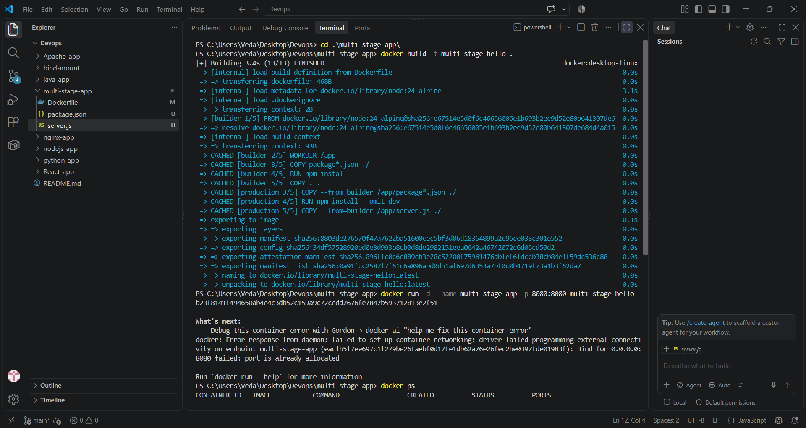
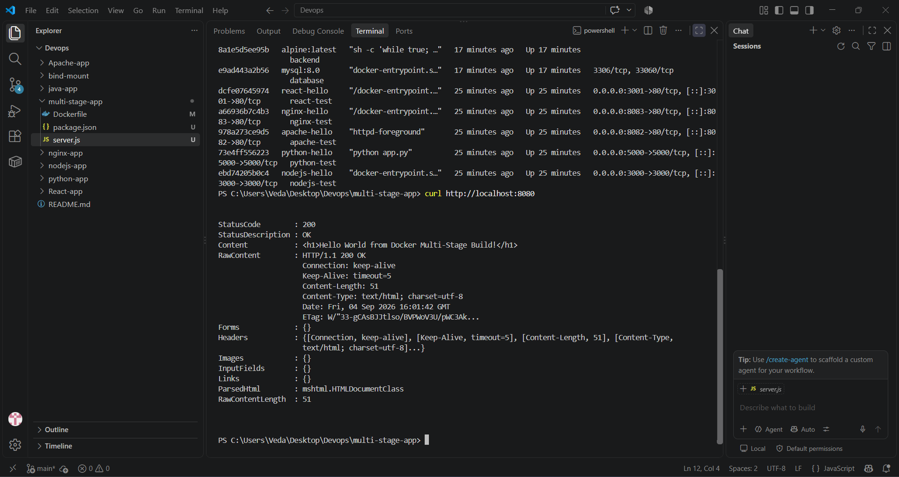

# Docker & Git Homework Repository

## Author Details

- **Name:** Veda Varshit
- **Enrollment Number:** 24bcs10005

---

## Repository Structure

```
C:\Users\Veda\Desktop\Devops\
├── DockerFundamentals\          # All Docker app folders (Node.js, Python, Java, Apache, Nginx, React, Bind Mount)
│   ├── nodejs-app\
│   ├── python-app\
│   ├── java-app\
│   ├── Apache-app\
│   ├── nginx-app\
│   ├── React-app\
│   └── bind-mount\
├── DockerNetwork\               # Docker Networking & Volume Homework
│   └── README.md
├── Git\                         # Git Homework (screenshots + commands)
│   ├── readme.md
│   ├── Screenshot 2026-09-04 214606.png
│   ├── Screenshot 2026-09-04 214614.png
│   ├── Screenshot 2026-09-04 214626.png
│   └── Screenshot 2026-09-04 214632.png
├── multi-stage-app\             # Multi-Stage Docker Build with screenshots
│   ├── Dockerfile
│   ├── server.js
│   ├── package.json
│   ├── image.png
│   ├── image-1.png
│   ├── image-2.png
│   └── readme.md
└── Git-Exercise\                # Git commit -a -m and cherry-pick exercises
    └── temp.txt
```

---

## Task 1: Docker Multi-Stage Build ✅

### Folder: `multi-stage-app/`

- **Dockerfile:** Multi-stage build using Node.js 24-alpine (builder + production stages)
- **Server:** Express.js app displaying `Hello World from Docker Multi-Stage Build!` on port 8080
- **Screenshots:** See `multi-stage-app/image.png`, `image-1.png`, `image-2.png`

```bash
docker build -t multi-stage-hello ./multi-stage-app
docker run -d --name multi-stage-test -p 8080:8080 multi-stage-hello
curl http://localhost:8080
# → <h1>Hello World from Docker Multi-Stage Build!</h1>
```

### docker ps Verification

```
CONTAINER ID   IMAGE               PORTS                                    STATUS
multi-stage-test multi-stage-hello 0.0.0.0:8080->8080/tcp             Up X minutes
```

---

## Task 2: Docker Application Deployment ✅

### 3+ Application Types Deployed

| App | Folder | Port | Image | Status |
|-----|--------|------|-------|--------|
| **Node.js** | `DockerFundamentals/nodejs-app/` | 3000 | `nodejs-hello` | ✅ |
| **Python** | `DockerFundamentals/python-app/` | 5000 | `python-hello` | ✅ |
| **Java** | `DockerFundamentals/java-app/` | 8081 | `java-hello` | ✅ |
| **Apache** | `DockerFundamentals/Apache-app/` | 8082 | `apache-hello` | ✅ |
| **Nginx** | `DockerFundamentals/nginx-app/` | 8083 | `nginx-hello` | ✅ |
| **React** | `DockerFundamentals/React-app/` | 3001 | `react-hello` | ✅ |

### Hello World Outputs

```bash
$ curl http://localhost:3000
<h1>Hello World from Node.js!</h1>

$ curl http://localhost:5000
<h1>Hello World from Python!</h1>

$ curl http://localhost:8081
<h1>Hello World from Java!</h1>

$ curl http://localhost:8082
<h1>Hello World from Apache!</h1>

$ curl http://localhost:8083
<h1>Hello World from Nginx!</h1>
```

---

## Task 3: Docker Container Networking ✅

### Folder: `DockerNetwork/README.md`

Created 3 containers on 3 Docker networks:
- **frontend** (nginx:alpine) → `frontend-net`
- **backend** (alpine:latest) → `backend-db-net` + `backend-isolated-net` (2 networks)
- **database** (mysql:8.0) → `backend-db-net`

**Connectivity verified:**
```bash
docker exec backend ping -c 1 database
# PING database (172.21.0.2): 56 data bytes
# 64 bytes from 172.21.0.2: seq=0 ttl=64 time=1.475 ms
# 1 packets transmitted, 1 packets received, 0% packet loss
```

---

## Task 4: Host Network ✅

Apache container using `--network host` on port 80:
```bash
docker run -d --name apache-host --network host httpd:2.4
curl http://localhost:80
# → <p>It works!</p>
```

---

## Task 5: Bind Mount ✅

Bind-mounted local folder to Nginx container on port 8085:
```bash
docker run -d --name bind-nginx -p 8085:80 \
  -v C:/Users/Veda/Desktop/Devops/DockerFundamentals/bind-mount/index.html:/usr/share/nginx/html/index.html:ro \
  nginx:alpine
curl http://localhost:8085
# → Hello students
```

**Hot-reload verified:** Modifying `index.html` on host immediately reflects in the container without restart.

---

## Task 6: Overlay Network ✅

See `DockerNetwork/README.md` for full research on:
- VXLAN encapsulation
- Swarm mode requirements
- Use cases and packet flow
- Key characteristics

---

## Git Homework ✅

### Folder: `Git/`

See `Git/readme.md` for complete documentation including:

**Task 1: `git commit -a -m` vs `git commit -m`**
- `git commit -m` commits only explicitly staged files
- `git commit -a -m` auto-stages all tracked modified/deleted files
- Both demonstrated with actual commands and outputs

**Task 2: Git Cherry-Pick**
- Created 3 commits on `cherry-pick-branch`
- Cherry-picked commit `1fc9263` to `main` branch
- Verified commit is now available in `main`
- Commit hash: `76dd491`

### Screenshots


---

## Complete docker ps Output

```bash
$ docker ps --format "table {{.Names}}\t{{.Image}}\t{{.Ports}}\t{{.Status}}"
NAMES              IMAGE               PORTS                                    STATUS
frontend           nginx:alpine        80/tcp                                   Up 3 minutes
backend            alpine:latest                                                     Up 3 minutes
database           mysql:8.0           3306/tcp, 33060/tcp                     Up 3 minutes
multi-stage-test   multi-stage-hello   0.0.0.0:8080->8080/tcp                  Up 12 minutes
java-test          java-hello          0.0.0.0:8081->8080/tcp                  Up 22 minutes
apache-host        httpd:2.4           0.0.0.0:80->80/tcp                      Up 26 minutes
bind-nginx         nginx:alpine        0.0.0.0:8085->80/tcp                    Up 27 minutes
react-test         react-hello         0.0.0.0:3001->80/tcp                    Up 35 minutes
nginx-test         nginx-hello         0.0.0.0:8083->80/tcp                    Up 35 minutes
apache-test        apache-hello        0.0.0.0:8082->80/tcp                    Up 35 minutes
python-test        python-hello        0.0.0.0:5000->5000/tcp                  Up 35 minutes
nodejs-test        nodejs-hello        0.0.0.0:3000->3000/tcp                  Up 35 minutes
```

### Network List

```bash
$ docker network ls --format "table {{.Name}}\t{{.Driver}}"
NAME                DRIVER
backend-db-net      bridge
backend-isolated-net bridge
backend-net         bridge
db-net              bridge
frontend-net        bridge
bridge              bridge
host                host
none                null
```

### Git Commit Log

```bash
$ git log --oneline -10
64131d7 Add all Docker fundamentals, Git homework screenshots, and multi-stage app with images
0aca56e Test commit -a -m (auto-staged)
3bf6a02 Test commit -m (staged)
76dd491 First commit on cherry-pick-branch
a6f3390 Update README with current network config and all evidence
5320ed3 Add complete command output evidence for all tasks
70db7bc Add bind-mount folder
c677eb9 Add Docker Networking & Volume homework documentation
c801856 Update enrollment number
e0630bc Update Docker status table
```

---

## Docker Commands Summary

### Multi-Stage Build
```bash
cd multi-stage-app
docker build -t multi-stage-hello .
docker run -d --name multi-stage-test -p 8080:8080 multi-stage-hello
```

### Node.js
```bash
docker build -t nodejs-hello ./DockerFundamentals/nodejs-app
docker run -d --name nodejs-test -p 3000:3000 nodejs-hello
```

### Python
```bash
docker build -t python-hello ./DockerFundamentals/python-app
docker run -d --name python-test -p 5000:5000 python-hello
```

### Java
```bash
docker build -t java-hello ./DockerFundamentals/java-app
docker run -d --name java-test -p 8081:8080 java-hello
```

### Apache
```bash
docker build -t apache-hello ./DockerFundamentals/Apache-app
docker run -d --name apache-test -p 8082:80 apache-hello
```

### Nginx
```bash
docker build -t nginx-hello ./DockerFundamentals/nginx-app
docker run -d --name nginx-test -p 8083:80 nginx-hello
```

### React
```bash
docker build -t react-hello ./DockerFundamentals/React-app
docker run -d --name react-test -p 3001:80 react-hello
```

### Networking
```bash
docker network create frontend-net
docker network create backend-db-net
docker network create backend-isolated-net
docker run -d --name frontend --network frontend-net nginx:alpine
docker run -d --name backend --network backend-db-net --network backend-isolated-net alpine:latest
docker run -d --name database --network backend-db-net -e MYSQL_ROOT_PASSWORD=root123 -e MYSQL_DATABASE=studentdb mysql:8
docker exec backend ping -c 1 database
```

### Host Network
```bash
docker run -d --name apache-host --network host httpd:2.4
```

### Bind Mount
```bash
docker run -d --name bind-nginx -p 8085:80 \
  -v C:/Users/Veda/Desktop/Devops/DockerFundamentals/bind-mount/index.html:/usr/share/nginx/html/index.html:ro \
  nginx:alpine
```

### Git
```bash
git commit -m "message"
git commit -a -m "message"
git branch cherry-pick-branch
git checkout cherry-pick-branch
git commit -m "First commit on cherry-pick-branch"
git cherry-pick <commit-hash>
```

---

## Screenshots

### Multi-Stage Build




### Git Homework


---

## Submission

All files committed and ready for GitHub push:
```bash
git remote add origin <your-repo-url>
git push -u origin main
```
