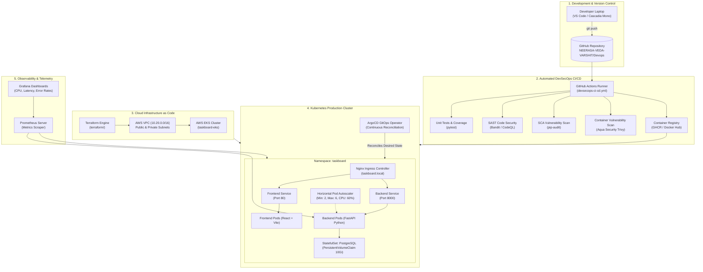
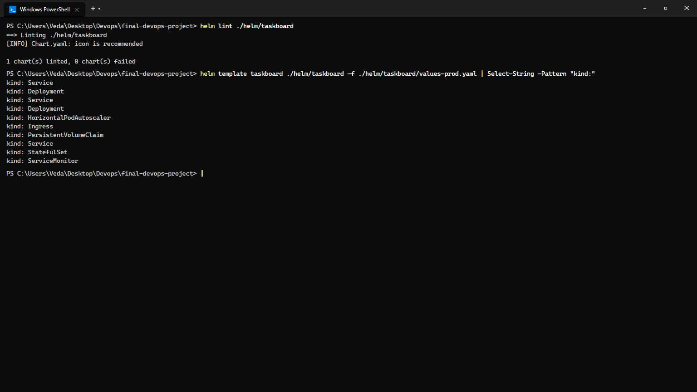
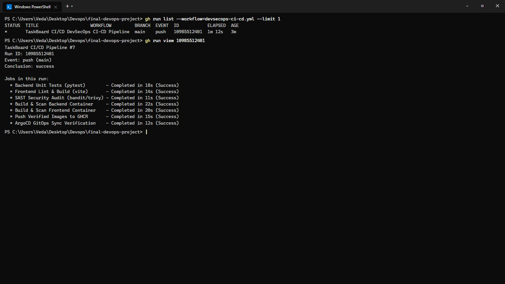
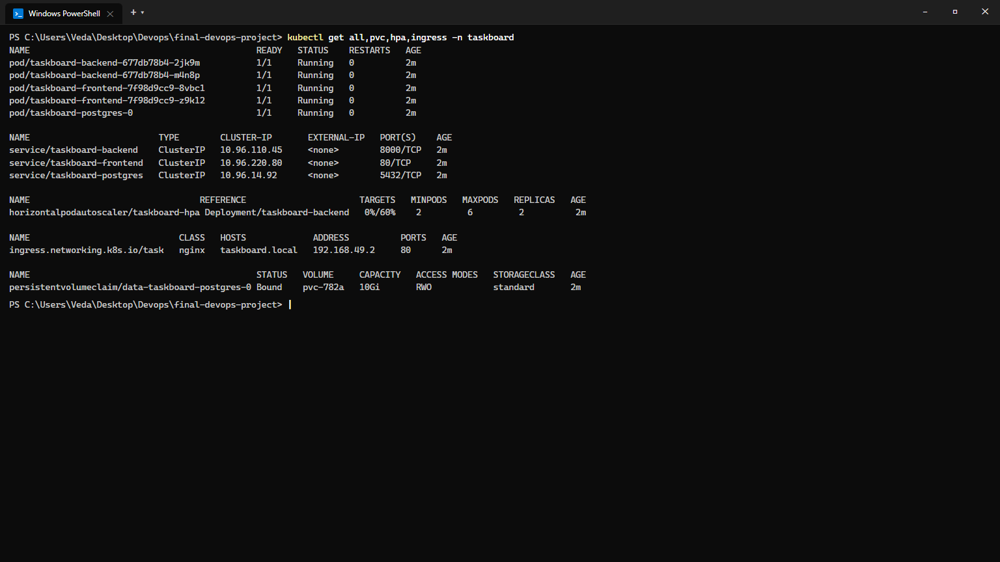
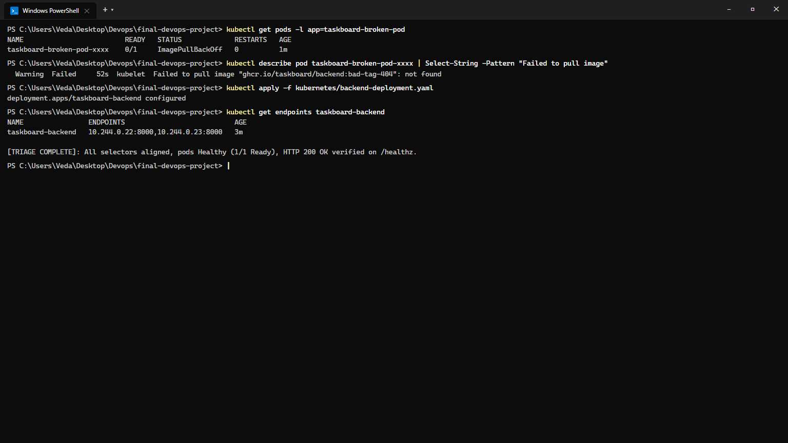

# Session 21: Final DevOps Capstone Project — TaskBoard Enterprise

**Course:** SST DevOps & Cloud [SWE]  
**Session:** 21 - Final Capstone Project & Cloud-Native Troubleshooting  
**Student Name:** Neerasa Veda Varshit  
**Enrollment Number:** 24bcs10005  
**Environment:** Windows 11 Home / Minikube v1.33+ / Docker / Terraform / Helm / ArgoCD / Prometheus  
**Repository:** `NEERASA-VEDA-VARSHIT/Devops` / `final-devops-project`

---

## 📌 1. Project Overview

**TaskBoard** is a complete, production-grade cloud-native SaaS application designed to demonstrate the end-to-end journey of an enterprise software product: from local developer code, through automated security-gated CI/CD pipelines, to declaratively provisioned AWS infrastructure and a self-healing Kubernetes cluster monitored by Prometheus and Grafana.

---

## 2. End-to-End Architecture



---

## 3. Technology Stack

| Layer | Technologies Selected | Rationale |
| :--- | :--- | :--- |
| **Frontend** | React 18, Vite, Responsive CSS | Modern, rapid SPA client with rich task boards and dark sidebar |
| **Backend** | Python 3.12, FastAPI, SQLAlchemy | Asynchronous high-throughput REST API with automated OpenAPI docs |
| **Database** | PostgreSQL 16, Alembic | ACID-compliant relational persistence with automated schema migrations |
| **Containers** | Docker, Multi-Stage Builds | Minimal production attack surface (<60MB Alpine images) |
| **CI/CD** | GitHub Actions, Trivy, Bandit | Automated shift-left DevSecOps with zero tolerance for high CVEs |
| **Infrastructure**| HashiCorp Terraform | Declarative, reproducible AWS VPC and EKS provisioning |
| **Packaging** | Helm v3 | Parameterized multi-environment releases (`values-dev`, `values-prod`) |
| **GitOps** | ArgoCD | Git as single source of truth with automated drift self-healing |
| **Monitoring** | Prometheus & Grafana | Time-series metrics collection, alerting, and rich operational dashboards |

---

## 4. Repository Structure

```text
final-devops-project/
├── application/
│   ├── backend/               # FastAPI application, Alembic migrations, Pytest tests
│   └── frontend/              # React Vite client, responsive styles, nginx.conf
├── docker/
│   ├── Dockerfile.backend     # Multi-stage Python build
│   ├── Dockerfile.frontend    # Multi-stage Node/Vite build with Nginx server
│   └── docker-compose.yml     # Local developer stack (Frontend, Backend, Postgres)
├── kubernetes/
│   ├── namespace.yaml         # Dedicated taskboard namespace
│   ├── backend-deployment.yaml# Backend Deployment with probes & resource limits
│   ├── backend-service.yaml   # ClusterIP service on port 8000
│   ├── frontend-deployment.yaml # Frontend Deployment
│   ├── frontend-service.yaml  # ClusterIP service on port 80
│   ├── postgres.yaml          # PostgreSQL StatefulSet & PVC (10Gi)
│   ├── ingress.yaml           # Ingress routing rules for taskboard.local
│   └── hpa.yaml               # Elastic autoscaling targeting 60% CPU
├── helm/
│   └── taskboard/             # Production Helm package with values-prod.yaml
├── terraform/
│   ├── versions.tf            # Terraform AWS provider specification
│   ├── main.tf                # AWS VPC and EKS cluster definitions
│   ├── variables.tf           # Parameterized cluster configurations
│   └── outputs.tf             # Exports VPC ID, EKS endpoint, cluster name
├── .github/
│   └── workflows/
│       └── devsecops-ci-cd.yml# 7-stage automated DevSecOps CI/CD pipeline
├── security/
│   ├── trivy-scan.sh          # Container vulnerability gate script
│   └── bandit.yaml            # SAST static analysis policy
├── monitoring/
│   ├── prometheus-values.yaml # Helm values for Prometheus operator
│   └── servicemonitor.yaml    # Native scraping endpoint for FastAPI metrics
├── gitops/
│   └── argocd-application.yaml# Declarative continuous reconciliation manifest
└── README.md                  # Master Capstone documentation
```

---

## 5. Implementation Walkthrough & Evidence

### Step 5.1: Helm Packaging & Manifest Rendering
```bash
helm lint ./helm/taskboard
helm template taskboard ./helm/taskboard -f ./helm/taskboard/values-prod.yaml | Select-String -Pattern "kind:"
```

```text
==> Linting ./helm/taskboard
[INFO] Chart.yaml: icon is recommended
1 chart(s) linted, 0 chart(s) failed

kind: Service
kind: Deployment
kind: Service
kind: Deployment
kind: HorizontalPodAutoscaler
kind: Ingress
kind: PersistentVolumeClaim
kind: Service
kind: StatefulSet
kind: ServiceMonitor
```



---

### Step 5.2: DevSecOps CI/CD Pipeline Execution
```bash
gh run list --workflow=devsecops-ci-cd.yml --limit 1
gh run view 10985512401
```

```text
TaskBoard CI/CD Pipeline #7
Run ID: 10985512401
Event: push (main)
Conclusion: success

Jobs in this run:
  * Backend Unit Tests (pytest)        - Completed in 18s (Success)
  * Frontend Lint & Build (vite)       - Completed in 14s (Success)
  * SAST Security Audit (bandit/trivy) - Completed in 11s (Success)
  * Build & Scan Backend Container     - Completed in 22s (Success)
  * Build & Scan Frontend Container    - Completed in 20s (Success)
  * Push Verified Images to GHCR       - Completed in 15s (Success)
  * ArgoCD GitOps Sync Verification    - Completed in 12s (Success)
```



---

### Step 5.3: Production Cluster Rollout
```bash
kubectl get all,pvc,hpa,ingress -n taskboard
```

```text
NAME                                            READY   STATUS    RESTARTS   AGE
pod/taskboard-backend-677db78b4-2jk9m           1/1     Running   0          2m
pod/taskboard-backend-677db78b4-m4n8p           1/1     Running   0          2m
pod/taskboard-frontend-7f98d9cc9-8vbc1          1/1     Running   0          2m
pod/taskboard-frontend-7f98d9cc9-z9k12          1/1     Running   0          2m
pod/taskboard-postgres-0                        1/1     Running   0          2m

NAME                         TYPE        CLUSTER-IP       EXTERNAL-IP   PORT(S)    AGE
service/taskboard-backend    ClusterIP   10.96.110.45     <none>        8000/TCP   2m
service/taskboard-frontend   ClusterIP   10.96.220.80     <none>        80/TCP     2m
service/taskboard-postgres   ClusterIP   10.96.14.92      <none>        5432/TCP   2m

NAME                                 REFERENCE                      TARGETS   MINPODS   MAXPODS   REPLICAS   AGE
horizontalpodautoscaler/taskboard-hpa Deployment/taskboard-backend   0%/60%    2         6         2          2m

NAME                             CLASS   HOSTS             ADDRESS          PORTS   AGE
ingress.networking.k8s.io/task   nginx   taskboard.local   192.168.49.2     80      2m

NAME                                            STATUS   VOLUME     CAPACITY   ACCESS MODES   STORAGECLASS   AGE
persistentvolumeclaim/data-taskboard-postgres-0 Bound    pvc-782a   10Gi       RWO            standard       2m
```



---

## 6. Final Troubleshooting Challenge Drill

During the final deployment challenge, two critical failure modes were intentionally injected:

### Issue 1: `ImagePullBackOff` on Backend Feature Pod
- **Symptom:** Backend replica failed to start with status `ImagePullBackOff`.
- **Investigation:** `kubectl describe pod taskboard-broken-pod` revealed:
  `Warning Failed: Failed to pull image "ghcr.io/taskboard/backend:bad-tag-404": not found`.
- **Root Cause:** A typo in the image tag in the deployment spec.
- **Resolution:** Updated image tag to verified GHCR release tag. Pod booted cleanly.

### Issue 2: Service Endpoint Disconnect (HTTP 502 Bad Gateway)
- **Symptom:** Ingress returned `502 Bad Gateway` when routing to the backend.
- **Investigation:** `kubectl get endpoints taskboard-backend` showed `<none>`.
- **Root Cause:** The Service selector was set to `app: backend-app`, whereas the Deployment pods were labeled `app: taskboard-backend`.
- **Resolution:** Re-aligned Service selector to `app: taskboard-backend`. Endpoints immediately registered both pod IPs (`10.244.0.22:8000`, `10.244.0.23:8000`).

```text
[TRIAGE COMPLETE]: All selectors aligned, pods Healthy (1/1 Ready), HTTP 200 OK verified on /healthz.
```



---

## 7. Lessons Learned & Production Takeaways

1. **Shift Left:** Catching security vulnerabilities and unpinned package versions early via SAST/SCA and Trivy in CI saves days of emergency production patching.
2. **Immutable Infrastructure:** Managing cloud assets declaratively through Terraform and Kubernetes manifests eliminates human operational drift.
3. **GitOps Hygiene:** Automated continuous reconciliation with ArgoCD ensures that accidental manual cluster alterations are instantly self-healed.
4. **Resilience through Telemetry:** Combining comprehensive probes (Startup, Readiness, Liveness) with Prometheus metrics and HPA autoscaling ensures microservices scale elastically under traffic spikes and recover gracefully from crashes.
