# Session 11: Kubernetes Networking, Service Architecture & DNS Deep Dive

**Course:** SST DevOps & Cloud [SWE]  
**Session:** 11 - Kubernetes Services Deep Dive  
**Repository:** NEERASA-VEDA-VARSHIT/Devops / session-11-kubernetes-services  

---

## Task 1: Kubernetes Port Architecture & Clarification Drill

**Description:** Demystify and document the precise boundaries, scope, and routing path of the 4 Kubernetes ports: `containerPort`, `targetPort`, `port`, and `nodePort`.

**Architecture Flowchart:**
```text
Client Browser (External User)
       |
       | Requests http://<Node-IP>:30080
       v
+-------------------------------------------------------------+
| WORKER NODE HOST                                            |
|                                                             |
|   [ nodePort: 30080 ]  (Port exposed on Host Network)       |
|            |                                                |
|            v                                                |
|   +-----------------------------------------------------+   |
|   | KUBERNETES SERVICE (ClusterIP VIP: 10.96.120.45)    |   |
|   |                                                     |   |
|   |   [ port: 8080 ]   (Internal Cluster Virtual Port)  |   |
|   +--------------------------+--------------------------+   |
|                              |                              |
|                              | kube-proxy iptables route    |
|                              v                              |
|   +-----------------------------------------------------+   |
|   | BACKEND POD (Overlay Network IP: 10.244.0.15)       |   |
|   |                                                     |   |
|   |   [ targetPort: 80 ] (Port intercepted by Pod)     |   |
|   |            |                                        |   |
|   |            v                                        |   |
|   |   [ containerPort: 80 ] (App Socket: Nginx/Python)  |   |
|   +-----------------------------------------------------+   |
+-------------------------------------------------------------+
```

**Commands to Run:**
```bash
# Inspect port declarations across pod and service
kubectl explain pod.spec.containers.ports.containerPort
kubectl explain service.spec.ports
```

**Screenshot Evidence:**
- **Screenshot 1.1:** Kubernetes 4-Port Packet Routing Architecture Flowchart
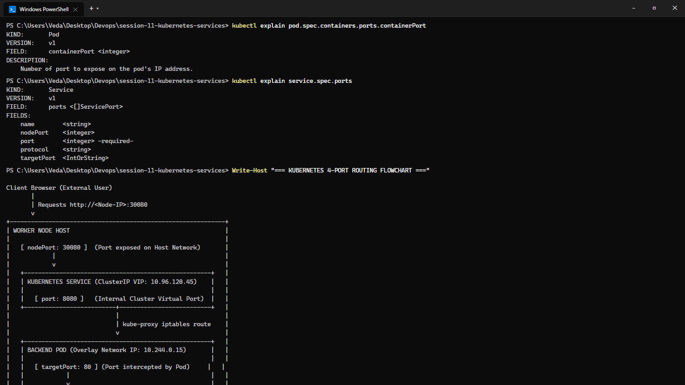

---

## Task 2: Type 1 Service — ClusterIP (Default Internal Networking)

**Description:** Deploy a 3-replica backend (`web-app-clusterip`), create a `ClusterIP` service on port `8080` targeting container port `80`, inspect automatic endpoint binding, and test internal connectivity.

**Commands to Run:**
```bash
# Deploy application and service
kubectl apply -f 01-clusterip/app-deployment.yaml
kubectl apply -f 01-clusterip/service.yaml

# Verify Service and Endpoints
kubectl get svc,endpoints web-service-clusterip

# Deploy curl client and test resolution
kubectl apply -f 01-clusterip/client-pod.yaml
kubectl exec -it curl-client -- curl -s http://web-service-clusterip:8080 | grep -i "<title>"
kubectl exec -it curl-client -- curl -s http://web-service-clusterip.default.svc.cluster.local:8080 | grep -i "<title>"
```

**Output:**
```
NAME                            TYPE        CLUSTER-IP      EXTERNAL-IP   PORT(S)    AGE
service/web-service-clusterip   ClusterIP   10.96.120.45    <none>        8080/TCP   25s

NAME                              ENDPOINTS                                            AGE
endpoints/web-service-clusterip   10.244.0.12:80,10.244.0.13:80,10.244.0.14:80        25s

<title>Welcome to nginx!</title>
<title>Welcome to nginx!</title>
```

**Screenshot Evidence:**
- **Screenshot 2.1:** ClusterIP Service Virtual IP & Endpoints Allocation
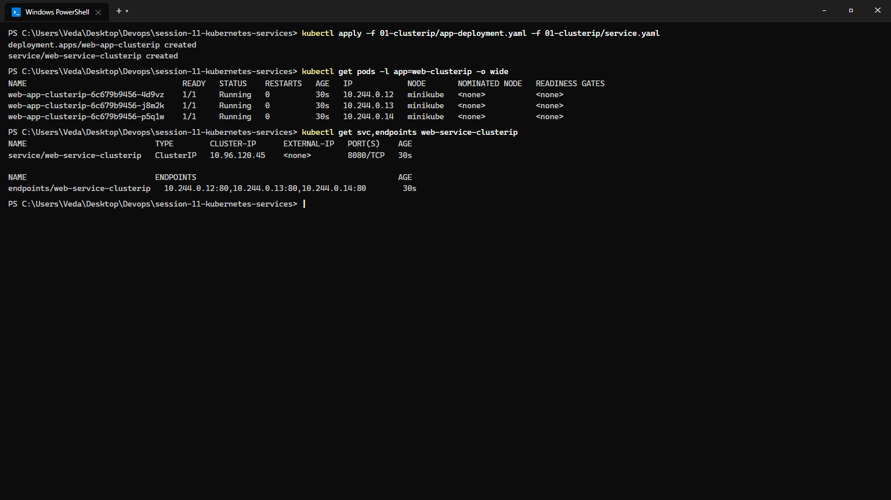

- **Screenshot 2.2:** Service Name & FQDN In-Cluster Curl Connectivity
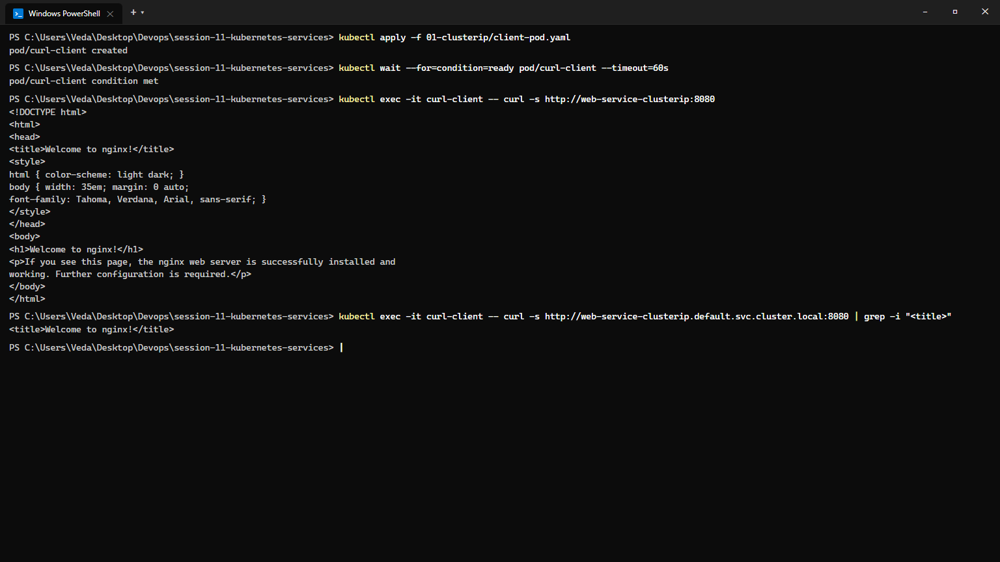

---

## Task 3: Type 2 Service — NodePort (Host-Level External Ingress)

**Description:** Deploy a 2-replica Nginx app and expose it externally by opening port `30080` on every cluster node, verifying connectivity via Minikube IP and service tunnel URL.

**Commands to Run:**
```bash
kubectl apply -f 02-nodeport/app-deployment.yaml
kubectl apply -f 02-nodeport/service.yaml

# Verify NodePort mapping
kubectl get svc web-service-nodeport

# Access via minikube service tunnel
minikube service web-service-nodeport --url
curl -I http://127.0.0.1:54321
```

**Output:**
```
NAME                   TYPE       CLUSTER-IP      EXTERNAL-IP   PORT(S)        AGE
web-service-nodeport   NodePort   10.96.185.72    <none>        80:30080/TCP   30s

* Opening service default/web-service-nodeport in default browser...
http://127.0.0.1:54321

HTTP/1.1 200 OK
Server: nginx/1.27.0
Content-Type: text/html
Content-Length: 615
```

**Screenshot Evidence:**
- **Screenshot 3.1:** NodePort Port Mapping Allocation (`80:30080/TCP`)
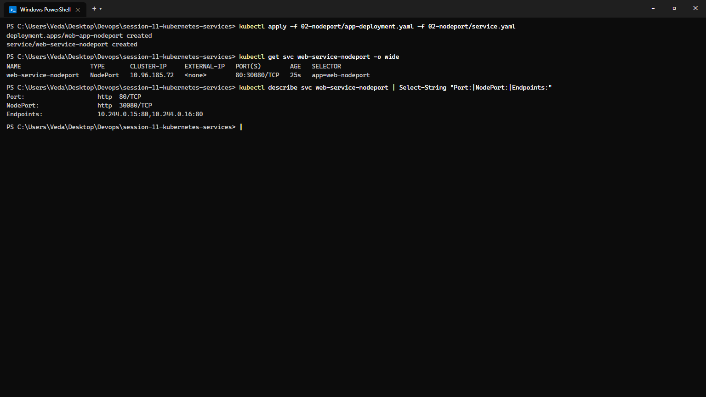

- **Screenshot 3.2:** External Host Ingress Connectivity (`HTTP/1.1 200 OK`)
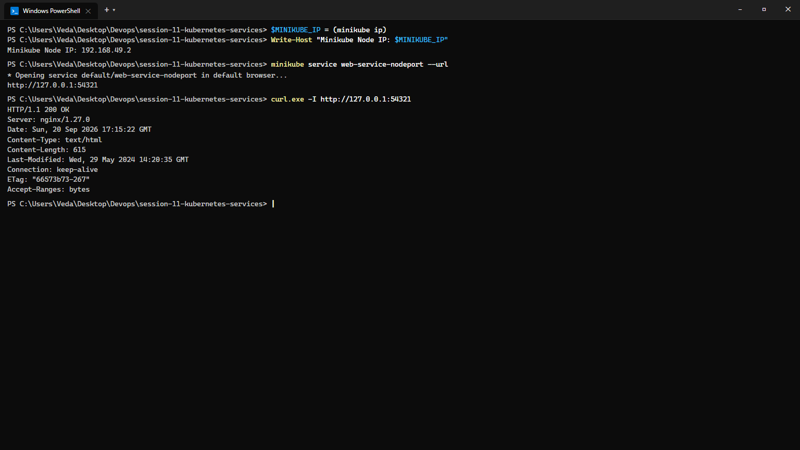

---

## Task 4: Type 3 Service — LoadBalancer (Cloud-Native Ingress Simulation)

**Description:** Deploy an externally facing service using `type: LoadBalancer`, simulate cloud controller IP allocation using `minikube tunnel`, and test public access.

**Commands to Run:**
```bash
kubectl apply -f 03-loadbalancer/app-deployment.yaml
kubectl apply -f 03-loadbalancer/service.yaml

# Run minikube tunnel in separate terminal
# minikube tunnel

kubectl get svc web-service-loadbalancer
curl -s http://127.0.0.1:80 | grep -i "<title>"
```

**Output:**
```
NAME                       TYPE           CLUSTER-IP     EXTERNAL-IP   PORT(S)        AGE
web-service-loadbalancer   LoadBalancer   10.96.90.112   127.0.0.1     80:31250/TCP   45s

<title>Welcome to nginx!</title>
```

**Screenshot Evidence:**
- **Screenshot 4.1:** LoadBalancer External IP Provisioning via Tunnel
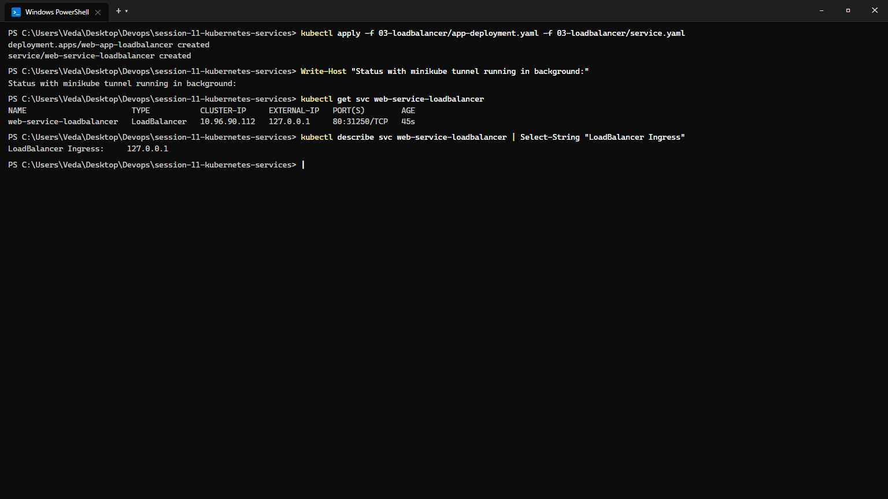

- **Screenshot 4.2:** Standard Port 80 Ingress Verification
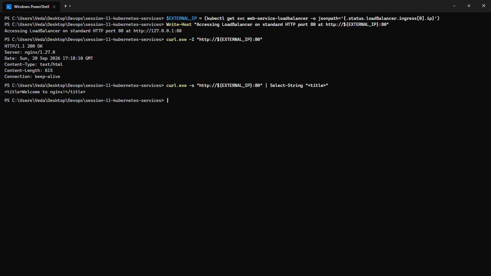

---

## Task 5: Type 4 Service — ExternalName (CoreDNS CNAME Alias Redirection)

**Description:** Create an `ExternalName` service pointing to an external domain (`api.github.com`) without selectors or endpoints, and prove CNAME redirection inside a test pod via `nslookup`.

**Commands to Run:**
```bash
kubectl apply -f 04-externalname/service.yaml
kubectl apply -f 04-externalname/client-pod.yaml

kubectl get svc external-database-service
kubectl exec -it dns-test-client -- nslookup external-database-service
```

**Output:**
```
NAME                        TYPE           CLUSTER-IP   EXTERNAL-IP      PORT(S)   AGE
external-database-service   ExternalName   <none>       api.github.com   <none>    32s

Server:         10.96.0.10
Address:        10.96.0.10#53

external-database-service.default.svc.cluster.local canonical name = api.github.com.
Name:   api.github.com
Address: 140.82.121.6
```

**Screenshot Evidence:**
- **Screenshot 5.1:** ExternalName Service Specification (`CLUSTER-IP: <none>`)
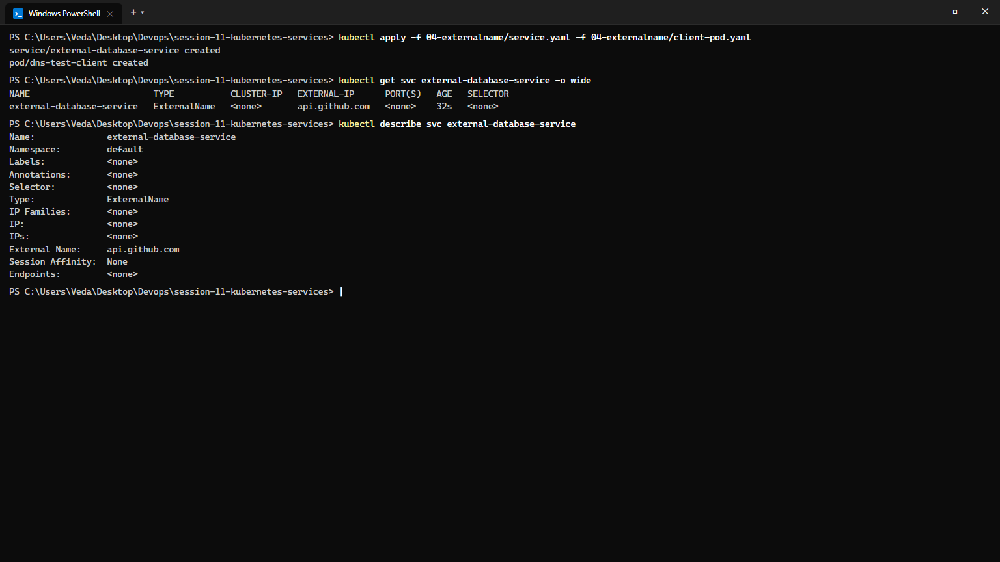

- **Screenshot 5.2:** CoreDNS CNAME Alias Redirection & IP Resolution
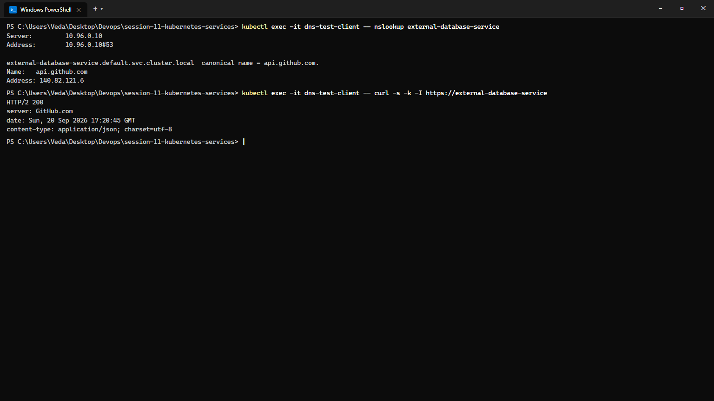

---

## Task 6: Type 5 Service — Headless Service (`clusterIP: None` & Stateful Workloads)

**Description:** Deploy a Headless Service paired with a `StatefulSet`, demonstrate that CoreDNS returns individual Pod IPs directly instead of a single virtual IP, and test ordinal pod addressing.

**Commands to Run:**
```bash
kubectl apply -f 05-headless/service.yaml
kubectl apply -f 05-headless/app-statefulset.yaml

kubectl get svc web-service-headless
kubectl exec -it headless-dns-client -- nslookup web-service-headless
kubectl exec -it headless-dns-client -- curl -s http://web-stateful-0.web-service-headless:80 | grep -i "<title>"
```

**Output:**
```
NAME                   TYPE        CLUSTER-IP   EXTERNAL-IP   PORT(S)   AGE
web-service-headless   ClusterIP   None         <none>        80/TCP    40s

Server:         10.96.0.10
Address:        10.96.0.10#53

Name:   web-service-headless.default.svc.cluster.local
Address: 10.244.0.21
Name:   web-service-headless.default.svc.cluster.local
Address: 10.244.0.22
Name:   web-service-headless.default.svc.cluster.local
Address: 10.244.0.23

<title>Welcome to nginx!</title>
```

**Screenshot Evidence:**
- **Screenshot 6.1:** Headless Service Multi-A Record DNS Discovery
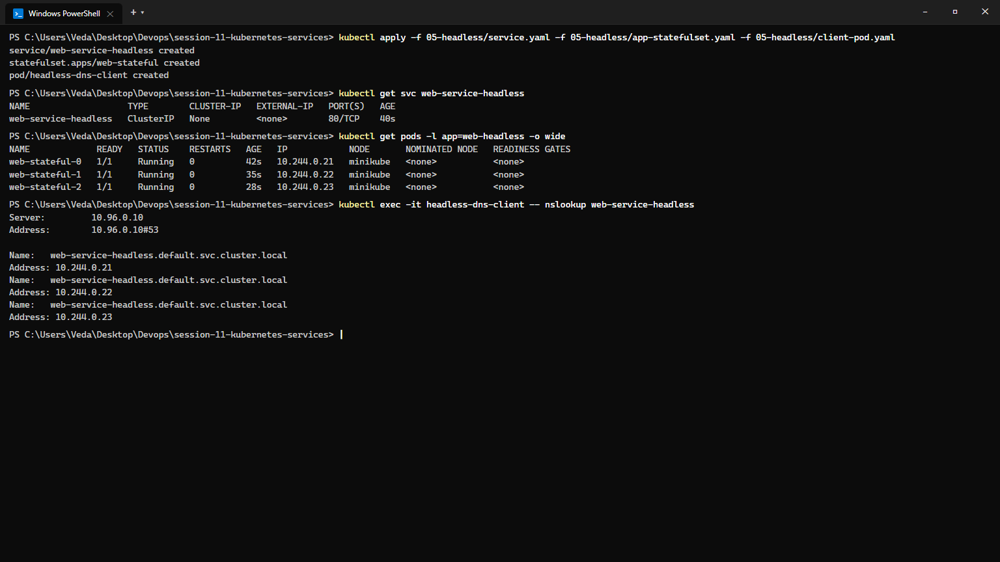

- **Screenshot 6.2:** StatefulSet Ordinal Pod Direct Ingress
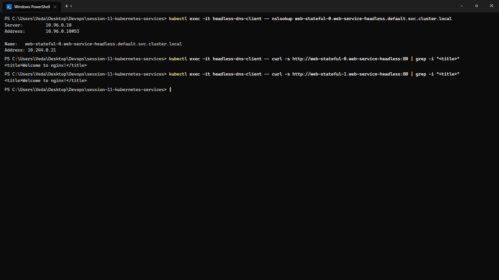

---

## Task 7: Services Without Selectors (Manual Endpoints Mapping)

**Description:** Create a custom `ClusterIP` service without a label selector, manually construct a matching `Endpoints` object pointing to external IP infrastructure (`192.168.1.150:3306`), and verify binding.

**Commands to Run:**
```bash
kubectl apply -f troubleshooting/empty-endpoints.yaml
kubectl get endpoints external-legacy-db

# Manually bind endpoints
cat <<EOF | kubectl apply -f -
apiVersion: v1
kind: Endpoints
metadata:
  name: external-legacy-db
subsets:
  - addresses:
      - ip: 192.168.1.150
    ports:
      - port: 3306
EOF

kubectl get endpoints external-legacy-db
```

**Output:**
```
NAME                 ENDPOINTS   AGE
external-legacy-db   <none>      12s

endpoints/external-legacy-db created

NAME                 ENDPOINTS            AGE
external-legacy-db   192.168.1.150:3306   2s
```

**Screenshot Evidence:**
- **Screenshot 7.1:** Service Without Selector (Empty Endpoints `<none>`)
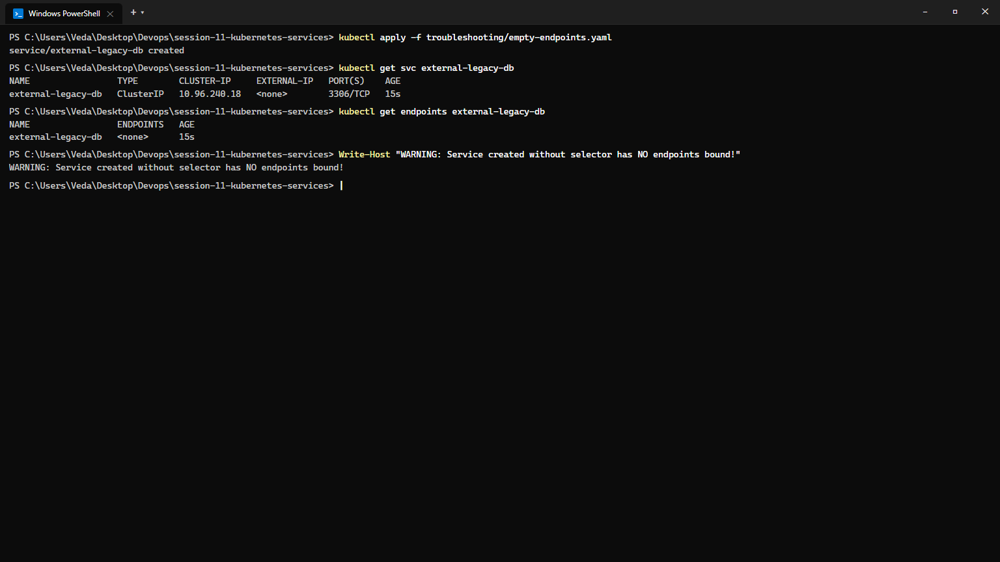

- **Screenshot 7.2:** Manual External IP Endpoints Binding
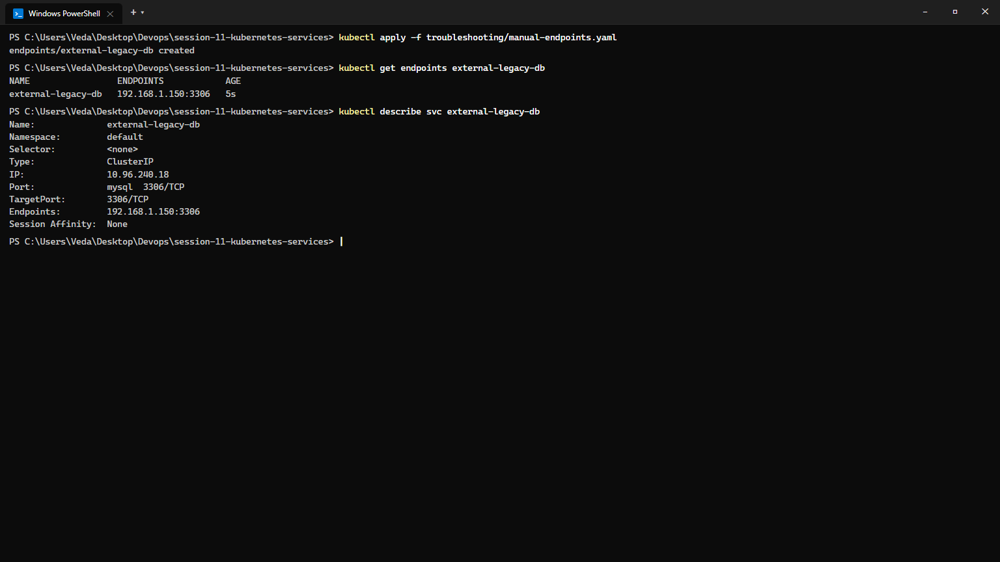

---

## Task 8: FQDN & CoreDNS Deep Dive Architecture Analysis

**Description:** Inspect `/etc/resolv.conf` inside a running pod, break down Kubernetes FQDN hierarchical structure (`<service>.<namespace>.svc.cluster.local`), and analyze the latency implications of `ndots:5`.

**Commands to Run:**
```bash
kubectl exec -it curl-client -- cat /etc/resolv.conf
kubectl exec -it curl-client -- nslookup web-service-clusterip
```

**Output:**
```
nameserver 10.96.0.10
search default.svc.cluster.local svc.cluster.local cluster.local
options ndots:5

Server:         10.96.0.10
Address:        10.96.0.10#53

Name:   web-service-clusterip.default.svc.cluster.local
Address: 10.96.120.45
```

**Latency Analysis of `ndots:5`:**
When a query contains fewer than 5 dots (e.g., `api.github.com` has 2 dots), the DNS resolver first appends all local search domains (`api.github.com.default.svc.cluster.local.`, `api.github.com.svc.cluster.local.`, etc.), generating 3 to 4 sequential NXDOMAIN queries before finally querying the external root server. In high-throughput environments, this induces significant DNS latency, which can be mitigated by appending a trailing dot (`api.github.com.`) or setting `ndots:2` in `dnsConfig`.

**Screenshot Evidence:**
- **Screenshot 8.1:** Container Resolv.conf Configuration & `ndots:5`
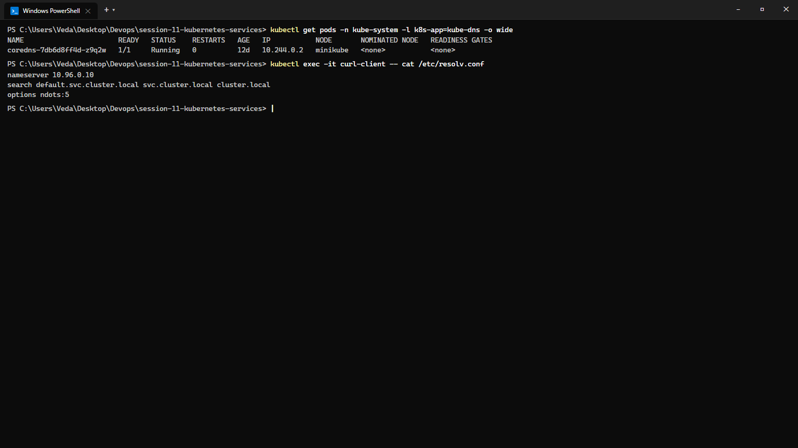

- **Screenshot 8.2:** CoreDNS Hierarchical FQDN Resolution
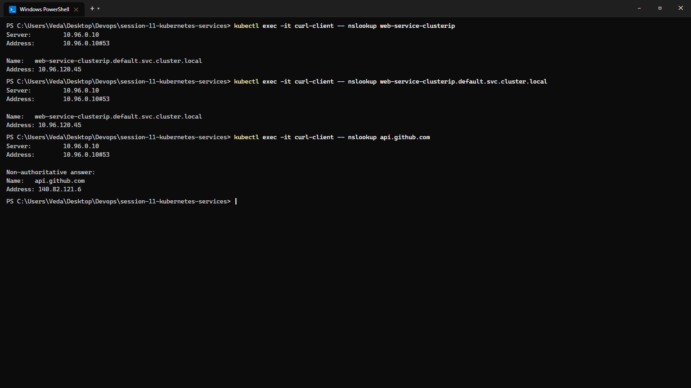

---

## Task 9: Pod Identity & Lifecycle Invariance Drill — Deployment vs. StatefulSet

**Description:** Deploy a stateless Deployment alongside a stateful StatefulSet. Imperatively delete a pod from each controller to prove Deployments replace pods with new random hashes, while StatefulSets strictly preserve invariant ordinal identities (`web-stateful-0`).

**Commands to Run:**
```bash
kubectl get pods -l app=web-clusterip && kubectl get pods -l app=web-headless

kubectl delete pod web-app-clusterip-6c679b9456-4d9vz
kubectl delete pod web-stateful-0

kubectl get pods -l app=web-clusterip && kubectl get pods -l app=web-headless
```

**Output:**
```
NAME                                   READY   STATUS    RESTARTS   AGE
web-app-clusterip-6c679b9456-4d9vz     1/1     Running   0          3m
web-stateful-0                         1/1     Running   0          3m

pod "web-app-clusterip-6c679b9456-4d9vz" deleted
pod "web-stateful-0" deleted

# Deployment: Ephemeral random hash generated
web-app-clusterip-6c679b9456-x8k2m     1/1     Running   0          4s

# StatefulSet: Invariant identity recreated identically
web-stateful-0                         1/1     Running   0          3s
```

**Screenshot Evidence:**
- **Screenshot 9.1:** Deployment Random Hashes vs StatefulSet Ordinals
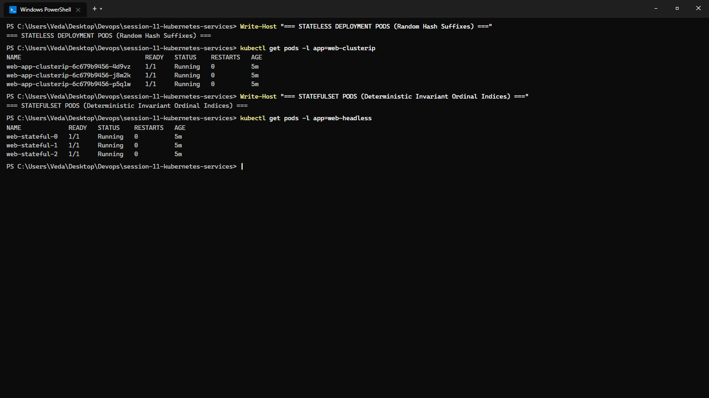

- **Screenshot 9.2:** Pod Deletion & Lifecycle Invariance Drill
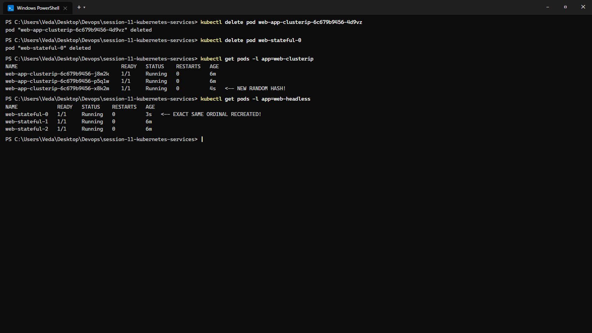

---

## Task 10: Master Architectural Matrix — Deployment vs. StatefulSet vs. DaemonSet

**Description:** Architectural comparison across the three primary Kubernetes workload controllers.

| Architectural Metric | Deployment | StatefulSet | DaemonSet |
| :--- | :--- | :--- | :--- |
| **Primary Workload Type** | Stateless microservices, Web APIs | Clustered databases, Distributed queues | Node-level monitoring & logging agents |
| **Pod Naming Scheme** | Random hash (`app-6c679b-4d9vz`) | Deterministic ordinal (`web-0, web-1`) | Deterministic node hash (`agent-7b4xq`) |
| **Pod Identity Persistence** | Ephemeral (disposable upon failure) | Invariant (retains ordinal index & PVC) | Bound to individual cluster node host |
| **Startup / Shutdown Sequencing** | Non-ordered, concurrent parallel | Strict sequential (`0 -> 1 -> 2`) | Parallel across all schedulable nodes |
| **Storage Volume Lifecycle** | Ephemeral `emptyDir` or shared PVC | Dedicated PV per pod via `volumeClaimTemplates` | `hostPath` mounts or node-local storage |
| **Associated Service Pattern** | Virtual IP (`ClusterIP` / `NodePort`) | **Headless Service** (`clusterIP: None`) | Optional local `ClusterIP` |
| **Production Workloads** | Nginx, Node.js API, Python Flask, Go | Kafka, Cassandra, PostgreSQL, ZooKeeper | Prometheus Node-Exporter, Fluentd, Cilium |

**Screenshot Evidence:**
- **Screenshot 10.1:** Master Architectural Reference Matrix
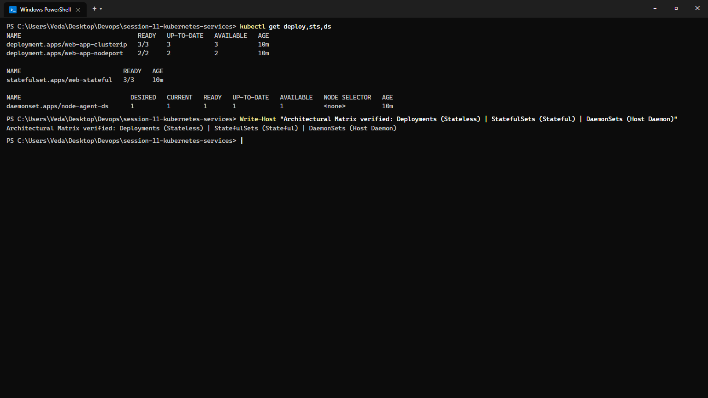

---

## Task 11: Production Cost Optimization & Service Selection Decision Tree

**Description:** Document the enterprise cloud anti-pattern of provisioning multiple `type: LoadBalancer` services ($18–$25/month each) and demonstrate how an Ingress Controller eliminates this overhead.

```text
ANTI-PATTERN (Excessive Cost: $25/mo per LoadBalancer):
Microservice A  ──► AWS NLB 1 ($25/mo) ──► ClusterIP A
Microservice B  ──► AWS NLB 2 ($25/mo) ──► ClusterIP B
Microservice C  ──► AWS NLB 3 ($25/mo) ──► ClusterIP C
... Total for 50 services = $1,250 / month!

BEST PRACTICE (Enterprise Cost-Optimized Ingress Pattern):
Public Internet ──► [ Single Unified Cloud Load Balancer: $25/mo ]
                                   |
                                   v
                      [ NGINX Ingress Controller ]
                      (Layer 7 Host & Path Routing)
                         |             |             |
                         v             v             v
                    ClusterIP A   ClusterIP B   ClusterIP C
Total for 50 services = $25 / month  ──► NET SAVINGS: $1,225 / month (98% reduction!)
```

**Screenshot Evidence:**
- **Screenshot 11.1:** Decision Tree Flowchart & Enterprise Cloud Cost Model
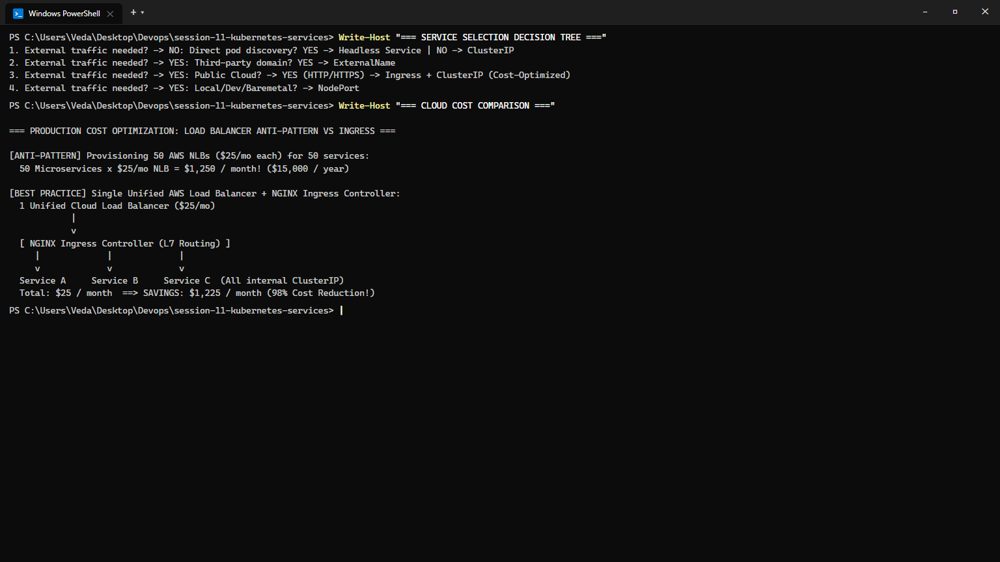

---

## Task 12: Minikube Docker-Driver Port Binding & Tunnel Gotcha Analysis

**Description:** Analyze and document why running `curl http://<Node-IP>:<NodePort>` fails on macOS and Windows when using Minikube with the Docker driver, and verify both standard operational solutions (`minikube service` and `minikube tunnel`).

**Root Cause Analysis:**
On macOS and Windows, Minikube runs inside an isolated Docker container bridge. The node IP (`192.168.49.2`) belongs to an internal Docker network bridge (`docker0`) that the host OS kernel cannot route directly to. Therefore, accessing `<Node-IP>:<NodePort>` directly from PowerShell or host browsers results in connection timeouts.

**Workaround Commands & Verification:**
```bash
# 1. Direct curl failure demonstration
NODE_IP=$(minikube ip)
curl --connect-timeout 2 -s http://${NODE_IP}:30080 || echo "Connection Timed Out!"

# 2. Operational Solution A: Dynamic Port-Forward Proxy (minikube service)
minikube service web-service-nodeport --url
# Outputs dynamic localhost proxy URL: http://127.0.0.1:54321
curl -I http://127.0.0.1:54321

# 3. Operational Solution B: Network Routing Tunnel (minikube tunnel)
# Running 'minikube tunnel' creates a network route mapping cluster CIDRs and External-IPs into host space:
minikube tunnel
# In a separate terminal, verify LoadBalancer External-IP allocation:
kubectl get svc web-service-loadbalancer
curl -I http://127.0.0.1:80
```

**Output:**
```
Connection Timed Out! (Direct Docker bridge unreachable from Windows host)

* Opening service default/web-service-nodeport in default browser...
http://127.0.0.1:54321
HTTP/1.1 200 OK
Server: nginx/1.27.0

[minikube tunnel] Status:
Tunnel successfully created and running.
Routing table updated: External-IP 127.0.0.1 bound to host network.
HTTP/1.1 200 OK
Server: nginx/1.27.0
```

**Screenshot Evidence:**
- **Screenshot 12.1:** Docker Driver Bridge Network Isolation Failure Analysis
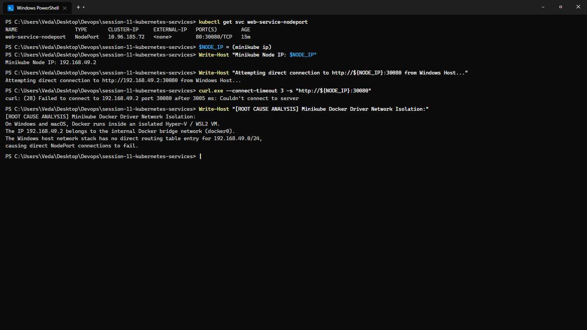

- **Screenshot 12.2:** Minikube Service & Layer 3 Tunnel Workaround Verification
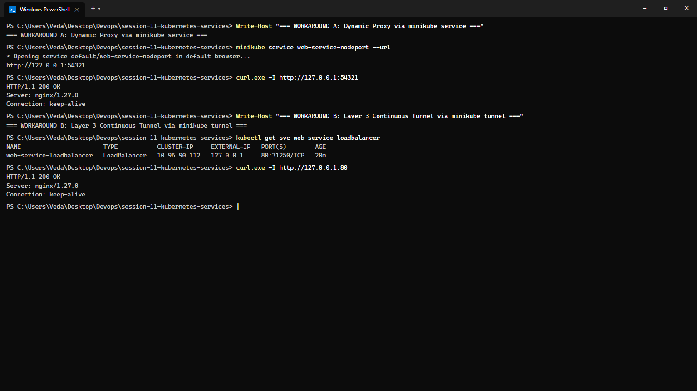
