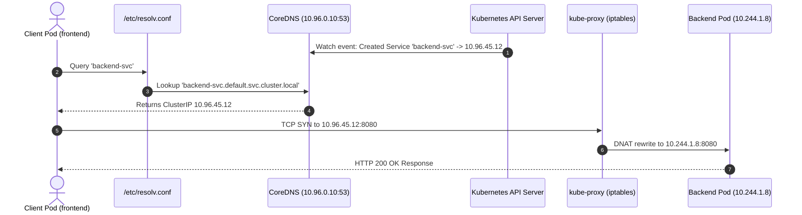

# Task 4: CoreDNS Architecture, Service Discovery & Troubleshooting

**Course:** SST DevOps & Cloud [SWE]  
**Session:** 11 - Kubernetes Networking & Services  
**Author:** Neerasa Veda Varshit (`24bcs10005`)  
**Repository:** `NEERASA-VEDA-VARSHIT/Devops` / `session-11-kubernetes-services/coredns`

---

## 1. What is CoreDNS?

**CoreDNS** is an open-source, pluggable, flexible, and authoritative DNS server written in Go. In Kubernetes (starting from version 1.13+), CoreDNS replaced `kube-dns` as the default cluster-internal DNS solution.

CoreDNS runs as a native Kubernetes deployment inside the `kube-system` namespace. It listens for DNS queries across the cluster network and dynamically tracks Kubernetes resources (Services, Endpoints, and Pods) through an active connection to the Kubernetes API server.

```bash
# Verify CoreDNS pods in the kube-system namespace
kubectl get pods -n kube-system -l k8s-app=kube-dns -o wide
```

```text
NAME                       READY   STATUS    RESTARTS   AGE   IP            NODE
coredns-7db6d8ff4d-8x92j   1/1     Running   0          5d    10.244.0.2    minikube
coredns-7db6d8ff4d-wpm4q   1/1     Running   0          5d    10.244.0.3    minikube
```

---

## 2. Why Does Kubernetes Use CoreDNS?

Prior to CoreDNS, Kubernetes relied on `kube-dns`, which was composed of three separate containers inside every pod (`kubedns`, `dnsmasq-nanny`, and `sidecar`). CoreDNS unified this functionality into a single binary process, offering major advantages:

1. **Pluggable Architecture:**  
   Every feature in CoreDNS is a modular plugin (e.g., `kubernetes`, `forward`, `cache`, `errors`, `health`, `prometheus`, `loop`). This makes it lightweight, highly maintainable, and extensible.
2. **Low Memory Footprint & High Performance:**  
   Written entirely in Go with concurrency safeguards, CoreDNS handles hundreds of thousands of queries per second with sub-millisecond response latency.
3. **Native Kubernetes API Integration:**  
   The `kubernetes` plugin implements the official Kubernetes DNS specifications, automatically responding to Service and Endpoint changes in real time.
4. **Prometheus Metrics Native:**  
   Exposes comprehensive metrics out of the box on port `9153` for scraping and alerting on query response times and lookup errors.

---

## 3. How Kubernetes Service Discovery Works

Kubernetes assigns dynamic IP addresses to Pods every time they are restarted, rescheduled, or scaled. Because Pod IPs are ephemeral, client applications cannot hardcode them.

**Service Discovery Flow:**
1. A **Service** is created with a static virtual **ClusterIP** and a label selector matching backend Pods.
2. CoreDNS watches the Kubernetes API and registers an `A` or `AAAA` record matching the service's FQDN:
   ```text
   backend-svc.production.svc.cluster.local.  30  IN  A  10.96.45.12
   ```
3. When a client Pod sends a request to `backend-svc`, CoreDNS resolves the domain to `10.96.45.12`.
4. `kube-proxy` (via `iptables` or `IPVS` rules on the host node) intercepts traffic to `10.96.45.12` and load balances it across the live healthy Pod IP endpoints.



---

## 4. How DNS Resolution Works Inside a Pod

When an application container initiates a socket connection to a domain:

1. **Step 1: Resolver Lookup:**  
   The container OS network stack checks `/etc/resolv.conf`.
   ```ini
   nameserver 10.96.0.10
   search default.svc.cluster.local svc.cluster.local cluster.local
   options ndots:5
   ```
2. **Step 2: Search Domain Expansion (`ndots:5`):**  
   If the queried domain has fewer than 5 dots (e.g., `api.example.com`), the resolver appends search paths in order:
   - `api.example.com.default.svc.cluster.local` (CoreDNS responds `NXDOMAIN`)
   - `api.example.com.svc.cluster.local` (CoreDNS responds `NXDOMAIN`)
   - `api.example.com.cluster.local` (CoreDNS responds `NXDOMAIN`)
   - `api.example.com` (CoreDNS forwards query upstream to node/public DNS)
3. **Step 3: Response Cache & Routing:**  
   CoreDNS caches the response according to TTL settings and returns the resolved IPv4/IPv6 address to the container.

---

## 5. CoreDNS Configuration (`Corefile` in ConfigMap)

CoreDNS configuration is defined centrally in a Kubernetes ConfigMap named `coredns` inside the `kube-system` namespace.

```bash
kubectl get configmap coredns -n kube-system -o yaml
```

### Standard `Corefile` Structure & Plugin Explanations

```yaml
apiVersion: v1
kind: ConfigMap
metadata:
  name: coredns
  namespace: kube-system
data:
  Corefile: |
    .:53 {
        errors
        health {
           lameduck 5s
        }
        ready
        kubernetes cluster.local in-addr.arpa ip6.arpa {
           pods insecure
           fallthrough in-addr.arpa ip6.arpa
           ttl 30
        }
        prometheus :9153
        forward . /etc/resolv.conf {
           max_concurrent 1000
        }
        cache 30
        loop
        reload
        loadbalance
    }
```

### Key Plugin Reference:

| Plugin | Responsibility |
| :--- | :--- |
| **`errors`** | Logs query errors and lookup exceptions to stdout. |
| **`health`** | Serves an HTTP health check endpoint on port 8080 for liveness probes. |
| **`ready`** | Serves HTTP 200 on port 8181 when all plugins are initialized and ready to serve traffic. |
| **`kubernetes`** | The core plugin that responds to queries within `cluster.local`. It reads Service and Pod records directly from Kubernetes. |
| **`prometheus`** | Exposes metrics for Prometheus scraper at `http://localhost:9153/metrics`. |
| **`forward`** | Forwards non-cluster queries (e.g., `google.com`, `aws.com`) to the upstream DNS nameservers defined in the node's `/etc/resolv.conf`. |
| **`cache`** | Caches DNS query responses for 30 seconds to minimize load on CoreDNS and the API server. |
| **`loop`** | Detects DNS forwarding loops (e.g. forward loop to `127.0.0.1`) and halts execution to avoid infinite CPU consumption. |
| **`reload`** | Watches the ConfigMap and dynamically reloads configuration within 30 seconds without restarting the pods. |
| **`loadbalance`** | Acts as a round-robin DNS load balancer across multiple records (e.g. headless services). |

---

## 6. Troubleshooting Cluster DNS Step-by-Step

When Pods cannot connect to Services or resolve external domains, follow this systematic DevOps diagnostic guide:

### Step 1: Verify CoreDNS Pod Health
```bash
# Check if CoreDNS pods are running and ready
kubectl get pods -n kube-system -l k8s-app=kube-dns

# Inspect logs of the CoreDNS pods for crash messages or forward errors
kubectl logs -n kube-system -l k8s-app=kube-dns --tail=100
```

### Step 2: Verify the `kube-dns` Service and ClusterIP
```bash
kubectl get svc -n kube-system -l k8s-app=kube-dns
```
Expected output:
```text
NAME       TYPE        CLUSTER-IP   EXTERNAL-IP   PORT(S)                  AGE
kube-dns   ClusterIP   10.96.0.10   <none>        53/UDP,53/TCP,9153/TCP   5d
```
Verify that the `CLUSTER-IP` matches the `nameserver` line in `/etc/resolv.conf` inside client pods.

### Step 3: Run Interactive DNS Diagnostics (`nslookup` / `dig`)
```bash
# Launch a temporary curl/dns diagnostic container
kubectl run dnsutils --rm -it --image=busybox:1.28 -- restart=Never -- nslookup kubernetes.default
```

If resolution succeeds:
```text
Server:    10.96.0.10
Address 1: 10.96.0.10 kube-dns.kube-system.svc.cluster.local

Name:      kubernetes.default
Address 1: 10.96.0.1 kubernetes.default.svc.cluster.local
```

### Step 4: Common Failure Scenarios and Solutions

#### Issue 1: `CrashLoopBackOff` with `plugin/loop: Loop ... detected`
- **Root Cause:** Host system has `nameserver 127.0.0.53` (Ubuntu `systemd-resolved`). CoreDNS forwards external queries back to the host, creating an infinite loop.
- **Fix:** Update the kubelet configuration to reference the upstream resolv conf:
  ```bash
  # In /var/lib/kubelet/config.yaml or kubelet flags:
  --resolv-conf=/run/systemd/resolve/resolv.conf
  ```
  Alternatively, edit the CoreDNS ConfigMap to forward directly to public resolvers:
  ```text
  forward . 8.8.8.8 1.1.1.1
  ```

#### Issue 2: External Domains Fail, Internal Services Work
- **Root Cause:** Node cannot access the upstream internet DNS server, or firewall/Security Group blocks UDP port 53 outbound.
- **Fix:** Verify node internet connectivity and upstream DNS reachability:
  ```bash
  curl -I https://www.google.com
  dig @8.8.8.8 google.com
  ```

#### Issue 3: Latency Spikes on External Queries (`ndots:5` Penalty)
- **Root Cause:** Client applications making frequent external HTTP/REST calls suffer 3-4 extra DNS queries because of `ndots:5`.
- **Fix:** In the application deployment manifest, adjust `dnsConfig`:
  ```yaml
  spec:
    dnsConfig:
      options:
        - name: ndots
          value: "2"
  ```
  Or append a trailing dot in application config URLs: `https://api.stripe.com./v1/charges`.
