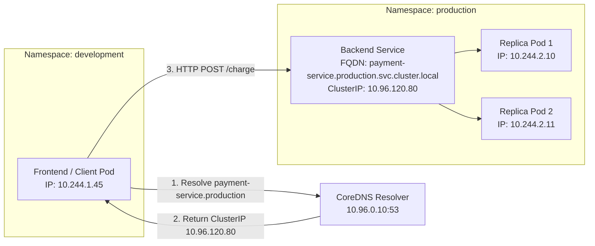

# Task 3: Kubernetes Fully Qualified Domain Name (FQDN)

**Course:** SST DevOps & Cloud [SWE]  
**Session:** 11 - Kubernetes Networking & Services  
**Author:** Neerasa Veda Varshit (`24bcs10005`)  
**Repository:** `NEERASA-VEDA-VARSHIT/Devops` / `session-11-kubernetes-services/fqdn`

---

## 1. What is an FQDN?

An **FQDN (Fully Qualified Domain Name)** is the complete, unambiguous domain name that specifies the exact location of a host or service within the Domain Name System (DNS) hierarchy. It leaves no room for ambiguity because it specifies all domain levels from the hostname up to the top-level domain (TLD).

### The Real-World Analogy:
- **Short Name:** Calling your teammate *"Rahul"* inside the same office room. Everyone in the room knows exactly who you mean.
- **FQDN:** Sending mail through the postal service addressed to:  
  `Rahul Sharma, Department of Engineering, ZeroBook Tower, Bangalore, Karnataka, India`  
  Because the complete hierarchical path is written, postal workers anywhere in the world can deliver the mail without confusion.

In Kubernetes:
- When two Pods reside in the **same namespace**, they can address each other using just the short service name (e.g., `backend`).
- When a Pod needs to talk across **different namespaces** or from outside the cluster, it uses the full **FQDN**.

---

## 2. Kubernetes Service DNS Architecture & Naming Convention

Every Service created inside a Kubernetes cluster is automatically registered with the cluster's internal DNS server (CoreDNS). Kubernetes adheres to a strict RFC 1123-compliant naming schema:

```text
┌─────────────────────────────────────────────────────────────────────────────┐
│                          KUBERNETES SERVICE FQDN                            │
│                                                                             │
│     payment-service  .    production    .    svc    .    cluster.local      │
│     └──────┬──────┘       └─────┬────┘      └──┬──┘      └──────┬──────┘    │
│            │                    │              │                │           │
│       Service Name          Namespace      Resource      Cluster Domain     │
│       (metadata.name)                      Indicator                        │
└─────────────────────────────────────────────────────────────────────────────┘
```

### Breakdown of Segments:

1. **Service Name (`<service-name>`):**  
   The identifier given to the Service object in `metadata.name` (e.g., `payment-service`, `auth-api`, `postgres-db`).
2. **Namespace (`<namespace>`):**  
   The logical partition where the Service object is deployed (e.g., `default`, `production`, `staging`, `kube-system`).
3. **Resource Indicator (`svc`):**  
   Identifies this DNS record as a Kubernetes Service (distinguishing it from Pod records, which use `pod`).
4. **Cluster Base Domain (`cluster.local`):**  
   The root domain configured for the cluster network (defaults to `cluster.local` in Minikube, kubeadm, and cloud providers like EKS and GKE).

---

## 3. How Pods Communicate Using FQDN Across Namespaces

### The `/etc/resolv.conf` Search Path Mechanism

Every container running in a Kubernetes Pod has an auto-injected `/etc/resolv.conf` file containing search domains:

```ini
nameserver 10.96.0.10
search production.svc.cluster.local svc.cluster.local cluster.local
options ndots:5
```

When a container makes a network call:
1. **Same Namespace Communication:**  
   Pod in `production` runs:
   ```bash
   curl http://backend:8080
   ```
   The resolver consults `/etc/resolv.conf` and appends `production.svc.cluster.local`. The resulting query matches `backend.production.svc.cluster.local`, resolving directly to the backend Service's virtual ClusterIP.

2. **Cross-Namespace Communication (Different Namespaces):**  
   A test runner or frontend Pod deployed in the `development` namespace wants to query the `payment-service` deployed in `production`.
   
   - If the container executes `curl http://payment-service`, the resolver searches `payment-service.development.svc.cluster.local` and fails with `NXDOMAIN (Non-Existent Domain)`.
   - **Resolution:** The application must specify the namespace:
     ```bash
     # Format A: Service + Namespace (Shortened Cross-Namespace FQDN)
     curl http://payment-service.production:8080/api/v1/charge

     # Format B: Fully Qualified Domain Name (Complete, Unambiguous FQDN)
     curl http://payment-service.production.svc.cluster.local:8080/api/v1/charge
     ```

---

## 4. Practical Cross-Namespace Examples

### Architecture Diagram



### Manifest Example: Cross-Namespace Communication

#### 1. Backend Service in `production` Namespace:
```yaml
apiVersion: v1
kind: Namespace
metadata:
  name: production
---
apiVersion: v1
kind: Service
metadata:
  name: payment-service
  namespace: production
spec:
  type: ClusterIP
  ports:
    - port: 8080
      targetPort: 8080
  selector:
    app: payment-api
```

#### 2. Frontend Deployment in `development` Namespace:
```yaml
apiVersion: v1
kind: Namespace
metadata:
  name: development
---
apiVersion: apps/v1
kind: Deployment
metadata:
  name: frontend-app
  namespace: development
spec:
  replicas: 1
  selector:
    matchLabels:
      app: frontend
  template:
    metadata:
      labels:
        app: frontend
    spec:
      containers:
        - name: web
          image: curlimages/curl:latest
          command: ["/bin/sh", "-c"]
          args:
            - |
              while true; do
                echo "Querying payment service via cross-namespace FQDN..."
                curl -s http://payment-service.production.svc.cluster.local:8080/health
                sleep 5
              done
```

---

## 5. Pod FQDNs vs Service FQDNs

In addition to Services, individual Pods can also possess FQDN records under specific conditions:

| Object Type | FQDN Schema | Use Case |
| :--- | :--- | :--- |
| **ClusterIP Service** | `<service>.<ns>.svc.cluster.local` | Standard load-balanced virtual IP for microservices. |
| **Headless Service** | `<service>.<ns>.svc.cluster.local` | Returns direct IPs of all backing Pods (no virtual ClusterIP). |
| **StatefulSet Pod** | `<pod-name>.<service>.<ns>.svc.cluster.local` | Persistent identity for clustered databases (Kafka, ZooKeeper, MongoDB). Example: `kafka-0.kafka-svc.prod.svc.cluster.local`. |
| **Ordinary Pod (Default)** | `<pod-ip-with-dashes>.<ns>.pod.cluster.local` | Ephemeral Pod IP lookup (e.g., `10-244-1-5.default.pod.cluster.local`). |

---

## 6. Verifying FQDN with `nslookup` inside the Cluster

To test FQDN resolution directly from a terminal:

```bash
# Run a temporary diagnostic container
kubectl run dns-test --rm -it --image=busybox:1.28 -- restart=Never -- sh

# Inside the test pod:
/ # nslookup payment-service.production.svc.cluster.local
Server:    10.96.0.10
Address 1: 10.96.0.10 kube-dns.kube-system.svc.cluster.local

Name:      payment-service.production.svc.cluster.local
Address 1: 10.96.120.80 payment-service.production.svc.cluster.local
```

### Key Takeaways
1. FQDN removes any ambiguity across cluster namespaces and multi-cluster networks.
2. The format is consistently `<service>.<namespace>.svc.cluster.local`.
3. Microservices should utilize namespace-qualified or full FQDN names when communicating across environment boundaries.
