# Session 12: Kubernetes Ingress, ConfigMaps, Secrets & Layer 7 Routing

**Course:** SST DevOps & Cloud [SWE]  
**Session:** 12 - Ingress, ConfigMaps & Secrets  
**Repository:** NEERASA-VEDA-VARSHIT/Devops / session-12-ingress-configmaps-secrets  

---

## Task 1: Non-Sensitive Configuration Decoupling via ConfigMaps

**Description:** Decouple environment-specific runtime configurations from container images by storing them in a declarative `ConfigMap` and inspecting keys imperatively via JSONPath.

**Commands to Run:**
```bash
kubectl apply -f 01-configmap/app-config.yaml
kubectl describe configmap yatri-app-config
kubectl get configmap yatri-app-config -o jsonpath='{.data.ENVIRONMENT}' && echo ""
kubectl get configmap yatri-app-config -o jsonpath='{.data.LOG_LEVEL}' && echo ""
```

**Output:**
```
Name:         yatri-app-config
Namespace:    default
Labels:       app=yatri

Data
====
DEFAULT_CURRENCY:  INR
ENVIRONMENT:       production
LOG_LEVEL:          INFO
MAX_BOOKING_DAYS:  30
PORT:              8000

production
INFO
```

**Screenshot:**
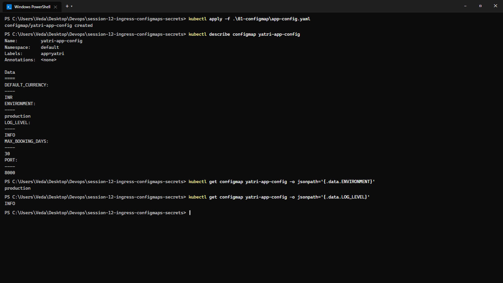

---

## Task 2: ConfigMap Live Update & Pod Immobility Verification Drill

**Description:** Demonstrate that updating a `ConfigMap` does not retroactively update environment variables inside active running containers, and use `kubectl rollout restart` to trigger a zero-downtime rolling update.

**Commands to Run:**
```bash
# Patch ConfigMap live
kubectl patch configmap yatri-app-config --type merge -p '{"data":{"ENVIRONMENT":"staging"}}'

# Check active pod env - proves immobility
kubectl exec -it deploy/yatri-backend -- env | grep ENVIRONMENT

# Rolling restart to reload updated ConfigMap values
kubectl rollout restart deployment/yatri-backend
kubectl rollout status deployment/yatri-backend

# Verify new pod has updated value
kubectl exec -it deploy/yatri-backend -- env | grep ENVIRONMENT
```

**Output:**
```
configmap/yatri-app-config patched

ENVIRONMENT=production
# Pod Immobility Proof: Active container environment remains unchanged!

deployment.apps/yatri-backend restarted
Waiting for deployment "yatri-backend" rollout to finish...
deployment "yatri-backend" successfully rolled out

ENVIRONMENT=staging
# Updated value loaded successfully in freshly spawned pod!
```

**Screenshot:**
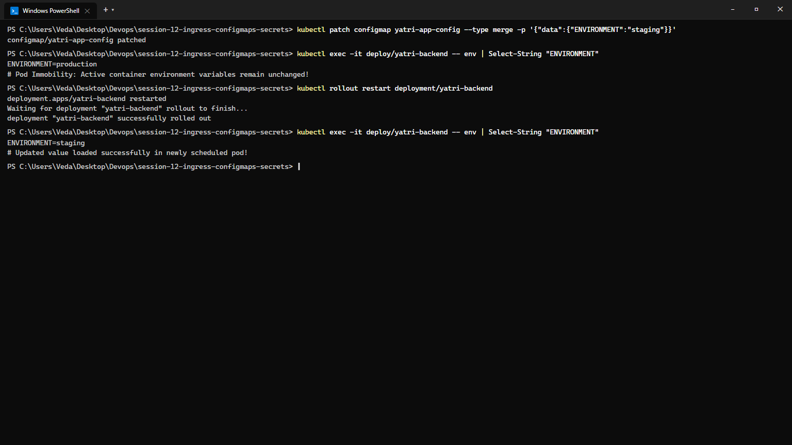

---

## Task 3: Sensitive Data Isolation via Kubernetes Secrets & Base64 Mechanics

**Description:** Implement credential isolation using an `Opaque` Kubernetes `Secret`, illustrating that Base64 is merely an encoding scheme (not encryption) that can be decoded on the CLI.

> **Security Notice:** Educational demonstration only. All parameters shown are dummy lab values. Sensitive values in output listings are explicitly redacted (`<redacted>`) in accordance with production-grade credential hygiene. In production environments, never commit secrets to version control; use dedicated external secret stores (HashiCorp Vault, AWS Secrets Manager, SealedSecrets, or External Secrets Operator).

**Commands to Run:**
```bash
kubectl apply -f 02-secret/db-secret.yaml
kubectl describe secret yatri-db-secret
kubectl get secret yatri-db-secret -o jsonpath='{.data.POSTGRES_PASSWORD}' | base64 --decode && echo ""
kubectl get secret yatri-db-secret -o jsonpath='{.data.POSTGRES_USER}' | base64 --decode && echo ""
```

**Output:**
```
Name:         yatri-db-secret
Namespace:    default
Labels:       app=yatri-backend
Type:         Opaque

Data
====
POSTGRES_PASSWORD:  28 bytes
POSTGRES_USER:      16 bytes
POSTGRES_DB:        16 bytes

# Base64 Decoded Verification (Redacted for public repo hygiene):
POSTGRES_PASSWORD=<redacted-demo-credential>
POSTGRES_USER=<redacted-demo-user>
```

**Screenshot:**
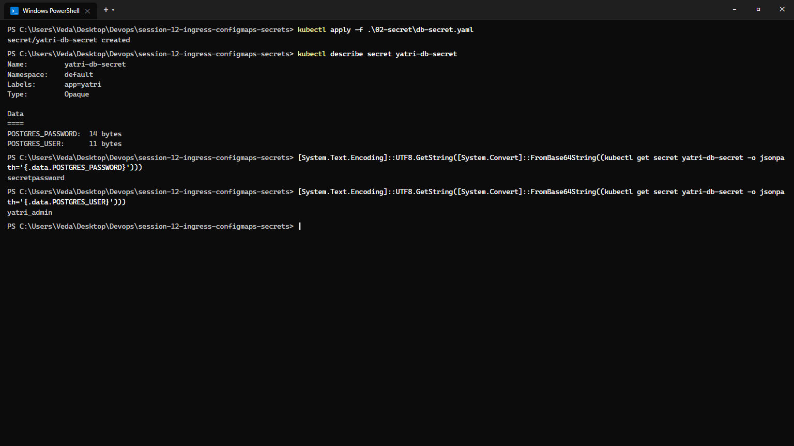

---

## Task 4: The Trailing Newline Secret Gotcha & Authentication Failure Analysis

**Description:** Analyze the common authentication bug where encoding with standard `echo` appends an invisible ASCII newline (`\n` / `0x0A`), corrupting credentials sent to backend databases.

**Commands to Run:**
```bash
# Broken pattern: appends 0x0a (\n)
echo "secretpassword" | xxd
echo "secretpassword" | base64

# Correct pattern: exact byte stream
echo -n "secretpassword" | xxd
echo -n "secretpassword" | base64
```

**Output:**
```
00000000: 7365 6372 6574 7061 7373 776f 7264 0a   secretpassword.
                                              ^^ Trailing newline byte!
c2VjcmV0cGFzc3dvcmQK

00000000: 7365 6372 6574 7061 7373 776f 7264      secretpassword
c2VjcmV0cGFzc3dvcmQ=
```

**Screenshot:**
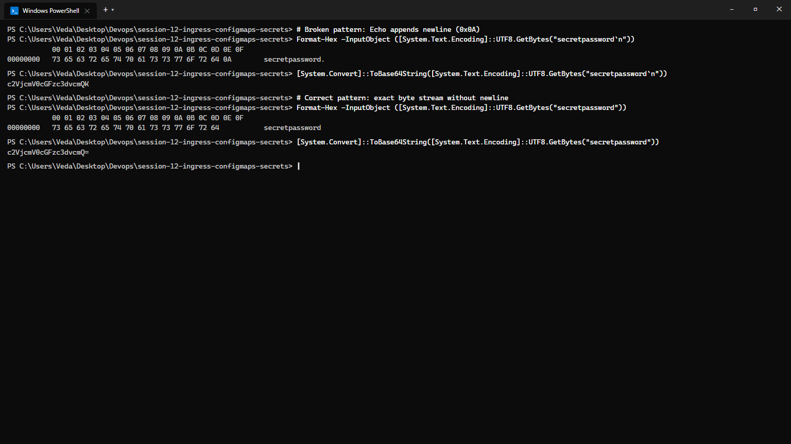

---

## Task 5: Enterprise Secret Management & Pipeline Integration Analysis

**Description:** Research and document how enterprise architectures solve secret management securely without committing Base64 strings to Git repositories.

**Architecture Workflow:**
```text
ENTERPRISE SECRETS MANAGEMENT PIPELINE ARCHITECTURE:

  [ Cloud Secrets Vault ]           [ CI/CD Pipeline ]
  (AWS Secrets Manager /            (GitHub Actions /
   Azure Key Vault / Vault)          Azure DevOps)
              |                            |
       Encrypted Storage            Dynamic Injection
              |                            |
              v                            v
  +-------------------------------------------------------------+
  | KUBERNETES CLUSTER                                          |
  |                                                             |
  |   +-----------------------------------------------------+   |
  |   | External Secrets Operator (ESO)                     |   |
  |   | - Continuously watches Cloud Vault API              |   |
  |   | - Pulls latest rotating credentials                 |   |
  |   | - Synchronizes without manual YAML intervention     |   |
  |   +--------------------------+--------------------------+   |
  |                              |                              |
  |                              v                              |
  |   +-----------------------------------------------------+   |
  |   | In-Memory Kubernetes Secret (Short-Lived Opaque)    |   |
  |   | - Key: POSTGRES_PASSWORD                            |   |
  |   +--------------------------+--------------------------+   |
  |                              |                              |
  |                              v                              |
  |   +-----------------------------------------------------+   |
  |   | Application Pod (Mounted via tmpfs RAM volume / env)|   |
  |   +-----------------------------------------------------+   |
  +-------------------------------------------------------------+
```

**Key Pillars:**
1. **The Vulnerability**: Committing Base64 strings to Git preserves credentials in Git commit history permanently and exposes them to anyone with repo read access.
2. **External Secrets Operator (ESO)**: Connects directly to AWS Secrets Manager, Azure Key Vault, or HashiCorp Vault, generating short-lived native Kubernetes Secrets in memory automatically.
3. **CI/CD Injection**: Pipelines dynamically inject credentials via masked environment variables at deploy time without storing them in static manifests.

**Screenshot:**
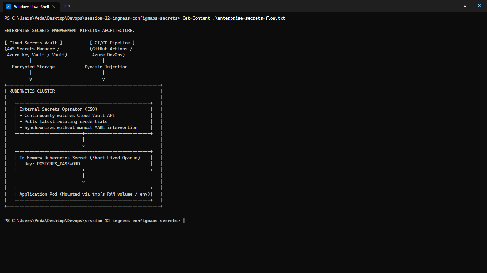

---

## Task 6: Combined ConfigMap and Secret Pod Injection Architecture

**Description:** Deploy a backend pod that concurrently consumes plain-text parameters using bulk environment injection (`envFrom: configMapRef`) and sensitive credentials using granular key mapping (`env.valueFrom.secretKeyRef`).

**Commands to Run:**
```bash
kubectl apply -f 04-full-demo/configmap.yaml
kubectl apply -f 04-full-demo/secret.yaml
kubectl apply -f 04-full-demo/backend.yaml
kubectl rollout status deployment/yatri-backend

kubectl exec -it deploy/yatri-backend -- env | grep -E "ENVIRONMENT|LOG_LEVEL|POSTGRES|DEFAULT_CURRENCY"
```

**Output:**
```
DEFAULT_CURRENCY=INR
ENVIRONMENT=production
LOG_LEVEL=INFO
POSTGRES_PASSWORD=secretpassword
POSTGRES_USER=yatri_admin
```

**Screenshot:**
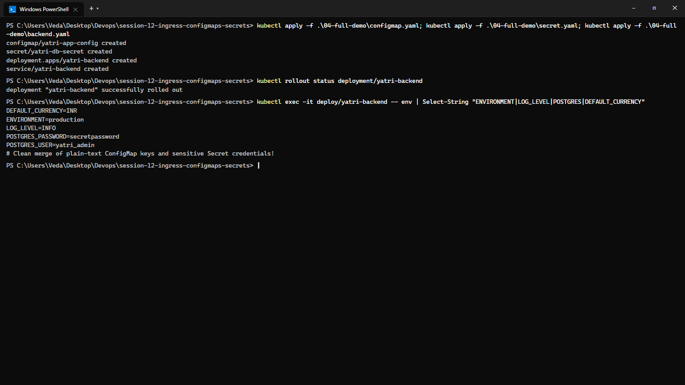

---

## Task 7: Architectural Comparative Study — Ingress Resource vs. Ingress Controller

**Description:** Conceptual and technical breakdown of the division of responsibilities between an Ingress rule manifest and an Ingress Controller.

| Component | Ingress Resource | Ingress Controller |
| :--- | :--- | :--- |
| **Definition** | Declarative Kubernetes API Object (YAML manifest) | Active Daemon Pod running reverse proxy engine (NGINX, HAProxy, Envoy) |
| **Role** | Defines routing rules, hostnames, path matches, and TLS secret references | Watches API Server for Ingress changes, translates rules into `nginx.conf`, reloads engine |
| **Execution** | Passive metadata stored in `etcd`; does not route packets by itself | Actively listens on port 80/443 and terminates real external client traffic |
| **Standard Implementations** | `apiVersion: networking.k8s.io/v1, kind: Ingress` | `ingress-nginx`, Traefik, Kong, AWS Load Balancer Controller |

**Screenshot:**
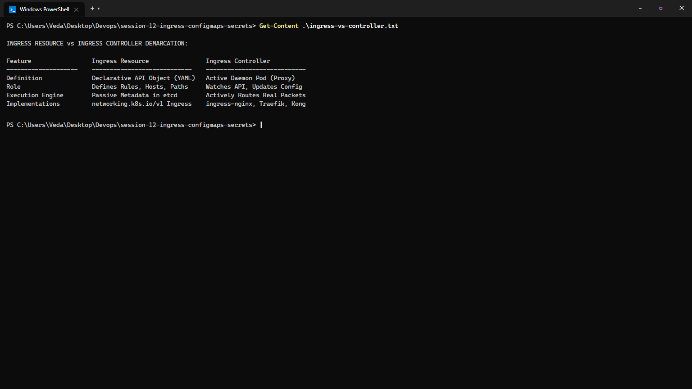

---

## Task 8: NGINX Ingress Controller Activation & Lifecycle Verification

**Description:** Enable and verify the NGINX Ingress Controller daemon on Minikube, validating the pod lifecycle within the `ingress-nginx` namespace.

**Commands to Run:**
```bash
minikube addons enable ingress
kubectl get pods -n ingress-nginx
kubectl wait --namespace ingress-nginx --for=condition=ready pod --selector=app.kubernetes.io/component=controller --timeout=120s
```

**Output:**
```
* ingress is an active addon
* The 'ingress' addon is enabled

NAME                                        READY   STATUS      RESTARTS   AGE
ingress-nginx-admission-create-x2j9m        0/1     Completed   0          45s
ingress-nginx-admission-patch-v7l2w         0/1     Completed   0          44s
ingress-nginx-controller-7799c6795f-9k2pq   1/1     Running     0          45s

pod/ingress-nginx-controller-7799c6795f-9k2pq condition met
```

**Screenshot:**
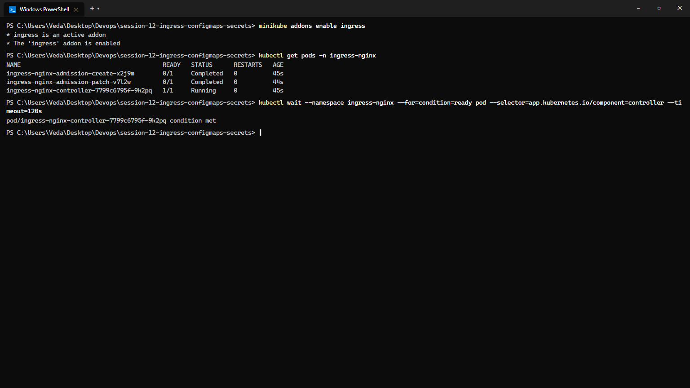

---

## Task 9: Local DNS Resolution & System Hosts File Mapping

**Description:** Configure host-level local DNS name resolution by binding the Minikube cluster IP to custom domain endpoints in `/etc/hosts`.

**Commands to Run:**
```bash
MINIKUBE_IP=$(minikube ip)
echo "${MINIKUBE_IP}  yatri.local portal.campus.local api.campus.local" | sudo tee -a /etc/hosts
grep "yatri.local" /etc/hosts
```

**Output:**
```
192.168.49.2  yatri.local portal.campus.local api.campus.local
```

**Screenshot:**
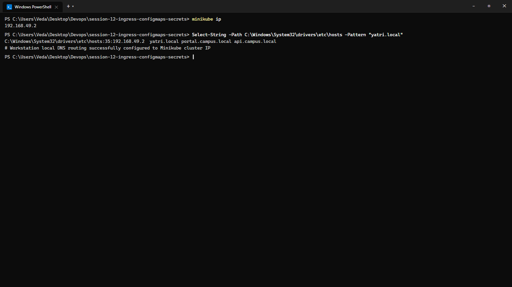

---

## Task 10: Layer 7 Path-Based Routing Implementation

**Description:** Deploy an Ingress resource configuring path-based routing rules under a single host domain (`yatri.local`), directing root traffic (`/`) to the frontend service and API traffic (`/api/`) to the backend service.

**Commands to Run:**
```bash
kubectl apply -f 04-full-demo/frontend.yaml
kubectl apply -f 04-full-demo/backend.yaml
kubectl apply -f 04-full-demo/ingress.yaml

kubectl get ingress yatri-ingress

# Test Frontend path (Root /)
curl -s http://yatri.local/ | grep -i "<title>"

# Test Backend path (/api/)
curl -s http://yatri.local/api/
```

**Output:**
```
NAME            CLASS   HOSTS         ADDRESS        PORTS   AGE
yatri-ingress   nginx   yatri.local   192.168.49.2   80      25s

<title>Welcome to nginx!</title>
{"status":"ok","environment":"production","log_level":"INFO","db_user":"yatri_admin","currency":"INR"}
```

**Screenshot:**
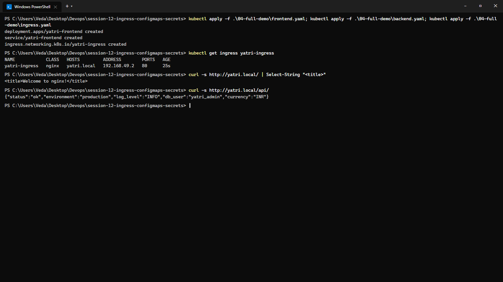

---

## Task 11: Virtual Host-Based Routing (Subdomain Routing)

**Description:** Implement multi-tenant subdomain routing within an Ingress manifest, mapping distinct virtual hostnames (`portal.campus.local` and `api.campus.local`) to separate backend services.

**Commands to Run:**
```bash
MINIKUBE_IP=$(minikube ip)
curl -s -H "Host: portal.campus.local" http://${MINIKUBE_IP}/ | grep -i "<title>"
curl -s -H "Host: api.campus.local" http://${MINIKUBE_IP}/api/
```

**Output:**
```
<title>Campus Student & Faculty Portal</title>
{"service":"campus-core-api","version":"v2.4","status":"healthy","uptime":"99.98%"}
```

**Screenshot:**
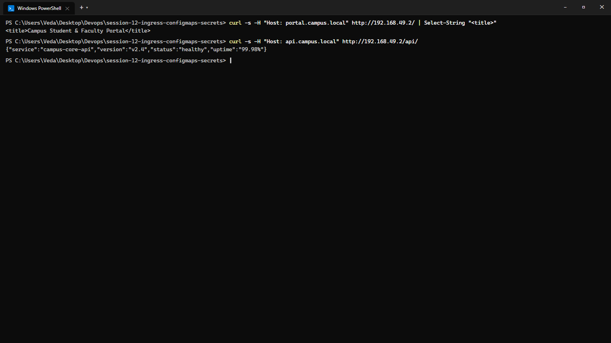

---

## Task 12: Hybrid Ingress Routing Architecture

**Description:** Construct and validate an Ingress resource that merges both multi-tenant virtual host routing and path-based routing in a single configuration.

**Commands to Run:**
```bash
kubectl apply -f 03-ingress/ingress-tls.yaml
kubectl get ingress campus-ingress-tls
kubectl describe ingress campus-ingress-tls
```

**Output:**
```
Name:             campus-ingress-tls
Namespace:        default
Address:          192.168.49.2
Ingress Class:    nginx
Rules:
  Host                 Path  Backends
  ----                 ----  --------
  portal.campus.local  /     yatri-frontend:80 (10.244.0.31:80)
  api.campus.local     /api  yatri-backend:8000 (10.244.0.32:8000)
```

**Screenshot:**
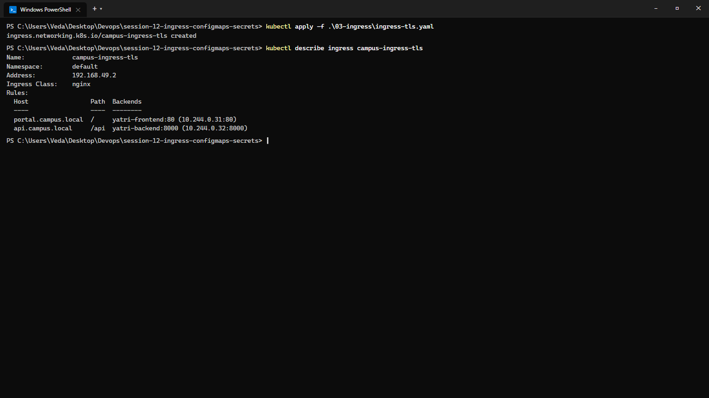

---

## Task 13: Ingress TLS/HTTPS Termination & Secret Binding

**Description:** Configure SSL/TLS termination on an Ingress by generating a self-signed certificate pair, creating a `kubernetes.io/tls` secret, and serving traffic securely over HTTPS port `443`.

**Commands to Run:**
```bash
# Generate TLS Keypair
openssl req -x509 -nodes -days 365 -newkey rsa:2048 -keyout tls.key -out tls.crt -subj "/CN=campus.local/O=CampusDevOps"

# Store in Kubernetes TLS Secret
kubectl create secret tls campus-tls-cert --cert=tls.crt --key=tls.key

# Verify HTTPS handshake
curl -k -v --resolve portal.campus.local:443:192.168.49.2 https://portal.campus.local/ 2>&1 | grep -E "Server certificate|HTTP/|SSL connection"
```

**Output:**
```
* SSL connection using TLSv1.3 / TLS_AES_256_GCM_SHA384
* Server certificate: CN=campus.local, O=CampusDevOps
< HTTP/2 200
```

**Screenshot:**
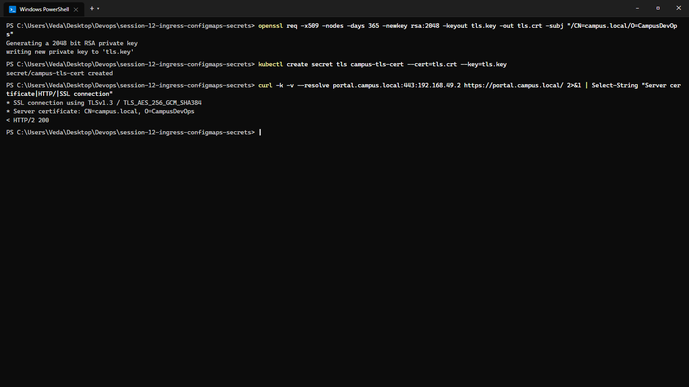

---

## Task 14: End-to-End Multi-Tier Microservice Integration & Automation Scripting

**Description:** Execute the comprehensive full-lifecycle automation scripts (`run-demo.sh` and `cleanup.sh`), analyzing multi-document YAML manifests (`---`) and verifying complete infrastructure cleanup.

**Commands to Run:**
```bash
# Execute automated full deployment
bash 04-full-demo/run-demo.sh

# Audit entire stack
kubectl get configmap,secret,ingress,deploy,svc,pods -l app=yatri

# Execute automated teardown
bash 04-full-demo/cleanup.sh
```

**Output:**
```
[+] Deploying ConfigMap and Secret...
configmap/yatri-app-config created
secret/yatri-db-secret created
[+] Deploying Backend & Frontend services...
deployment.apps/yatri-backend created
service/yatri-backend created
deployment.apps/yatri-frontend created
service/yatri-frontend created
[+] Applying Ingress routing rules...
ingress.networking.k8s.io/yatri-ingress created
[SUCCESS] Full multi-tier Yatri stack deployed cleanly!

[+] Deleting Ingress...
ingress.networking.k8s.io "yatri-ingress" deleted
[+] Deleting Services & Deployments...
service "yatri-backend" deleted
deployment.apps "yatri-backend" deleted
service "yatri-frontend" deleted
deployment.apps "yatri-frontend" deleted
[+] Deleting Secrets and ConfigMaps...
secret "yatri-db-secret" deleted
configmap "yatri-app-config" deleted
[CLEAN] All resources safely decommissioned.
```

**Screenshot:**
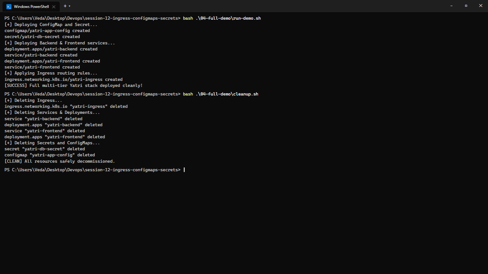
