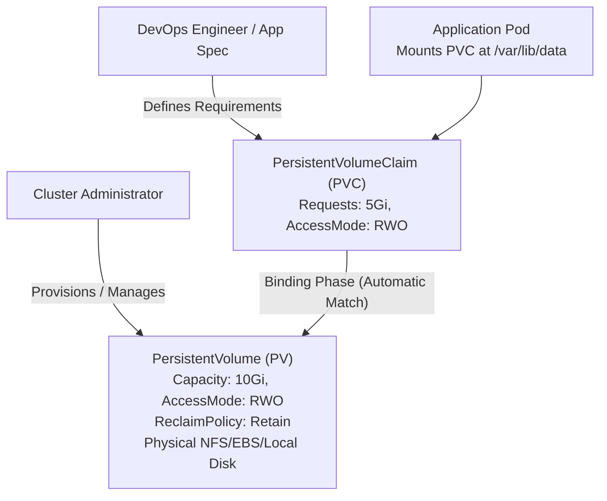

# Task 1: Kubernetes Volumes & Persistent Storage Architecture

**Course:** SST DevOps & Cloud [SWE]  
**Session:** 13 - Kubernetes Storage, HPA & Probes  
**Author:** Neerasa Veda Varshit (`24bcs10005`)  
**Repository:** `NEERASA-VEDA-VARSHIT/Devops` / `session-13-storage-hpa-probes/01-kubernetes-volumes`

---

## 1. Introduction: Why Do We Need Kubernetes Volumes?

Containers inside Kubernetes Pods are ephemeral by default. When a container crashes or restarts:
- Its root filesystem is wiped back to the state defined in its container image.
- Any local logs, user uploads, cache, or database records written to disk are destroyed.
- Multiple containers inside the same Pod cannot share files without a shared storage medium.

A **Kubernetes Volume** solves this by decoupling storage lifecycle from individual container lifecycles, allowing data to persist across container crashes and providing mechanisms for cluster-wide persistent storage.

---

## 2. Core Volume Types & Comparisons

### A. `emptyDir` Volume
An `emptyDir` volume is initially empty and is created when a Pod is assigned to a node.
- **Lifecycle:** Bound strictly to the lifecycle of the **Pod**. If the container inside the Pod crashes, the data in `emptyDir` survives. However, if the Pod is deleted or evicted, the `emptyDir` data is permanently erased.
- **Backing Storage:** Node disk (or RAM if `medium: Memory` is specified).
- **Use Cases:** Scratch space, sorting algorithms, temporary disk caching, or sharing files between containers in a multi-container Pod (e.g., sidecar pattern).

#### Manifest Example (`emptydir-pod.yaml`):
```yaml
apiVersion: v1
kind: Pod
metadata:
  name: emptydir-demo
spec:
  containers:
    - name: writer
      image: busybox
      command: ["/bin/sh", "-c", "while true; do echo $(date) >> /shared-data/log.txt; sleep 5; done"]
      volumeMounts:
        - name: temp-storage
          mountPath: /shared-data
    - name: reader
      image: busybox
      command: ["/bin/sh", "-c", "sleep 2; while true; do tail -n 1 /shared-data/log.txt; sleep 5; done"]
      volumeMounts:
        - name: temp-storage
          mountPath: /shared-data
  volumes:
    - name: temp-storage
      emptyDir: {}
```

---

### B. `hostPath` Volume
A `hostPath` volume mounts a file or directory from the host worker node's filesystem directly into the Pod.
- **Lifecycle:** Survives container restarts and Pod deletions because data lives on the underlying node filesystem.
- **Limitations:** Data is tied to that specific node. If the Pod is rescheduled to another worker node, it cannot access the data from the previous node.
- **Use Cases:** Node-level monitoring agents (Prometheus node-exporter mounting `/sys` or `/proc`), container log collectors (Fluentd mounting `/var/log/pods`), and Docker-in-Docker daemons mounting `/var/run/docker.sock`.

#### Manifest Example (`hostpath-pod.yaml`):
```yaml
apiVersion: v1
kind: Pod
metadata:
  name: hostpath-demo
spec:
  containers:
    - name: app
      image: nginx:alpine
      volumeMounts:
        - name: host-logs
          mountPath: /var/log/nginx
  volumes:
    - name: host-logs
      hostPath:
        path: /data/nginx-logs
        type: DirectoryOrCreate
```

---

## 3. Persistent Volumes (PV) & Persistent Volume Claims (PVC)

To enable true decoupled storage across arbitrary worker nodes in production, Kubernetes separates storage administration from developer consumption:



### Concepts:
1. **PersistentVolume (PV):**  
   A piece of storage in the cluster provisioned by an administrator or dynamically provisioned using Storage Classes. It is a cluster-level resource (independent of any single namespace).
2. **PersistentVolumeClaim (PVC):**  
   A request for storage by a user/developer. It specifies the desired size and access modes. PVCs are namespaced objects.

---

## 4. Lifecycle of PV and PVC

The interaction between PVs and PVCs follows four distinct phases:

1. **Provisioning:**
   - *Static Provisioning:* Cluster administrator creates PVs manually ahead of time.
   - *Dynamic Provisioning:* A StorageClass provisions physical storage automatically on-demand when a PVC is applied.
2. **Binding:**  
   The control plane watches for new PVCs, matches them with an appropriate available PV (evaluating capacity, access modes, storage class, and selectors), and binds them exclusively (1-to-1 relationship). The PVC status transitions to `Bound`.
3. **Using:**  
   A Pod mounts the PVC as a volume. The cluster mounts the underlying physical storage to the Pod's containers.
4. **Reclaiming:**  
   When the user deletes the PVC, the PV is released and the cluster applies the configured **Reclaim Policy**.

---

## 5. Reclaim Policies

The Reclaim Policy defines what happens to the underlying storage volume when its associated PVC is deleted:

| Reclaim Policy | Behavior | Production Recommendation |
| :--- | :--- | :--- |
| **`Retain`** | The PV persists and enters `Released` status. The data remains intact on physical disk, but cannot yet be bound to another PVC until manual admin scrub. | **Recommended for critical databases** (PostgreSQL, MySQL, Kafka) to prevent accidental data loss. |
| **`Delete`** | The PV and the underlying external cloud storage asset (e.g., AWS EBS volume, GCE PD) are automatically deleted immediately. | **Default for dynamic cloud provisioning** (StorageClasses) where volumes are ephemeral/stateless. |
| **`Recycle`** | Performs basic scrub (`rm -rf /volume/*`) and makes the PV available for a new claim. *(Deprecated in modern Kubernetes; dynamic provisioning is preferred).* | Deprecated. |

---

## 6. Access Modes

Volume plugins support different access modes describing how nodes may mount the volume:

| Access Mode | CLI Abbreviation | Meaning | Typical Storage Providers |
| :--- | :--- | :--- | :--- |
| **ReadWriteOnce** | `RWO` | Volume can be mounted as read-write by a **single node** only. | AWS EBS, Google Persistent Disk, Azure Disk, Minikube hostpath. |
| **ReadOnlyMany** | `ROX` | Volume can be mounted as read-only by **many nodes** concurrently. | NFS, AWS EFS, Google Cloud Filestore, CephFS. |
| **ReadWriteMany** | `RWX` | Volume can be mounted as read-write by **many nodes** simultaneously. | Network File Systems (NFS), AWS EFS, Azure Files, GlusterFS. |
| **ReadWriteOncePod** | `RWOP` | Volume can be mounted as read-write by a **single Pod** across the entire cluster (K8s 1.22+). | CSI-supported block drivers for strict single-writer safety. |

---

## 7. StorageClass & Dynamic Volume Provisioning

In modern cloud environments, administrators do not manually create hundreds of static PVs. Instead, they define a **StorageClass**:

- **Dynamic Provisioning:** When a developer submits a PVC referencing a `storageClassName`, Kubernetes automatically calls the underlying Container Storage Interface (CSI) driver to allocate storage in AWS/GCP/Azure/Minikube, creates a matching PV, and binds it instantly.

#### StorageClass Manifest (`storageclass.yaml`):
```yaml
apiVersion: storage.k8s.io/v1
kind: StorageClass
metadata:
  name: fast-ssd
provisioner: kubernetes.io/aws-ebs
parameters:
  type: gp3
  iops: "3000"
reclaimPolicy: Delete
volumeBindingMode: WaitForFirstConsumer
```

#### Dynamic PVC Manifest (`pvc.yaml`):
```yaml
apiVersion: v1
kind: PersistentVolumeClaim
metadata:
  name: app-dynamic-pvc
spec:
  accessModes:
    - ReadWriteOnce
  storageClassName: fast-ssd
  resources:
    requests:
      storage: 10Gi
```

---

## 8. Static PV & PVC Implementation Walkthrough

### 1. PersistentVolume Manifest (`pv.yaml`):
```yaml
apiVersion: v1
kind: PersistentVolume
metadata:
  name: local-pv
  labels:
    type: local
spec:
  storageClassName: manual
  capacity:
    storage: 2Gi
  accessModes:
    - ReadWriteOnce
  persistentVolumeReclaimPolicy: Retain
  hostPath:
    path: /mnt/data
```

### 2. PersistentVolumeClaim Manifest (`pvc.yaml`):
```yaml
apiVersion: v1
kind: PersistentVolumeClaim
metadata:
  name: local-pvc
spec:
  storageClassName: manual
  accessModes:
    - ReadWriteOnce
  resources:
    requests:
      storage: 1Gi
```

### 3. Application Pod Mounting Claim (`pod.yaml`):
```yaml
apiVersion: v1
kind: Pod
metadata:
  name: storage-consumer-pod
spec:
  containers:
    - name: web
      image: nginx:alpine
      volumeMounts:
        - name: storage-volume
          mountPath: /usr/share/nginx/html
  volumes:
    - name: storage-volume
      persistentVolumeClaim:
        claimName: local-pvc
```

### Verification Commands & Output:
```bash
kubectl apply -f pv.yaml
kubectl apply -f pvc.yaml
kubectl apply -f pod.yaml

kubectl get pv
kubectl get pvc
kubectl get pods
```

```text
NAME       CAPACITY   ACCESS MODES   RECLAIM POLICY   STATUS   CLAIM               STORAGECLASS   AGE
local-pv   2Gi        RWO            Retain           Bound    default/local-pvc   manual         12s

NAME        STATUS   VOLUME     CAPACITY   ACCESS MODES   STORAGECLASS   AGE
local-pvc   Bound    local-pv   2Gi        RWO            manual         8s

NAME                   READY   STATUS    RESTARTS   AGE
storage-consumer-pod   1/1     Running   0          4s
```

---

## Summary Matrix

| Storage Mechanism | Scope | Persistence Level | Multi-Container Support | Typical Use Case |
| :--- | :--- | :--- | :--- | :--- |
| **`emptyDir`** | Pod-level | Erased on Pod death; survives container crash | Yes (shared within Pod) | Scratch buffers, sidecar file sharing |
| **`hostPath`** | Node-level | Survives Pod death; bound to single host node | Yes (on same node) | Node agents, log extractors |
| **Static PV / PVC** | Cluster-level | Persists independently of Pod and Node | Yes | Databases, stateful apps on on-premise clusters |
| **Dynamic StorageClass** | Cloud-native | Automated provisioning with on-demand lifecycle | Yes | Production cloud workloads (EKS, GKE, AKS) |
