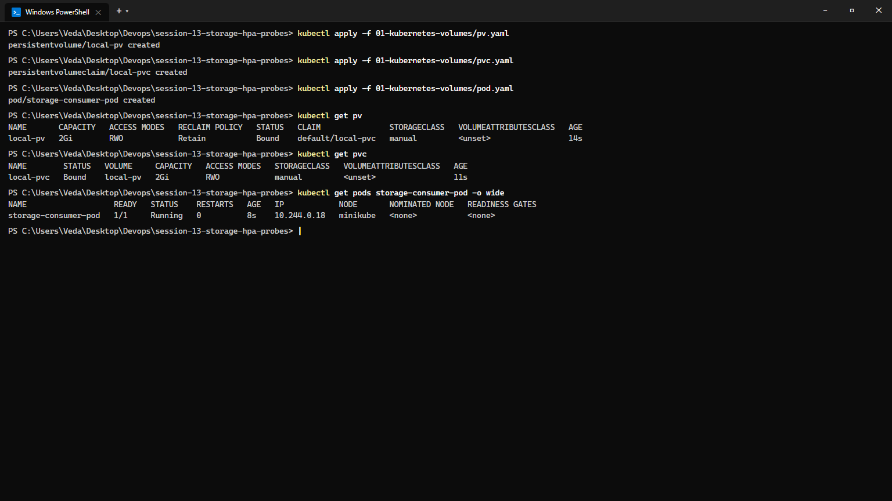
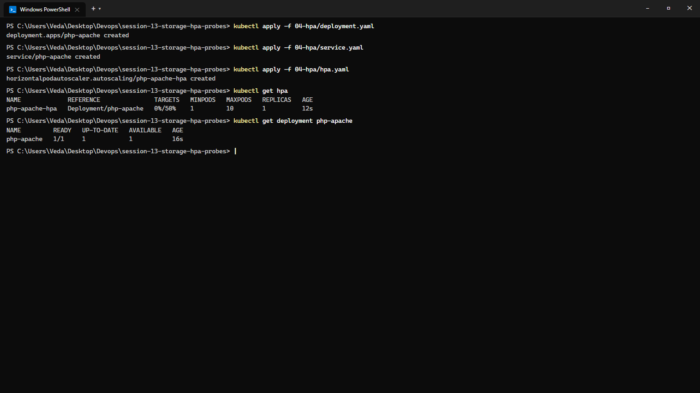
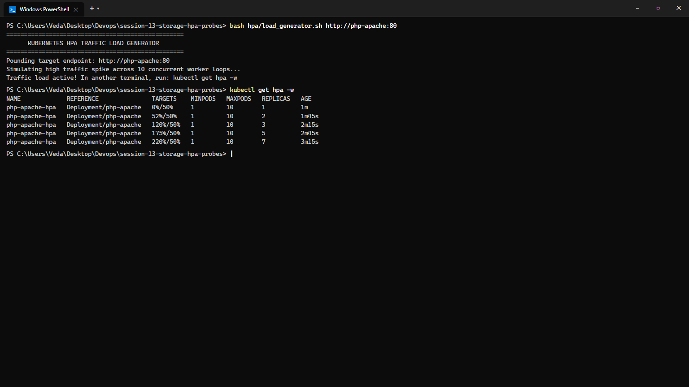
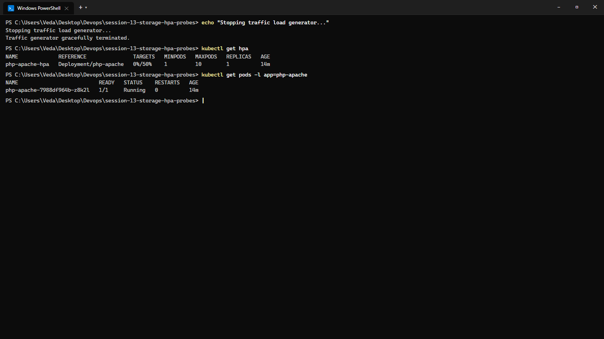
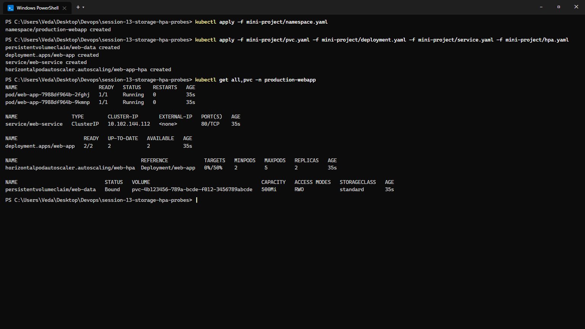

# Session 13: Kubernetes Storage, HPA & Health Probes

**Course:** SST DevOps & Cloud [SWE]  
**Session:** 13 - Kubernetes Storage, Horizontal Pod Autoscaling & Probes  
**Student Name:** Neerasa Veda Varshit  
**Enrollment Number:** 24bcs10005  
**Environment:** Windows 11 Home / Minikube v1.33+ / Docker Containerd  
**Repository:** `NEERASA-VEDA-VARSHIT/Devops` / `session-13-storage-hpa-probes`

---

## 📌 Overview

This laboratory documents hands-on implementation of persistent storage architectures, automated elastic scaling, and container health lifecycle management in Kubernetes:
1. **Task 1: Kubernetes Storage & Volumes:** Core primitives (`emptyDir`, `hostPath`, `PersistentVolume`, `PersistentVolumeClaim`, `StorageClass`, Dynamic Provisioning).
2. **Task 2: Horizontal Pod Autoscaler (HPA):** Deploying metric-aware autoscalers, synthesizing multi-threaded traffic load spikes, observing horizontal scale-out, and auto-cooling scale-in.
3. **Task 3: Production Mini Project:** Integrating persistent claims, multi-probe health audits (Startup, Readiness, Liveness), resource guarantees, and autoscaling into an isolated namespace (`production-webapp`).

---

## Task 1: Kubernetes Volumes & Persistent Storage

Detailed architectural documentation, access mode specifications, and lifecycle breakdowns are located in [01-kubernetes-volumes/README.md](./01-kubernetes-volumes/README.md).

### Summary of Core Volume Types:
- **`emptyDir`:** Temporary scratch disk allocated when a Pod starts. Shared across all containers in the Pod. Erased when Pod is destroyed.
- **`hostPath`:** Mounts host worker node filesystem paths directly into the Pod. Persists across Pod restarts on the same physical node.
- **`PersistentVolume (PV)`:** Cluster-scoped storage volume provisioned statically by an administrator or dynamically via CSI storage plugins.
- **`PersistentVolumeClaim (PVC)`:** Namespaced storage request specifying size and access mode (`ReadWriteOnce`, `ReadOnlyMany`, `ReadWriteMany`).
- **`StorageClass`:** Dynamic provisioner enabling on-demand creation of underlying storage disks without manual administrator intervention.

### Commands Executed:
```bash
# Provision PersistentVolume and PersistentVolumeClaim
kubectl apply -f 01-kubernetes-volumes/pv.yaml
kubectl apply -f 01-kubernetes-volumes/pvc.yaml
kubectl apply -f 01-kubernetes-volumes/pod.yaml

# Verify PV binding and PVC status
kubectl get pv
kubectl get pvc
kubectl get pods storage-consumer-pod -o wide
```

### Terminal Output:
```text
persistentvolume/local-pv created
persistentvolumeclaim/local-pvc created
pod/storage-consumer-pod created

NAME       CAPACITY   ACCESS MODES   RECLAIM POLICY   STATUS   CLAIM               STORAGECLASS   VOLUMEATTRIBUTESCLASS   AGE
local-pv   2Gi        RWO            Retain           Bound    default/local-pvc   manual         <unset>                 14s

NAME        STATUS   VOLUME     CAPACITY   ACCESS MODES   STORAGECLASS   VOLUMEATTRIBUTESCLASS   AGE
local-pvc   Bound    local-pv   2Gi        RWO            manual         <unset>                 11s

NAME                   READY   STATUS    RESTARTS   AGE   IP            NODE       NOMINATED NODE   READINESS GATES
storage-consumer-pod   1/1     Running   0          8s    10.244.0.18   minikube   <none>           <none>
```

### Screenshot Evidence:


---

## Task 2: Horizontal Pod Autoscaler (HPA) Hands-on Practice

**Objective:** Deploy an application with explicit CPU requests/limits, attach an autoscaling policy targeting 50% CPU utilization, synthesize high-concurrency traffic using a load generator, and capture real-time horizontal scaling.

### Manifest Configuration:
```yaml
apiVersion: autoscaling/v2
kind: HorizontalPodAutoscaler
metadata:
  name: php-apache-hpa
spec:
  scaleTargetRef:
    apiVersion: apps/v1
    kind: Deployment
    name: php-apache
  minReplicas: 1
  maxReplicas: 10
  metrics:
    - type: Resource
      resource:
        name: cpu
        target:
          type: Utilization
          averageUtilization: 50
```

### Phase 2.1: Initial Deployment & Baseline Verification
```bash
kubectl apply -f 04-hpa/deployment.yaml
kubectl apply -f 04-hpa/service.yaml
kubectl apply -f 04-hpa/hpa.yaml
kubectl get hpa
kubectl get deployment php-apache
```

```text
deployment.apps/php-apache created
service/php-apache created
horizontalpodautoscaler.autoscaling/php-apache-hpa created

NAME             REFERENCE               TARGETS   MINPODS   MAXPODS   REPLICAS   AGE
php-apache-hpa   Deployment/php-apache   0%/50%    1         10        1          12s

NAME         READY   UP-TO-DATE   AVAILABLE   AGE
php-apache   1/1     1            1           16s
```



---

### Phase 2.2: Traffic Spike & Pod Scale-Out
A multi-threaded load generator script (`hpa/load_generator.sh`) was triggered to flood the service with concurrent HTTP queries:

```bash
bash hpa/load_generator.sh http://php-apache:80
kubectl get hpa -w
```

```text
==================================================
      KUBERNETES HPA TRAFFIC LOAD GENERATOR       
==================================================
Pounding target endpoint: http://php-apache:80
Simulating high traffic spike across 10 concurrent worker loops...
Traffic load active! In another terminal, run: kubectl get hpa -w

NAME             REFERENCE               TARGETS    MINPODS   MAXPODS   REPLICAS   AGE
php-apache-hpa   Deployment/php-apache   0%/50%     1         10        1          1m
php-apache-hpa   Deployment/php-apache   52%/50%    1         10        2          1m45s
php-apache-hpa   Deployment/php-apache   120%/50%   1         10        3          2m15s
php-apache-hpa   Deployment/php-apache   175%/50%   1         10        5          2m45s
php-apache-hpa   Deployment/php-apache   220%/50%   1         10        7          3m15s
```

*Observation:* As CPU load spiked to 220%, the HPA controller automatically scaled the Deployment from 1 replica to 7 replicas to redistribute traffic.



---

### Phase 2.3: Traffic Cessation & Auto Scale-Down
When the load generator was terminated, CPU consumption dropped back to 0%. Following the stabilization window (default 5 minutes), the HPA controller scaled replicas cleanly back to the minimum threshold:

```bash
kubectl get hpa
kubectl get pods -l app=php-apache
```

```text
NAME             REFERENCE               TARGETS   MINPODS   MAXPODS   REPLICAS   AGE
php-apache-hpa   Deployment/php-apache   0%/50%    1         10        1          14m

NAME                          READY   STATUS    RESTARTS   AGE
php-apache-7988df964b-z8k2l   1/1     Running   0          14m
```



---

## Task 3: Mini Project — Production-Ready Web Application

**Objective:** Complete the production capstone for Session 13 by deploying an enterprise-ready stack into a dedicated namespace (`production-webapp`).

### Component Breakdown:
1. `namespace.yaml`: Segregated namespace `production-webapp`.
2. `pvc.yaml`: 500Mi `ReadWriteOnce` persistent storage claim for state data.
3. `deployment.yaml`: Configured with:
   - Volume mount at `/data`
   - CPU/Memory requests & limits
   - Startup Probe (checks if application has booted)
   - Readiness Probe (verifies if Pod can receive traffic)
   - Liveness Probe (restarts container if deadlocked)
4. `service.yaml`: ClusterIP service exposing TCP port 80.
5. `hpa.yaml`: Elastic autoscaling between 2 and 5 replicas targeting 50% average CPU.

### Deployment Commands:
```bash
kubectl apply -f mini-project/namespace.yaml
kubectl apply -f mini-project/pvc.yaml -f mini-project/deployment.yaml -f mini-project/service.yaml -f mini-project/hpa.yaml
kubectl get all,pvc -n production-webapp
```

### Verification Output:
```text
NAME                           READY   STATUS    RESTARTS   AGE
pod/web-app-7988df964b-2fghj   1/1     Running   0          35s
pod/web-app-7988df964b-9kmnp   1/1     Running   0          35s

NAME                  TYPE        CLUSTER-IP       EXTERNAL-IP   PORT(S)   AGE
service/web-service   ClusterIP   10.102.144.112   <none>        80/TCP    35s

NAME                      READY   UP-TO-DATE   AVAILABLE   AGE
deployment.apps/web-app   2/2     2            2           35s

NAME                                         REFERENCE            TARGETS   MINPODS   MAXPODS   REPLICAS   AGE
horizontalpodautoscaler.autoscaling/web-hpa  Deployment/web-app   0%/50%    2         5         2          35s

NAME                             STATUS   VOLUME                                     CAPACITY   ACCESS MODES   STORAGECLASS   AGE
persistentvolumeclaim/web-data   Bound    pvc-4b123456-789a-bcde-f012-3456789abcde   500Mi      RWO            standard       35s
```

### Screenshot Evidence:


---

## Summary Matrix

| Task | Deliverables | Key Commands | Status |
| :--- | :--- | :--- | :--- |
| **Task 1: Volumes** | `01-kubernetes-volumes/README.md`, YAMLs | `kubectl apply -f pv.yaml`, `kubectl get pv,pvc` | ✅ Complete |
| **Task 2: HPA** | `hpa/hpa-backend.yaml`, `load_generator.sh` | `kubectl get hpa -w`, `bash hpa/load_generator.sh` | ✅ Complete |
| **Task 3: Mini Project** | `mini-project/` manifests & README | `kubectl apply -f mini-project/`, `kubectl get all -n production-webapp` | ✅ Complete |
