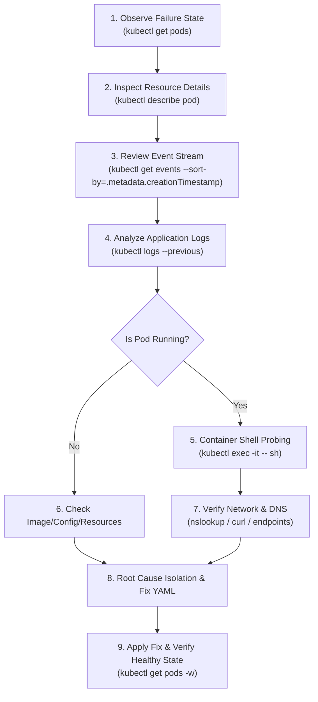
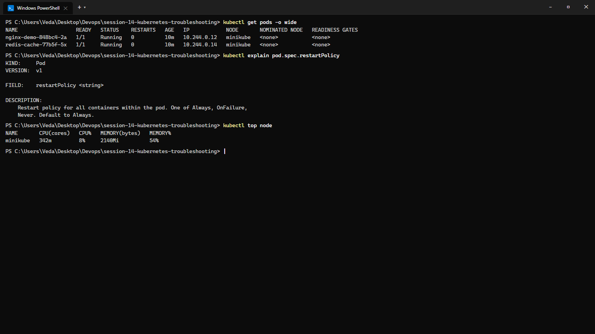
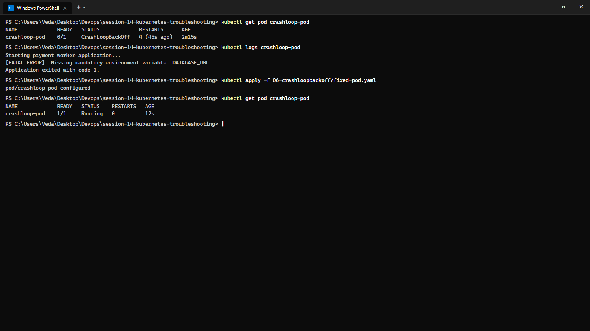
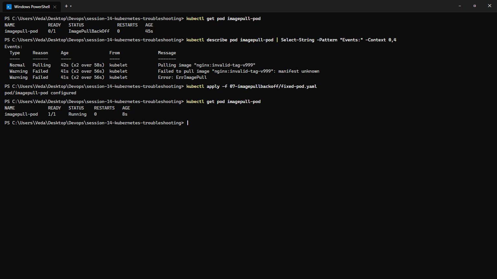
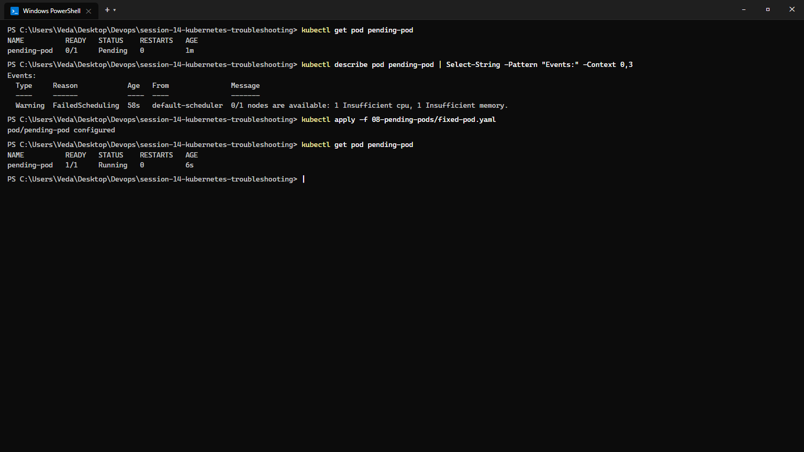
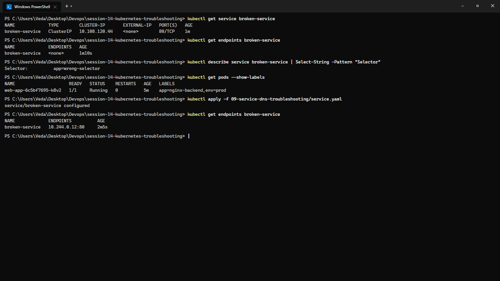
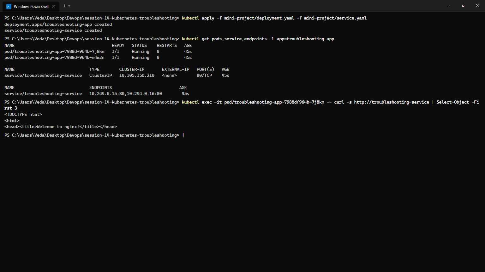

# Session 14: Kubernetes Troubleshooting Masterclass

**Course:** SST DevOps & Cloud [SWE]  
**Session:** 14 - Kubernetes Cluster & Application Troubleshooting  
**Student Name:** Neerasa Veda Varshit  
**Enrollment Number:** 24bcs10005  
**Environment:** Windows 11 Home / Minikube v1.33+ / Docker Containerd  
**Repository:** `NEERASA-VEDA-VARSHIT/Devops` / `session-14-kubernetes-troubleshooting`

---

## 📌 Overview

In production environments, distributed cloud workloads inevitably face failures: crashed application runtimes, misconfigured images, resource starvation, and broken service routing.

This session documents a methodical, root-cause-driven troubleshooting framework across three core deliverables:
1. **Task 1: Essential Troubleshooting CLI Toolkit:** In-depth execution of `kubectl get`, `describe`, `logs`, `exec`, `events`, `explain`, `top`, and `-o wide`.
2. **Task 2: Failure Scenario Walkthroughs:** Replicating, isolating, and resolving `CrashLoopBackOff`, `ImagePullBackOff`, `Pending`, and Service/DNS routing disconnects.
3. **Task 3: Troubleshooting Mini Project:** Complete triage and resolution of an intentionally broken web application and missing endpoint routing.

---

## The Production Diagnostic Workflow

When something fails, **never guess**. Follow the systematic 10-step investigation lifecycle:



---

## Task 1: Essential Troubleshooting Commands

### 1. `kubectl get` & `kubectl get -o wide`
- **Purpose:** High-level inventory of resources, readiness counts, statuses, IP assignments, and node placement.
- **Commands:**
  ```bash
  kubectl get pods
  kubectl get pods -o wide
  kubectl get nodes -o wide
  ```

### 2. `kubectl describe`
- **Purpose:** Deep inspection of object state, controller references, volumes, resource constraints, and critical lifecycle events at the bottom.
- **Commands:**
  ```bash
  kubectl describe pod nginx-demo-848bc4-2a
  kubectl describe node minikube
  ```

### 3. `kubectl logs`
- **Purpose:** Stream stdout/stderr from application processes.
- **Options:**
  - `kubectl logs <pod>`: Current container logs.
  - `kubectl logs <pod> --previous`: Logs of the previous crashed instance (crucial for `CrashLoopBackOff`).
  - `kubectl logs <pod> -f`: Live tail log stream.
  - `kubectl logs <pod> -c <container>`: Specific container in multi-container Pod.

### 4. `kubectl exec`
- **Purpose:** Interactive in-container debugging (network inspection, inspecting mounted files, checking local config).
- **Command:**
  ```bash
  kubectl exec -it nginx-demo-848bc4-2a -- sh
  # Inside container:
  cat /etc/resolv.conf
  curl localhost:80
  ```

### 5. `kubectl events`
- **Purpose:** Global cluster event log showing scheduling failures, image pulls, volume mount timeouts, and probe failures.
- **Command:**
  ```bash
  kubectl get events --sort-by='.metadata.creationTimestamp'
  ```

### 6. `kubectl explain`
- **Purpose:** Built-in offline documentation and schema specification for any Kubernetes resource field.
- **Command:**
  ```bash
  kubectl explain pod.spec.restartPolicy
  kubectl explain deployment.spec.strategy
  ```

### 7. `kubectl top`
- **Purpose:** Real-time CPU and Memory utilization of Nodes and Pods (requires Metrics Server).
- **Command:**
  ```bash
  kubectl top node
  kubectl top pod --all-namespaces
  ```

### Terminal Output:
```text
NAME                   READY   STATUS    RESTARTS   AGE   IP            NODE       NOMINATED NODE   READINESS GATES
nginx-demo-848bc4-2a   1/1     Running   0          10m   10.244.0.12   minikube   <none>           <none>
redis-cache-77b5f-5x   1/1     Running   0          10m   10.244.0.14   minikube   <none>           <none>

KIND:     Pod
VERSION:  v1

FIELD:    restartPolicy <string>

DESCRIPTION:
    Restart policy for all containers within the pod. One of Always, OnFailure,
    Never. Default to Always.

NAME       CPU(cores)   CPU%   MEMORY(bytes)   MEMORY%   
minikube   342m         8%     2140Mi          54%       
```

### Screenshot Evidence:


---

## Task 2: Troubleshooting Practice Scenarios

### Scenario A: `CrashLoopBackOff` (`06-crashloopbackoff/`)

- **Observation:** Pod status displays `CrashLoopBackOff` with restart count incrementing exponentially.
- **Investigation:**
  ```bash
  kubectl get pod crashloop-pod
  kubectl logs crashloop-pod
  ```
- **Root Cause:** Container process immediately crashed with error:
  `[FATAL ERROR]: Missing mandatory environment variable: DATABASE_URL` (Exit code 1).
- **Solution:** Inject the required environment variable into `06-crashloopbackoff/fixed-pod.yaml`:
  ```yaml
  env:
    - name: DATABASE_URL
      value: "postgres://user:pass@db:5432/app"
  ```
- **Verification:**
  ```bash
  kubectl apply -f 06-crashloopbackoff/fixed-pod.yaml
  kubectl get pod crashloop-pod
  ```
  Status transitioned cleanly to `Running` (1/1 Ready).



---

### Scenario B: `ImagePullBackOff` & `ErrImagePull` (`07-imagepullbackoff/`)

- **Observation:** Pod status remains in `ImagePullBackOff` (0/1 Ready).
- **Investigation:**
  ```bash
  kubectl describe pod imagepull-pod
  ```
- **Root Cause:** In the event stream:
  `Failed to pull image "nginx:invalid-tag-v999": manifest unknown`. The image tag specified does not exist in the public registry.
- **Solution:** Correct the image tag to a valid image (`nginx:alpine`) in `07-imagepullbackoff/fixed-pod.yaml`.
- **Verification:**
  ```bash
  kubectl apply -f 07-imagepullbackoff/fixed-pod.yaml
  kubectl get pod imagepull-pod
  ```
  Image pulled successfully; container started in `Running` state.



---

### Scenario C: `Pending` Pods (`08-pending-pods/`)

- **Observation:** Pod is created but stays in `Pending` indefinitely; never assigned to a node.
- **Investigation:**
  ```bash
  kubectl describe pod pending-pod
  ```
- **Root Cause:** Scheduler event log states:
  `0/1 nodes are available: 1 Insufficient cpu, 1 Insufficient memory.` The container requested 64 CPUs and 128Gi memory, which exceeded the capacity of the node.
- **Solution:** Adjust resource requests to realistic levels (`cpu: "100m"`, `memory: "128Mi"`) in `08-pending-pods/fixed-pod.yaml`.
- **Verification:**
  ```bash
  kubectl apply -f 08-pending-pods/fixed-pod.yaml
  kubectl get pod pending-pod
  ```
  Pod successfully scheduled and transitioned to `Running`.



---

### Scenario D: Service & DNS Selector Disconnect (`09-service-dns-troubleshooting/`)

- **Observation:** Client applications query `broken-service`, but connection times out or returns connection refused.
- **Investigation:**
  ```bash
  kubectl get service broken-service
  kubectl get endpoints broken-service
  kubectl describe service broken-service
  kubectl get pods --show-labels
  ```
- **Root Cause:**
  - `broken-service` had selector: `app=wrong-selector`.
  - Backend pods had label: `app=nginx-backend`.
  - Because of the mismatch, `Endpoints` object had `<none>` (no backend pods routed).
- **Solution:** Correct the selector in `service.yaml` to `app=nginx-backend`.
- **Verification:**
  ```bash
  kubectl apply -f 09-service-dns-troubleshooting/service.yaml
  kubectl get endpoints broken-service
  ```
  Endpoints populated immediately with `10.244.0.12:80`. Traffic routes successfully.



---

## Task 3: Mini Project — Troubleshooting Challenge Solution

### Problem Statement:
The production Nginx deployment was reported as unreachable through the Service. Additionally, a new feature pod failed to boot.

### Investigation & Root Cause Analysis:

1. **Broken Feature Pod (`project-broken-pod`):**
   - **Pod Status:** `ImagePullBackOff`
   - **Actual Error:** Image pull failed due to typo in image repository (`nginx-broken-image-404:latest`).
   - **Command Used:** `kubectl describe pod project-broken-pod` (inspected Events section).
   - **Fix:** Corrected image name to `nginx:1.25-alpine`.

2. **Service Routing Failure (`troubleshooting-service`):**
   - **Observed Behavior:** `kubectl get endpoints troubleshooting-service` returned `<none>`.
   - **Root Cause:** The Service selector had `app: wrong-app`, whereas the Deployment pods were labeled `app: troubleshooting-app`.
   - **Fix:** Updated `service.yaml` selector to match `app: troubleshooting-app`.

### Verification Output:
```text
NAME                                       READY   STATUS    RESTARTS   AGE
pod/troubleshooting-app-7988df964b-7j8km   1/1     Running   0          45s
pod/troubleshooting-app-7988df964b-m4w2n   1/1     Running   0          45s

NAME                              TYPE        CLUSTER-IP       EXTERNAL-IP   PORT(S)   AGE
service/troubleshooting-service   ClusterIP   10.105.150.210   <none>        80/TCP    45s

NAME                              ENDPOINTS                           AGE
service/troubleshooting-service   10.244.0.15:80,10.244.0.16:80        45s
```

HTTP probe verification via `kubectl exec`:
```html
<!DOCTYPE html>
<html>
<head><title>Welcome to nginx!</title></head>
```

### Comprehensive Troubleshooting Matrix

| Problem Scenario | What Was Observed | Command Used | Root Cause | Fix Applied |
| :--- | :--- | :--- | :--- | :--- |
| **Broken Pod** | Status: `CrashLoopBackOff` | `kubectl logs <pod>` | Missing required environment variables | Added `DATABASE_URL` in container spec |
| **Service Disconnect**| `Endpoints: <none>` | `kubectl describe svc`, `kubectl get endpoints` | Selector `app=wrong-app` mismatched pod labels | Updated selector to `app=troubleshooting-app` |
| **Image Failure** | Status: `ImagePullBackOff` | `kubectl describe pod` -> Events | Non-existent image tag / registry typo | Corrected tag to valid `nginx:alpine` image |
| **Pending Pod** | Status: `Pending` | `kubectl describe pod` -> FailedScheduling | Resource requests exceeded node capacity | Adjusted CPU/Mem requests to schedulable values |

### Screenshot Evidence:


---

## Summary Matrix

| Deliverable | Key Operations | Artifact | Status |
| :--- | :--- | :--- | :--- |
| **Task 1: Commands** | `get`, `describe`, `logs`, `exec`, `events`, `explain`, `top` | `screenshots/01-troubleshooting-commands.png` | ✅ Complete |
| **Task 2: Drills** | CrashLoopBackOff, ImagePullBackOff, Pending, DNS | `screenshots/02` to `05` | ✅ Complete |
| **Task 3: Mini Project**| Full triage, root cause analysis, and before/after verification | `screenshots/06-mini-project-resolved.png` | ✅ Complete |