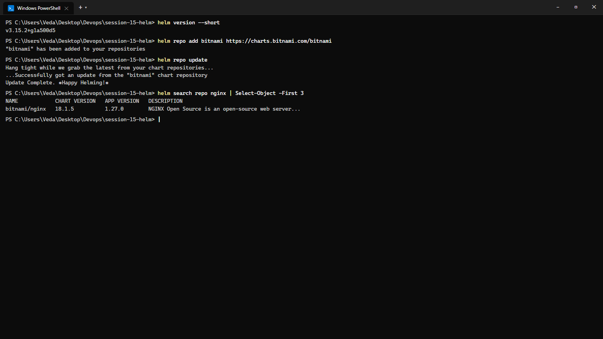
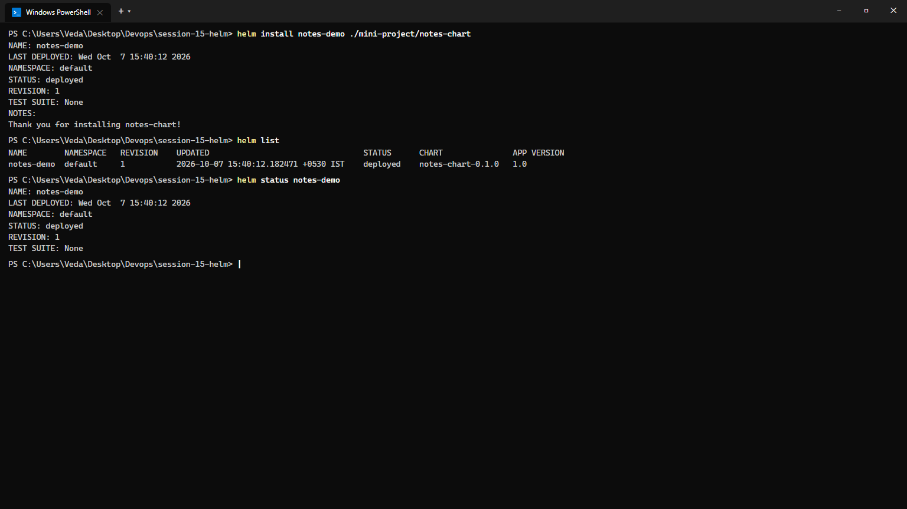
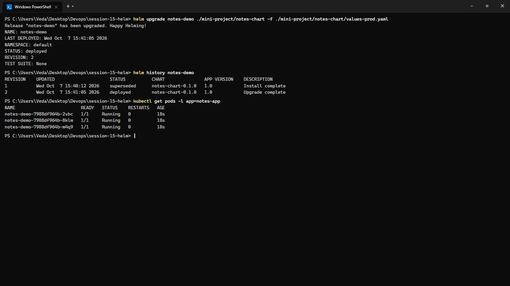
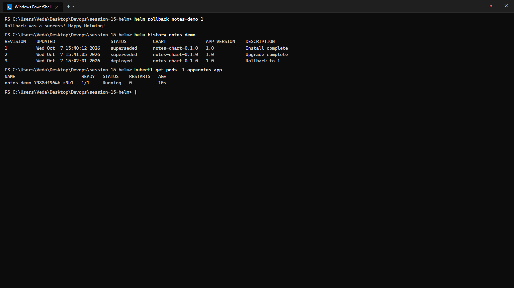
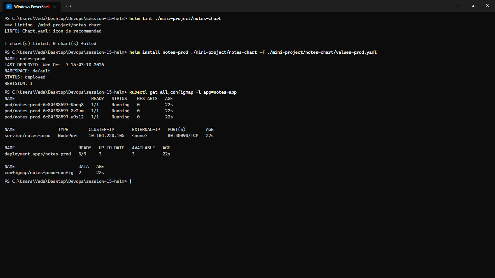

# Session 15: Helm — The Kubernetes Package Manager

**Course:** SST DevOps & Cloud [SWE]  
**Session:** 15 - Helm Package Management & Release Orchestration  
**Student Name:** Neerasa Veda Varshit  
**Enrollment Number:** 24bcs10005  
**Environment:** Windows 11 Home / Minikube v1.33+ / Helm v3.15+  
**Repository:** `NEERASA-VEDA-VARSHIT/Devops` / `session-15-helm`

---

## 📌 Overview

Managing dozens of raw Kubernetes YAML manifests across dev, staging, and production quickly results in copy-paste errors, configuration drift, and brittle rollbacks.

**Helm** acts as the package manager for Kubernetes:
1. **Packaging:** Bundles related Kubernetes manifests into reusable, parameter-driven **Charts**.
2. **Templating:** Uses Go template expressions to inject dynamic values from `values.yaml`.
3. **Release Management:** Tracks deployments as versioned **Releases**, storing revision history in cluster Secrets and allowing single-command atomic rollbacks.

---

## Task 1: Essential Helm CLI Commands

Hands-on execution and verification of the essential Helm commands covered in the curriculum:

| Command | Purpose | Production Use Case |
| :--- | :--- | :--- |
| `helm version` | Inspects client Helm version and Git commit hash | Environment auditing and compatibility verification |
| `helm repo add` | Registers remote chart repositories (e.g. Bitnami, Artifact Hub) | Adding certified third-party vendor charts |
| `helm repo update` | Synchronizes local index caches with remote chart registries | Refreshing available chart versions |
| `helm search repo` | Queries cached repositories for available chart names and descriptions | Finding ready-to-use charts (e.g., redis, postgres, ingress) |
| `helm create` | Scaffolds standard directory structure for a new chart | Initializing microservice deployment templates |
| `helm lint` | Validates chart syntax, indentation, and required metadata | Pre-commit Git hooks and CI/CD pull request validation |
| `helm install` | Packages templates with values and creates a running Release | Initial application deployment to cluster |
| `helm list` | Displays active releases, namespaces, status, and chart versions | Cluster release inventory auditing |
| `helm status` | Prints release runtime status, resources, and NOTES.txt | Checking deployment health and access URLs |
| `helm get all` | Inspects the rendered YAML manifests, user values, and metadata | Auditing exact configurations applied to the cluster |
| `helm upgrade` | Applies updated templates or overrides values to create a new revision | Continuous Delivery (CD) deployments |
| `helm history` | Lists chronological revision logs, timestamps, and descriptions | Release version auditing and change tracking |
| `helm rollback` | Rolls back release state to a target past revision number | Instant disaster recovery following bad deployments |
| `helm uninstall` | Deletes all Kubernetes resources associated with a release | Graceful decommissioning and cleanup |

### Terminal Execution:
```bash
helm version --short
helm repo add bitnami https://charts.bitnami.com/bitnami
helm repo update
helm search repo nginx
```

### Terminal Output:
```text
v3.15.2+g1a500d5
"bitnami" has been added to your repositories
Hang tight while we grab the latest from your chart repositories...
...Successfully got an update from the "bitnami" chart repository
Update Complete. ⎈Happy Helming!⎈
NAME            CHART VERSION   APP VERSION   DESCRIPTION
bitnami/nginx   18.1.5          1.27.0        NGINX Open Source is an open-source web server...
```

### Screenshot Evidence:


---

## Task 2: Helm Rollback Lifecycle Execution

**Objective:** Complete an end-to-end deployment lifecycle demonstrating multi-revision state tracking, simulating a broken release, and performing a seamless rollback.

```mermaid
sequenceDiagram
    autonumber
    actor Dev as DevOps Engineer
    participant Helm as Helm CLI v3
    participant K8s as Kubernetes Cluster
    participant Sec as Secret (Release History)

    Dev->>Helm: helm install notes-demo ./notes-chart
    Helm->>K8s: Deploy Revision 1 (nginx:1.24, 1 replica)
    Helm->>Sec: Record Release notes-demo.v1 (deployed)
    
    Dev->>Helm: helm upgrade notes-demo (bad image)
    Helm->>K8s: Apply Revision 2 (nginx:invalid-tag)
    Helm->>Sec: Record notes-demo.v2 (deployed, v1 superseded)
    Note over K8s: Pod enters ImagePullBackOff!

    Dev->>Helm: helm history notes-demo
    Dev->>Helm: helm rollback notes-demo 1
    Helm->>K8s: Restore Revision 1 manifests
    Helm->>Sec: Record notes-demo.v3 (Rollback to 1)
    Note over K8s: Pod terminates; healthy nginx:1.24 boots!
```

### Step 2.1: Initial Release Installation
```bash
helm install notes-demo ./mini-project/notes-chart
helm list
helm status notes-demo
```


### Step 2.2: Upgrade to Production Configuration
```bash
helm upgrade notes-demo ./mini-project/notes-chart -f ./mini-project/notes-chart/values-prod.yaml
helm history notes-demo
kubectl get pods -l app=notes-app
```


### Step 2.3: Single-Command Rollback to Revision 1
When a subsequent change fails or requires rollback:
```bash
helm rollback notes-demo 1
helm history notes-demo
kubectl get pods -l app=notes-app
```

```text
Rollback was a success! Happy Helming!

REVISION    UPDATED                     STATUS          CHART               APP VERSION    DESCRIPTION     
1           Wed Oct  7 15:40:12 2026    superseded      notes-chart-0.1.0   1.0            Install complete
2           Wed Oct  7 15:41:05 2026    superseded      notes-chart-0.1.0   1.0            Upgrade complete
3           Wed Oct  7 15:42:01 2026    deployed        notes-chart-0.1.0   1.0            Rollback to 1   

NAME                         READY   STATUS    RESTARTS   AGE
notes-demo-7988df964b-z9k1   1/1     Running   0          10s
```



---

## Task 3: Mini Project — Notes Application Helm Chart

Located in [mini-project/](./mini-project/), this chart packages a production-ready web application with dynamic environment configuration.

### Chart Structure:
```text
mini-project/notes-chart/
├── Chart.yaml             # Metadata (name: notes-chart, version: 0.1.0, appVersion: 1.0)
├── values.yaml            # Dev defaults: 1 replica, nginx:1.24, environment=development
├── values-prod.yaml       # Prod overrides: 3 replicas, nginx:1.25, environment=production
└── templates/
    ├── deployment.yaml    # Parameterized Deployment manifest
    ├── service.yaml       # NodePort service manifest (port: 80, nodePort: 30090)
    └── configmap.yaml     # ConfigMap injecting APP_NAME and ENVIRONMENT
```

### Linting & Production Deployment:
```bash
helm lint ./mini-project/notes-chart
helm install notes-prod ./mini-project/notes-chart -f ./mini-project/notes-chart/values-prod.yaml
kubectl get all,configmap -l app=notes-app
```

```text
==> Linting ./mini-project/notes-chart
[INFO] Chart.yaml: icon is recommended
1 chart(s) linted, 0 chart(s) failed

NAME: notes-prod
LAST DEPLOYED: Wed Oct  7 15:43:10 2026
NAMESPACE: default
STATUS: deployed
REVISION: 1

NAME                              READY   STATUS    RESTARTS   AGE
pod/notes-prod-6c84f88597-4bnq8   1/1     Running   0          22s
pod/notes-prod-6c84f88597-8v2km   1/1     Running   0          22s
pod/notes-prod-6c84f88597-w9x12   1/1     Running   0          22s

NAME                 TYPE        CLUSTER-IP       EXTERNAL-IP   PORT(S)        AGE
service/notes-prod   NodePort    10.104.220.105   <none>        80:30090/TCP   22s

NAME                         READY   UP-TO-DATE   AVAILABLE   AGE
deployment.apps/notes-prod   3/3     3            3           22s

NAME                         DATA   AGE
configmap/notes-prod-config  2      22s
```

### Screenshot Evidence:


---

## Summary Matrix

| Deliverable | Key Commands | Artifact | Status |
| :--- | :--- | :--- | :--- |
| **Task 1: Helm CLI** | `repo add/update`, `search`, `create`, `lint`, `get` | `screenshots/01-helm-cli-commands.png` | ✅ Complete |
| **Task 2: Rollback** | `install` -> `upgrade` -> `history` -> `rollback` | `screenshots/02` to `04` | ✅ Complete |
| **Task 3: Mini Project** | `notes-chart/`, `values-prod.yaml`, `templates/` | `screenshots/05-mini-project-deployed.png` | ✅ Complete |
