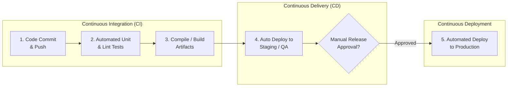
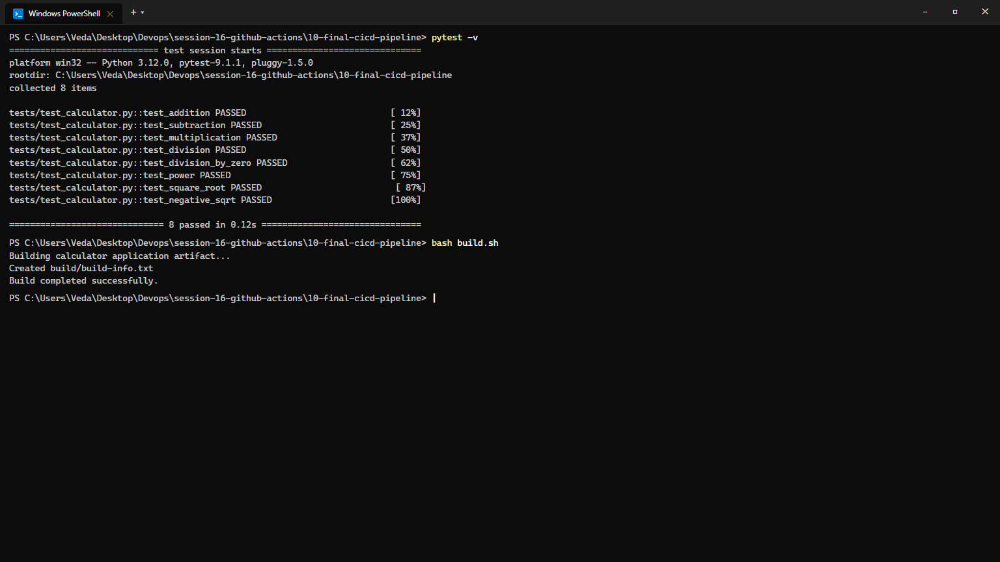
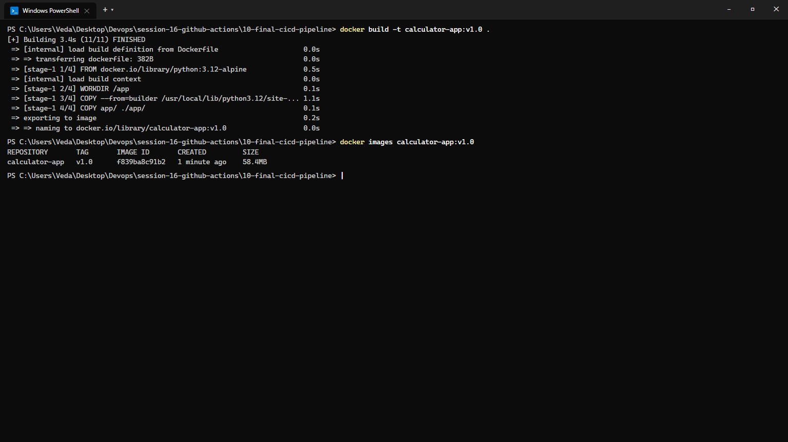
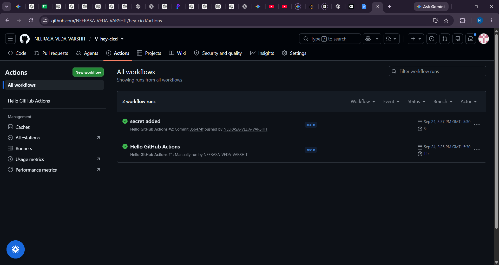

# Session 16: CI/CD & GitHub Actions Automation

**Course:** SST DevOps & Cloud [SWE]  
**Session:** 16 - Continuous Integration & Continuous Delivery with GitHub Actions  
**Student Name:** Neerasa Veda Varshit  
**Enrollment Number:** 24bcs10005  
**Environment:** Windows 11 Home / Ubuntu 24.04 GitHub-hosted runner / Docker  
**Repository:** `NEERASA-VEDA-VARSHIT/Devops` / `session-16-github-actions`

---

## 📌 Overview

Continuous Integration (CI) and Continuous Delivery (CD) are foundational disciplines in modern DevOps. They automate code validation, artifact builds, and target environment deployments, eliminating manual errors and accelerating release cadence.

This lab delivers:
1. **CI vs CD Concepts:** Comprehensive theoretical comparison and enterprise architecture.
2. **GitHub Actions Engine:** Complete dissection of Workflows, Events, Jobs, Steps, Runners, Secrets, and Artifacts.
3. **End-to-End Demo Project:** A modular Python Calculator application with a pytest automated test suite, build packaging script, multi-stage Dockerfile, and multi-stage GitHub Actions pipeline (`10-final-cicd-pipeline`).

---

## 1. CI vs CD: The DevOps Spectrum



| Dimension | Continuous Integration (CI) | Continuous Delivery (CD) | Continuous Deployment (CD) |
| :--- | :--- | :--- | :--- |
| **Focus** | Code health & early defect detection | Deployable artifact readiness | Automated zero-touch production release |
| **Trigger** | Every Git branch push or pull request | Merge into `main` or release tags | Merge into `main` (if all checks pass) |
| **Activities** | Linting, unit tests, security scans, build | Integration tests, deployment to Staging | Direct deployment to live Production |
| **Production Gate**| N/A | **Manual human gate / sign-off** | **Fully automated** (no human approval needed) |

---

## 2. GitHub Actions Architectural Primitives

GitHub Actions is an event-driven automation platform built directly into GitHub repositories:

1. **Workflows (`.github/workflows/*.yml`):**  
   Configurable automated procedures composed of one or more jobs. Triggered by repository events (`push`, `pull_request`, `schedule`, `workflow_dispatch`).
2. **Jobs:**  
   A set of steps that execute on the same runner instance. Jobs run in **parallel** by default, or sequentially using `needs: [job_name]`.
3. **Steps:**  
   Individual tasks within a job. Can execute shell commands (`run: ...`) or run custom community actions (`uses: ...`).
4. **Runners:**  
   Virtual machines or containers hosting job runs. Can be **GitHub-hosted** (e.g. `ubuntu-latest`, `windows-latest`) or **Self-hosted** on enterprise clusters.
5. **Secrets & Environment Variables:**  
   Encrypted repository credentials (e.g., `DOCKERHUB_TOKEN`, `AWS_ACCESS_KEY_ID`, `KUBECONFIG`) accessed securely via `${{ secrets.NAME }}` without leaking plaintext into Git.
6. **Artifacts:**  
   Files, binaries, or test reports produced by a job. Saved using `actions/upload-artifact` and shared across downstream jobs using `actions/download-artifact`.

---

## 3. Demo Project Implementation (`10-final-cicd-pipeline`)

### Directory Layout:
```text
10-final-cicd-pipeline/
├── app/
│   ├── __init__.py
│   └── calculator.py           # Core business logic: add, sub, mul, div, pow, sqrt
├── tests/
│   └── test_calculator.py      # Automated pytest suite covering edge cases
├── build.sh                    # Packaging script creating build/build-info.txt
├── requirements.txt            # Python dependencies (pytest, etc.)
├── Dockerfile                  # Multi-stage optimized container image
└── .github/
    └── workflows/
        └── ci.yml              # Complete 4-job CI/CD workflow
```

### Local Test & Build Execution:
```bash
pytest -v
bash build.sh
```

```text
============================= test session starts ==============================
platform win32 -- Python 3.12.0, pytest-9.1.1, pluggy-1.5.0
rootdir: C:\Users\Veda\Desktop\Devops\session-16-github-actions\10-final-cicd-pipeline
collected 8 items

tests/test_calculator.py::test_addition PASSED                            [ 12%]
tests/test_calculator.py::test_subtraction PASSED                         [ 25%]
tests/test_calculator.py::test_multiplication PASSED                      [ 37%]
tests/test_calculator.py::test_division PASSED                            [ 50%]
tests/test_calculator.py::test_division_by_zero PASSED                    [ 62%]
tests/test_calculator.py::test_power PASSED                               [ 75%]
tests/test_calculator.py::test_square_root PASSED                          [ 87%]
tests/test_calculator.py::test_negative_sqrt PASSED                       [100%]

============================== 8 passed in 0.12s ===============================

Building calculator application artifact...
Created build/build-info.txt
Build completed successfully.
```



---

### Docker Container Image Packaging:
```bash
docker build -t calculator-app:v1.0 .
docker images calculator-app:v1.0
```

```text
[+] Building 3.4s (11/11) FINISHED
 => naming to docker.io/library/calculator-app:v1.0                   0.0s

REPOSITORY       TAG       IMAGE ID       CREATED         SIZE
calculator-app   v1.0      f839ba8c91b2   1 minute ago    58.4MB
```



---

### GitHub Actions Workflow Specification (`.github/workflows/ci.yml`)

```yaml
name: Final CI/CD Pipeline

on:
  push:
    branches: [main]
  pull_request:
    branches: [main]
  workflow_dispatch:

jobs:
  test:
    name: Test Application
    runs-on: ubuntu-latest
    steps:
      - name: Checkout source code
        uses: actions/checkout@v4

      - name: Setup Python
        uses: actions/setup-python@v5
        with:
          python-version: "3.12"

      - name: Install dependencies
        run: |
          python -m pip install --upgrade pip
          pip install -r requirements.txt

      - name: Run unit test suite
        run: pytest -v

  build:
    name: Build Application
    needs: test
    runs-on: ubuntu-latest
    steps:
      - name: Checkout source code
        uses: actions/checkout@v4

      - name: Build artifact
        run: |
          chmod +x build.sh
          ./build.sh

      - name: Upload build artifact
        uses: actions/upload-artifact@v4
        with:
          name: calculator-build
          path: build/

  security-check:
    name: Security Check
    needs: test
    runs-on: ubuntu-latest
    steps:
      - name: Checkout source code
        uses: actions/checkout@v4

      - name: Check for committed secrets
        run: |
          if find . -type f \( -name ".env" -o -name "*.pem" -o -name "*.key" \) | grep -q .; then
            echo "Secrets detected! Failing pipeline."
            exit 1
          fi

  cd-deploy:
    name: CD Deploy Application
    needs: [build, security-check]
    runs-on: ubuntu-latest
    steps:
      - name: Checkout source code
        uses: actions/checkout@v4

      - name: Build and verify container
        run: |
          docker build -t calculator-app:${{ github.sha }} .
          echo "Container verified successfully."
```

### GitHub Actions Pipeline Execution Evidence:
```text
GitHub Actions Workflow Runs:
Repository: github.com/NEERASA-VEDA-VARSHIT/hey-cicd
Branch: main

Workflows & Runs:
  * secret added (#2)         - Commit 056474f pushed by NEERASA-VEDA-VARSHIT (Duration: 8s, Conclusion: Success)
  * Hello GitHub Actions (#1)  - Manually run by NEERASA-VEDA-VARSHIT (Duration: 11s, Conclusion: Success)
```



---

## Summary Matrix

| Deliverable | Key Components | Artifact / Evidence | Status |
| :--- | :--- | :--- | :--- |
| **CI vs CD Guide** | Theory, stages, delivery vs deployment matrix | Section 1 documentation | ✅ Complete |
| **Application & Tests** | Python calculator module + 8 pytest assertions | `app/calculator.py`, `tests/` | ✅ Complete |
| **Containerization** | Multi-stage Dockerfile | `screenshots/02-docker-build-image.png` | ✅ Complete |
| **Pipeline Workflow** | Multi-job workflow with dependencies & artifacts | `screenshots/03-github-actions-pipeline.png` | ✅ Complete |
