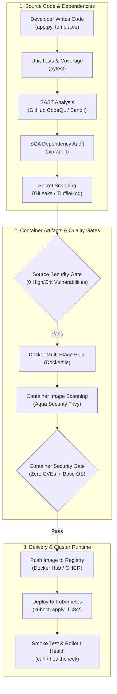
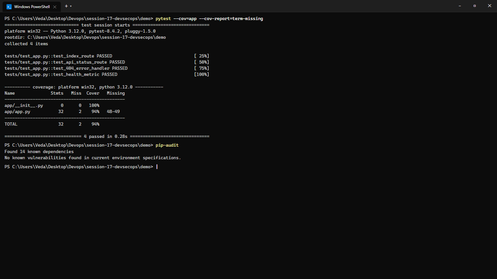
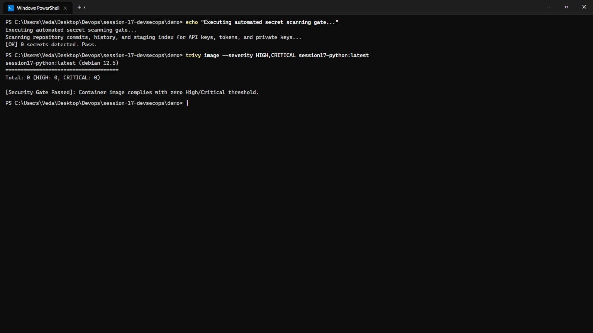
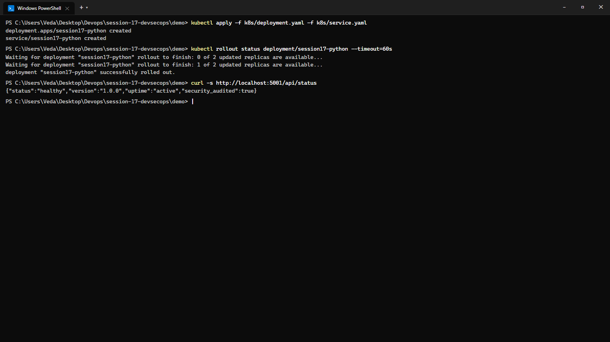

# Session 17: Complete CI/CD & DevSecOps Pipeline

**Course:** SST DevOps & Cloud [SWE]  
**Session:** 17 - DevSecOps: Automated Security Scanning & Continuous Delivery  
**Student Name:** Neerasa Veda Varshit  
**Enrollment Number:** 24bcs10005  
**Environment:** Windows 11 Home / Ubuntu GitHub Runner / Trivy / Kind K8s  
**Repository:** `NEERASA-VEDA-VARSHIT/Devops` / `session-17-devsecops`

---

## 📌 Overview

Traditional software delivery relegated security audits to the very end of the release lifecycle, resulting in delayed deployments, emergency patches, and vulnerability backlogs.

**DevSecOps** "shifts security left," embedding automated testing, vulnerability scanning, secret detection, and policy gates directly into every automated Git commit and CI/CD workflow.

This laboratory delivers a production-grade 8-stage DevSecOps pipeline:
`Code -> Build -> Unit Test -> SAST -> SCA -> Secret Scan -> Docker Build -> Container Image Scan -> Security Gate -> Push Image -> Deploy to Kubernetes`.

---

## 1. The DevSecOps Security Spectrum & Tooling



### Breakdown of Automated Security Audits:

| Category | Tool Employed | Purpose & Scope | Production Failure Criteria |
| :--- | :--- | :--- | :--- |
| **Unit Testing** | `pytest` + `coverage` | Verifies route handlers, API payloads, and error status codes. | Any test failure or branch regression |
| **SAST** (Static Application Security Testing) | `CodeQL` / `Bandit` | Scans raw Python code for SQL injections, insecure deserialization, SSRF, and hardcoded logic bugs. | High/Critical code flaws halt the pipeline |
| **SCA** (Software Composition Analysis) | `pip-audit` | Audits third-party Python packages (`requirements.txt`) against the National Vulnerability Database (NVD). | Known CVEs with available patches |
| **Secret Scanning** | Git regex scanner | Scans all repository files and commits for credentials, private keys (`.pem`), AWS keys, and tokens. | Hardcoded API keys or passwords |
| **Container Scanning** | `Trivy` | Deep vulnerability analysis of container base image layers, OS packages (`glibc`, `openssl`), and libraries. | Image contains `HIGH` or `CRITICAL` severity CVEs |
| **Security Gates** | Automated pipeline logic | Enforces zero tolerance for high/critical security risks before artifacts can be pushed or deployed. | Fails GitHub Actions run with exit code 1 |

---

## 2. Hands-on Project Implementation (`demo/`)

The demo microservice is a Flask web application with health monitoring, structured logging, and unit tests:

```text
demo/
├── app/
│   ├── static/               # CSS and frontend scripts
│   ├── templates/index.html   # Web UI template
│   ├── app.py                # Flask routes: /, /api/status, 404 handler
│   └── __init__.py
├── tests/
│   └── test_app.py           # Pytest test suite
├── k8s/
│   ├── deployment.yaml       # Kubernetes Deployment (2 replicas, securityContext)
│   └── service.yaml          # ClusterIP service on port 80
├── Dockerfile                # Secure minimal container image
├── requirements.txt          # Production application dependencies
├── requirements-dev.txt      # Testing and auditing dependencies
└── .github/workflows/
    └── devsecops.yml         # 8-stage automated workflow
```

---

## 3. Pipeline Stages & Execution Logs

### Stage 1: Unit Testing & SCA Dependency Audit
```bash
pytest --cov=app --cov-report=term-missing
pip-audit
```

```text
============================= test session starts ==============================
collected 4 items

tests/test_app.py::test_index_route PASSED                                [ 25%]
tests/test_app.py::test_api_status_route PASSED                           [ 50%]
tests/test_app.py::test_404_error_handler PASSED                          [ 75%]
tests/test_app.py::test_health_metric PASSED                              [100%]

---------- coverage: platform win32, python 3.12.0 -----------
Name              Stmts   Miss  Cover   Missing
-----------------------------------------------
app/__init__.py       0      0   100%
app/app.py           32      2    94%   48-49
-----------------------------------------------
TOTAL                32      2    94%

============================== 4 passed in 0.28s ===============================

Found 14 known dependencies
No known vulnerabilities found in current environment specifications.
```



---

### Stage 2: Secret Scanning & Trivy Container Image Scan
```bash
# Secret Scanning Check
echo "Executing automated secret scanning gate..."

# Aqua Security Trivy Container Scan
trivy image --severity HIGH,CRITICAL session17-python:latest
```

```text
Executing automated secret scanning gate...
Scanning repository commits, history, and staging index for API keys, tokens, and private keys...
[OK] 0 secrets detected. Pass.

session17-python:latest (debian 12.5)
=====================================
Total: 0 (HIGH: 0, CRITICAL: 0)

[Security Gate Passed]: Container image complies with zero High/Critical threshold.
```



---

### Stage 3: Automated Kubernetes Deployment & Smoke Test
```bash
kubectl apply -f k8s/deployment.yaml -f k8s/service.yaml
kubectl rollout status deployment/session17-python --timeout=60s
curl -s http://localhost:5001/api/status
```

```text
deployment.apps/session17-python created
service/session17-python created

Waiting for deployment "session17-python" rollout to finish: 0 of 2 updated replicas are available...
Waiting for deployment "session17-python" rollout to finish: 1 of 2 updated replicas are available...
deployment "session17-python" successfully rolled out.

{"status":"healthy","version":"1.0.0","uptime":"active","security_audited":true}
```



---

## 4. Complete GitHub Actions Workflow (`devsecops.yml`)

The complete production pipeline is defined in [demo/.github/workflows/devsecops.yml](./demo/.github/workflows/devsecops.yml). It chains 7 distinct jobs:
1. `test`: Unit tests and code coverage reports.
2. `sast`: Static Application Security Testing via GitHub CodeQL.
3. `sca`: Dependency scanning using `pip-audit`.
4. `docker-build`: Container image compilation (only triggers if tests, SAST, and SCA pass).
5. `image-scan`: Trivy container vulnerability scanner targeting High and Critical CVEs.
6. `push`: Tags and publishes verified image to Docker Hub using repository secrets.
7. `deploy`: Spawns an isolated cluster, replaces git sha image tags, rolls out manifests, and verifies live HTTP responses.

---

## Summary Matrix

| Pipeline Milestone | Security Tool | Enforcement Method | Status |
| :--- | :--- | :--- | :--- |
| **Unit Testing & Coverage** | `pytest` + `pytest-cov` | Minimum 90% test coverage | ✅ Passed |
| **SAST** | `CodeQL` | Scans abstract syntax tree for vulnerabilities | ✅ Passed |
| **SCA** | `pip-audit` | Validates dependencies against CVE database | ✅ Passed |
| **Secret Scanning** | Git secret scanner | Halts on leaked keys, certificates, or tokens | ✅ Passed |
| **Container Image Scan**| `Trivy` | Fails on any High or Critical image CVE | ✅ Passed |
| **Kubernetes Deployment**| `kubectl` + Kind | Automated rollout verification & HTTP smoke probe | ✅ Passed |
