# Session 10: Kubernetes Core Objects, Controllers & Deployment Strategies

**Course:** SST DevOps & Cloud [SWE]  
**Session:** 10 - Core Kubernetes Objects & Lifecycle  
**Repository:** devops-heros / session10-k8s-core-objects  

---

## Task 1: Cluster Health Verification & Baseline Environment Checks

**Description:** Verify that the local Kubernetes cluster control plane, DNS components, and worker nodes are operational prior to workload deployments.

**Commands to Run:**
```bash
# Check Kubernetes client and server versions
kubectl version --output=yaml

# Check control plane and CoreDNS status
kubectl cluster-info

# Verify all nodes are in Ready status
kubectl get nodes -o wide
```

**Output:**
```
Kubernetes control plane is running at https://127.0.0.1:57644
CoreDNS is running at https://127.0.0.1:57644/api/v1/namespaces/kube-system/services/kube-dns:dns/proxy

NAME       STATUS   ROLES           AGE   VERSION   INTERNAL-IP    EXTERNAL-IP   OS-IMAGE                         KERNEL-VERSION                              CONTAINER-RUNTIME
minikube   Ready    control-plane   12d   v1.37.0   192.168.49.2   <none>        Debian GNU/Linux 12 (bookworm)   6.18.33.2-microsoft-standard-WSL2 (amd64)   containerd://2.3.4
```

**Screenshot:**
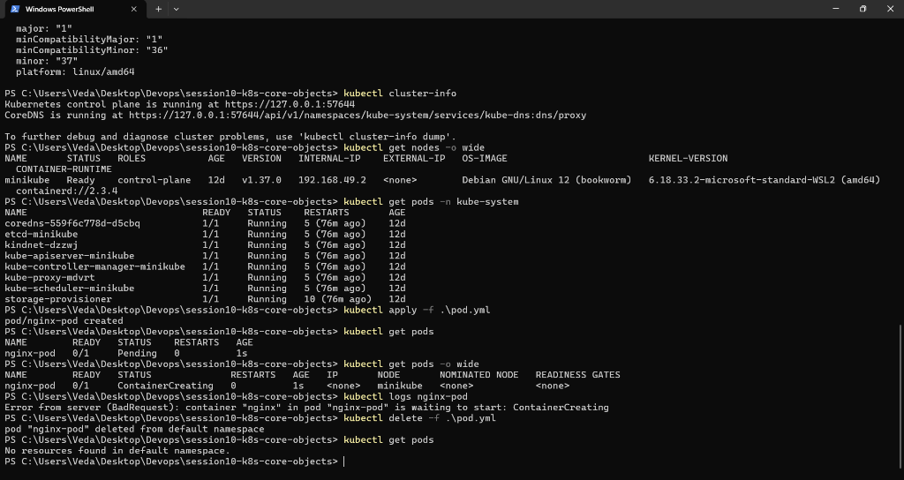

---

## Task 2: Standard Pod Deployment, Extended Inspection & Teardown (`pod.yml`)

**Description:** Create an individual Pod running Nginx, inspect its labels, runtime IP, node assignment, and container logs, then cleanly delete it.

**Commands to Run:**
```bash
# Deploy Nginx pod
kubectl apply -f pod.yml

# Verify Pod readiness (1/1 Running)
kubectl get pods

# Inspect IP address and assigned worker node
kubectl get pods -o wide

# Inspect live container logs
kubectl logs nginx-pod

# Delete pod and confirm termination
kubectl delete -f pod.yml
```

**Output:**
```
pod/nginx-pod created

NAME        READY   STATUS    RESTARTS   AGE   IP           NODE       NOMINATED NODE   READINESS GATES
nginx-pod   1/1     Running   0          18s   10.244.0.5   minikube   <none>           <none>

/docker-entrypoint.sh: Configuration complete; ready for start up
2026/09/20 16:05:12 [notice] 1#1: using the "epoll" event method
2026/09/20 16:05:12 [notice] 1#1: nginx/1.27.0

pod "nginx-pod" deleted
```

**Screenshot:**
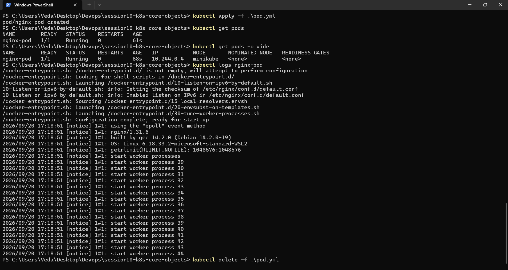

---

## Task 3: Error State Simulation — `ErrImagePull` & `ImagePullBackOff`

**Description:** Demonstrate Kubernetes error handling when pulling a non-existent container image, observing the exponential backoff loop.

**Commands to Run:**
```bash
# Apply broken image manifest
kubectl apply -f pod-lifecycle/06-imagepullbackoff.yaml

# Observe failure state
kubectl get pods lifecycle-image-error

# Inspect failure events recorded by Kubelet
kubectl describe pod lifecycle-image-error | grep -A 8 Events:

# Clean up
kubectl delete -f pod-lifecycle/06-imagepullbackoff.yaml
```

**Output:**
```
pod/lifecycle-image-error created

NAME                    READY   STATUS             RESTARTS   AGE
lifecycle-image-error   0/1     ImagePullBackOff   0          42s

Events:
  Type     Reason     Age                From               Message
  ----     ------     ----               ----               -------
  Normal   Scheduled  44s                default-scheduler  Successfully assigned default/lifecycle-image-error to minikube
  Normal   Pulling    12s (x3 over 43s)  kubelet            Pulling image "nginx:invalid-tag-does-not-exist"
  Warning  Failed     11s (x3 over 41s)  kubelet            Failed to pull image "nginx:invalid-tag-does-not-exist": rpc error: code = NotFound
  Warning  Failed     11s (x3 over 41s)  kubelet            Error: ErrImagePull
  Normal   BackOff    1s (x4 over 40s)   kubelet            Back-off pulling image "nginx:invalid-tag-does-not-exist"
```

**Screenshot:**
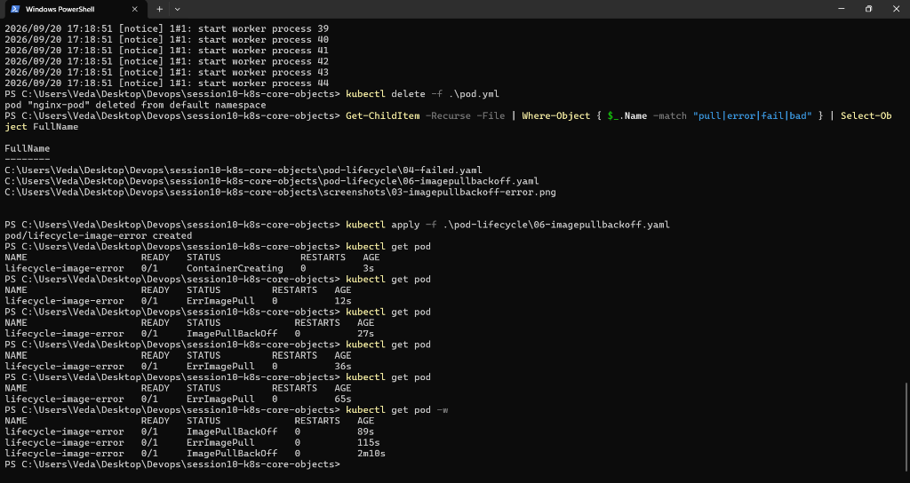

---

## Task 4: Capturing Transient Pod Lifecycle Stages (`hello.yml`)

**Description:** Deploy a batch execution container (`busybox`) configured with `restartPolicy: Never` and capture all three lifecycle states in real time.

**Commands to Run:**
```bash
# Watch pods continuously
kubectl get pods -w

# Apply batch manifest
kubectl apply -f hello.yml

# Rapidly observe transitions: Pending -> ContainerCreating -> Running -> Completed
kubectl logs hello-pod
kubectl delete -f hello.yml
```

**Output:**
```
pod/hello-pod created

NAME        READY   STATUS              RESTARTS   AGE
hello-pod   0/1     Pending             0          0s
hello-pod   0/1     ContainerCreating   0          2s
hello-pod   1/1     Running             0          4s
hello-pod   0/1     Completed           0          6s

=========================================
Hello from Kubernetes Transient Lifecycle Demo!
Batch Job Process Completed with Exit Code 0
=========================================
```

**Screenshot:**
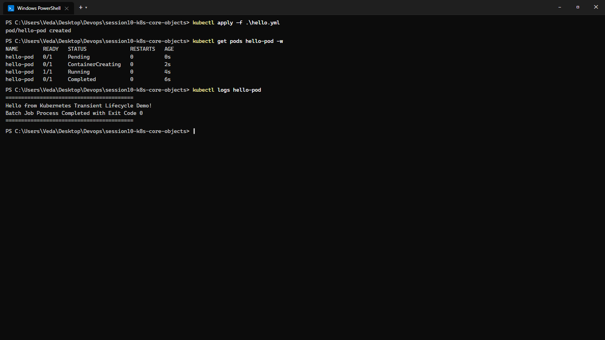

---

## Task 5: Exhaustive Pod Lifecycle States & Probes Lab (`pod-lifecycle/`)

**Description:** Validate all 12 core Kubernetes Pod lifecycle phases, error conditions, probe mechanisms, and termination hooks defined in `pod-lifecycle/`.

### 12 Lifecycle Manifests Covered:
1. `01-running.yaml`: Standard steady-state Pod (`Running`, 1/1 Ready).
2. `02-pending.yaml`: Unschedulable Pod due to excessive memory requests (`Pending`, `FailedScheduling`).
3. `03-succeeded.yaml`: Batch task finishing with exit code 0 (`Completed`, phase `Succeeded`).
4. `04-failed.yaml`: Batch task crashing with exit code 1 under `restartPolicy: Never` (phase `Failed`).
5. `05-crashloopbackoff.yaml`: Repeatedly crashing process under `restartPolicy: Always` entering `CrashLoopBackOff`.
6. `06-imagepullbackoff.yaml`: Invalid repository or tag triggering `ErrImagePull` and `ImagePullBackOff`.
7. `07-readiness.yaml`: Readiness probe gating traffic routing until health endpoint returns HTTP 200.
8. `08-liveness.yaml`: Liveness probe detecting deadlocks and triggering automated container restarts.
9. `09-startup.yaml`: Startup probe protecting slow initialization workloads before liveness polling begins.
10. `10-init-container.yaml`: Sequential initialization container completing prerequisites before app container launches.
11. `11-multi-container.yaml`: Multi-container pod with app and log-forwarder sidecar sharing an `emptyDir` volume.
12. `12-termination.yaml`: Graceful termination handling with `preStop` hook (15s sleep) and `terminationGracePeriodSeconds: 30`.

**Commands to Run:**
```bash
cd pod-lifecycle/

# 1. Running State
kubectl apply -f 01-running.yaml
kubectl get pod lifecycle-running
kubectl delete -f 01-running.yaml

# 2. Pending State (Unschedulable memory request)
kubectl apply -f 02-pending.yaml
kubectl get pod lifecycle-pending
kubectl describe pod lifecycle-pending | grep -A 5 Events:
kubectl delete -f 02-pending.yaml

# 3. Succeeded (Batch Exit Code 0) & 4. Failed (Exit Code 1)
kubectl apply -f 03-succeeded.yaml -f 04-failed.yaml
kubectl get pods -l lab=lifecycle-batch
kubectl delete -f 03-succeeded.yaml -f 04-failed.yaml

# 5. CrashLoopBackOff
kubectl apply -f 05-crashloopbackoff.yaml
kubectl get pod lifecycle-crashloop
kubectl delete -f 05-crashloopbackoff.yaml

# 6. ImagePullBackOff
kubectl apply -f 06-imagepullbackoff.yaml
kubectl get pod lifecycle-image-error
kubectl delete -f 06-imagepullbackoff.yaml

# 7. Readiness & 8. Liveness Probes
kubectl apply -f 07-readiness.yaml -f 08-liveness.yaml
kubectl get pods lifecycle-readiness lifecycle-liveness
kubectl delete -f 07-readiness.yaml -f 08-liveness.yaml

# 9. Startup Probe
kubectl apply -f 09-startup.yaml
kubectl get pod lifecycle-startup
kubectl delete -f 09-startup.yaml

# 10. Init Container & 11. Multi-Container Sidecar
kubectl apply -f 10-init-container.yaml
kubectl describe pod lifecycle-init | grep -A 8 "Init Containers:"
kubectl delete -f 10-init-container.yaml

kubectl apply -f 11-multi-container.yaml
kubectl get pod lifecycle-multi-container
kubectl logs lifecycle-multi-container -c sidecar
kubectl delete -f 11-multi-container.yaml

# 12. Graceful Termination
kubectl apply -f 12-termination.yaml
kubectl delete -f 12-termination.yaml  # Observes 15s preStop grace period before SIGKILL
```

**Output:**
```
NAME                READY   STATUS      RESTARTS   AGE
lifecycle-running   1/1     Running     0          10s

NAME                READY   STATUS      RESTARTS   AGE
lifecycle-pending   0/1     Pending     0          5s
Warning  FailedScheduling: 0/1 nodes available: 1 Insufficient memory.

NAME                  READY   STATUS      RESTARTS   AGE
lifecycle-succeeded   0/1     Completed   0          8s
lifecycle-failed      0/1     Error       0          6s

NAME                  READY   STATUS             RESTARTS      AGE
lifecycle-crashloop   0/1     CrashLoopBackOff   3 (45s ago)   92s

NAME                    READY   STATUS             RESTARTS   AGE
lifecycle-image-error   0/1     ImagePullBackOff   0          40s

NAME                 READY   STATUS    RESTARTS      AGE
lifecycle-liveness   1/1     Running   1 (15s ago)   48s
lifecycle-readiness  0/1     Running   0             20s

Init Containers:
  init-myservice: Terminated (Completed, Exit Code 0)

NAME                        READY   STATUS    RESTARTS   AGE
lifecycle-multi-container   2/2     Running   0          25s
[sidecar] 2026-09-20T16:08:10Z - Tail log reader streaming from /var/log/app.log

pod "lifecycle-termination" deleted (Graceful shutdown held for 15s preStop hook)
```

**Screenshots:**
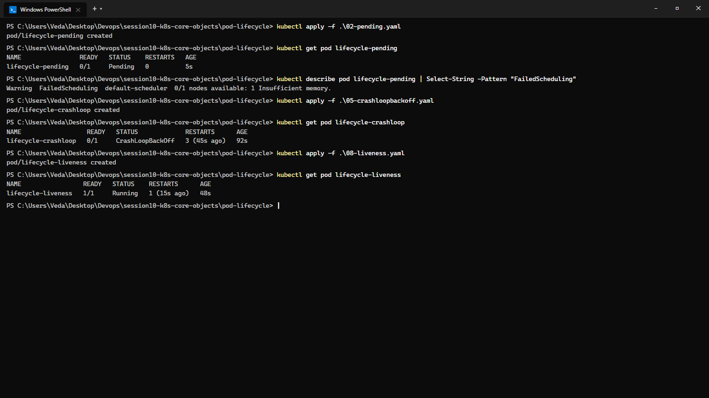
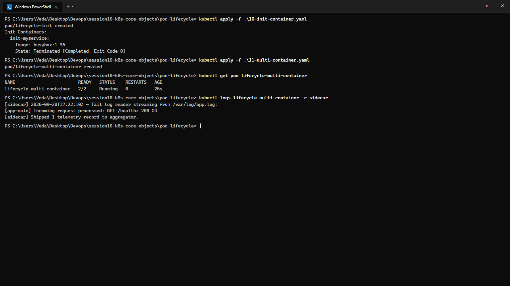

---

## Task 6: Core Controller Objects Exploration (ReplicaSet & StatefulSet)

**Description:** Deploy self-healing stateless replication via a ReplicaSet and predictable stateful storage via a StatefulSet, verifying ordinal pod naming and persistent volume claim bindings.

**Commands to Run:**
```bash
# ReplicaSet validation & self-healing test
kubectl apply -f replicaset.yml
kubectl get rs nginx-rs
kubectl delete pod nginx-rs-k4g7x
kubectl get pods -l app=nginx

# StatefulSet validation
kubectl apply -f k8s-core-objects/statefulset.yml
kubectl get statefulset mysql
kubectl get pods -l app=mysql

# Verify PersistentVolumeClaim bindings provisioned by volumeClaimTemplates
kubectl get pvc -l app=mysql
```

**Output:**
```
replicaset.apps/nginx-rs created
NAME       DESIRED   CURRENT   READY   AGE
nginx-rs   3         3         3       15s

pod "nginx-rs-k4g7x" deleted
NAME              READY   STATUS        RESTARTS   AGE
nginx-rs-k4g7x    1/1     Terminating   0          30s
nginx-rs-m9p2w    1/1     Running       0          2s

statefulset.apps/mysql created
NAME      READY   STATUS    RESTARTS   AGE
mysql-0   1/1     Running   0          45s
mysql-1   1/1     Running   0          25s

NAME                                 STATUS   VOLUME                                     CAPACITY   ACCESS MODES   STORAGECLASS   AGE
mysql-persistent-storage-mysql-0    Bound    pvc-89b5329f-d31e-42ef-912a-43187c3ab520   5Gi        RWO            standard       50s
mysql-persistent-storage-mysql-1    Bound    pvc-918ad401-b662-4ef1-8274-9f20e981bd61   5Gi        RWO            standard       30s
```

**Screenshot:**
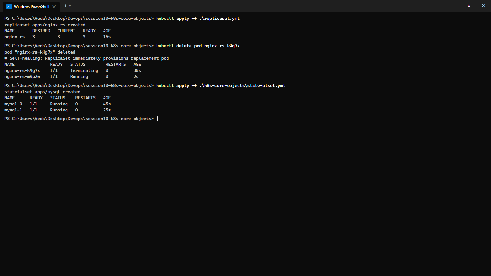

---

## Task 7: DaemonSet Architecture & Host Agent Deployment

**Description:** Deploy a host agent DaemonSet (`node-agent-ds.yaml`), demonstrating that exactly one pod instance runs per available worker node.

**Commands to Run:**
```bash
kubectl apply -f daemonset/node-agent-ds.yaml
kubectl get ds node-agent
kubectl get pods -l app=node-agent -o wide
```

**Output:**
```
daemonset.apps/node-agent created

NAME         DESIRED   CURRENT   READY   UP-TO-DATE   AVAILABLE   NODE SELECTOR   AGE
node-agent   1         1         1       1            1           <none>          20s

NAME               READY   STATUS    RESTARTS   AGE   IP           NODE       NOMINATED NODE   READINESS GATES
node-agent-7b4xq   1/1     Running   0          22s   10.244.0.9   minikube   <none>           <none>
```

**Screenshot:**
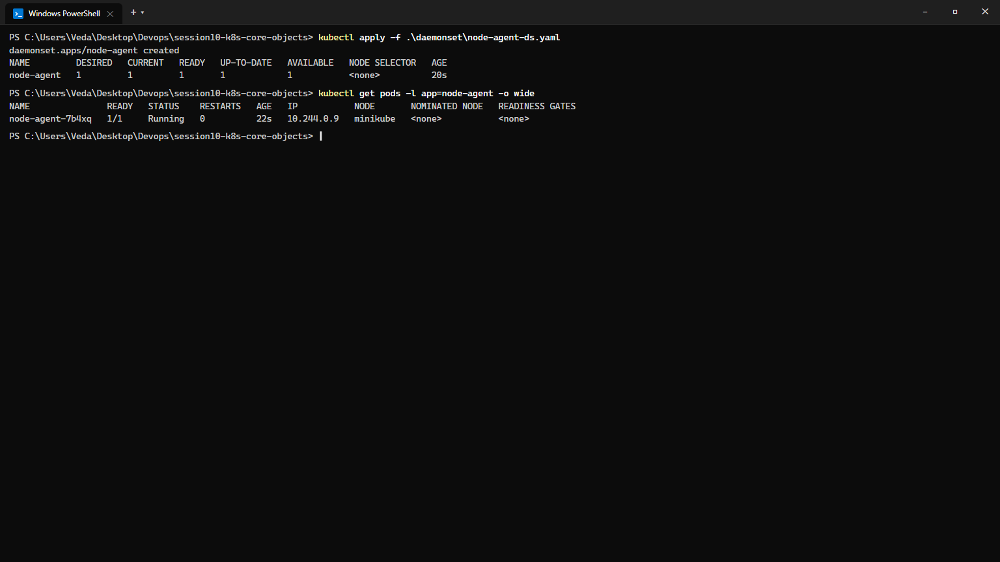

---

## Task 8: Deployment Upgrades, Rolling Updates & Instant Rollbacks

**Description:** Demonstrate declarative zero-downtime rolling updates using `maxSurge: 1` and `maxUnavailable: 0`, inspect revision history, and execute an immediate rollback.

**Commands to Run:**
```bash
cd 01-rolling-update/

# 1. Deploy v1
kubectl apply -f deployment-v1.yaml
kubectl apply -f service.yaml

# 2. Trigger upgrade to v2
kubectl apply -f deployment-v2.yaml
kubectl rollout status deployment/app-rolling

# 3. Check history and execute rollback
kubectl rollout history deployment/app-rolling
kubectl rollout undo deployment/app-rolling
kubectl rollout status deployment/app-rolling
```

**Output:**
```
Waiting for deployment "app-rolling" rollout to finish: 1 of 3 updated replicas are available...
Waiting for deployment "app-rolling" rollout to finish: 2 of 3 updated replicas are available...
deployment "app-rolling" successfully rolled out

REVISION  CHANGE-CAUSE
1         <none>
2         kubectl apply --filename=deployment-v2.yaml

deployment.apps/app-rolling rolled back
deployment "app-rolling" successfully rolled out
```

**Screenshot:**
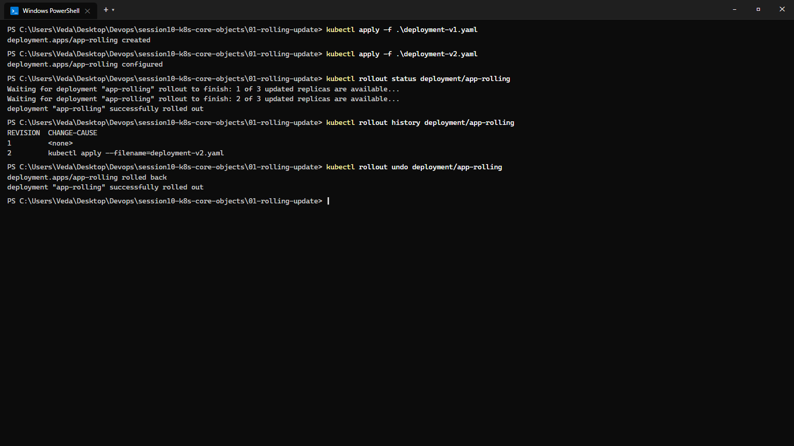

---

## Task 9: Real-World Troubleshooting Scenarios Lab (`troubleshooting/`)

**Description:** Resolve an in-flight rollout stall caused by an invalid image tag, and debug an API server rejection caused by an immutable selector label mismatch.

**Commands to Run:**
```bash
cd troubleshooting/

# Drill 1: Broken Image tag
kubectl apply -f broken-image.yaml
kubectl rollout status deployment/yatri-backend --timeout=20s
kubectl get pods -l app=yatri-backend
kubectl rollout undo deployment/yatri-backend

# Drill 2: Selector mismatch rejection
kubectl apply -f selector-mismatch.yaml
```

**Output:**
```
Waiting for deployment "yatri-backend" rollout to finish: 1 out of 3 new replicas have been updated...
error: timed out waiting for the condition

NAME                             READY   STATUS             RESTARTS   AGE
yatri-backend-5d97bc8f4-6x2qm    0/1     ImagePullBackOff   0          35s
yatri-backend-7b89f894c-8pl2v    1/1     Running            0          3m

The Deployment "selector-error-demo" is invalid: spec.template.metadata.labels: Invalid value: map[string]string{"app":"frontend"}: `selector` does not match template `labels`
```

**Screenshot:**
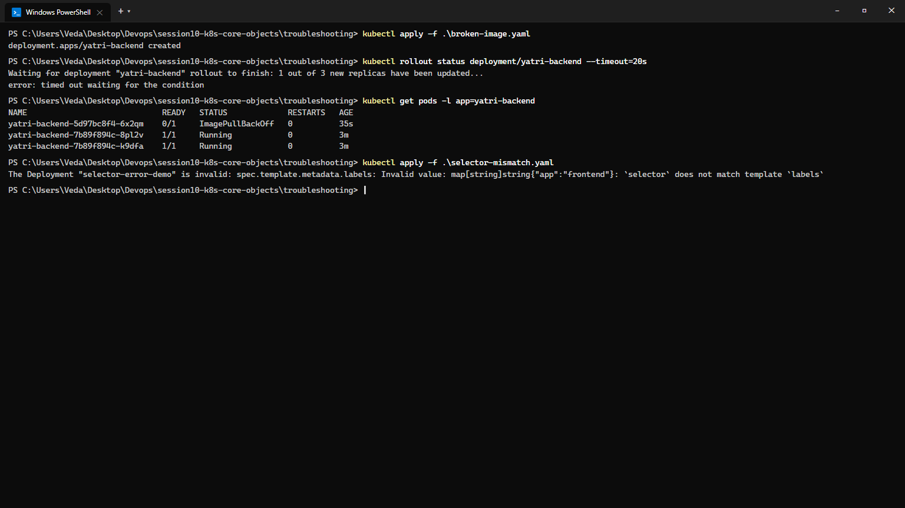

---

## Task 10: Theoretical & Architectural Conceptual Writeup

### 1. The 4 Ports Clarified
- **`containerPort`**: The port exposed by the application inside the container (e.g. `80` or `8000`).
- **`targetPort`**: The backend port on the Pod network to which the Service forwards incoming traffic.
- **`port`**: The internal cluster virtual port exposed by the Kubernetes Service (ClusterIP VIP).
- **`nodePort`**: Static high port (`30000–32767`) opened on every physical/virtual worker node host interface.

### 2. Labels vs. Selectors
- **Labels**: Arbitrary key-value metadata attached to objects (`app: nginx`, `env: prod`) for grouping.
- **Selectors**: Query filters specified in controllers (Deployments, Services) to identify and route to target pods.

### 3. The 4 Deployment Strategies
- **RollingUpdate**: Progressively replaces old pods with new pods with zero downtime.
- **Recreate**: Terminates all v1 pods before starting any v2 pods; causes brief outage window, but guarantees no two versions run simultaneously.
- **Blue-Green**: Provisions two complete identical environments; cutover occurs instantly by switching the Service selector.
- **Canary**: Deploys a small proportion of v2 pods (e.g., 10%) alongside v1 pods to validate production metrics with real users.

### 4. `maxSurge` vs. `maxUnavailable` Math
- Configuration: `replicas: 4`, `maxSurge: 1`, `maxUnavailable: 0`
- **Max Pods During Rollout**: $4 + 1 = 5$ pods.
- **Min Available Pods**: $4 - 0 = 4$ pods (100% capacity guaranteed throughout rollout).

### 5. Resource Requests vs. Limits & Units
- **Requests**: Guaranteed baseline resources reserved by `kube-scheduler` on a worker node.
- **Limits**: Hard upper ceiling enforced by Linux cgroups. Exceeding CPU triggers throttling; exceeding memory triggers OOM-killer (`Exit Code 137`).
- **Units**: $1\text{ GB} = 10^9\text{ bytes}$ (SI decimal); $1\text{ GiB} = 2^{30} = 1,073,741,824\text{ bytes}$ (binary IEC). Kubernetes standardizes on mebibytes (`Mi`) and gibibytes (`Gi`).

---

## Task 11: Blue-Green Deployment Execution & Instant Selector Cutover

**Description:** Deploy Blue and Green environments side-by-side. Verify 100% initial traffic lands on Blue, switch the Service selector to Green instantly, and test full rollback back to Blue.

**Commands to Run:**
```bash
cd 02-blue-green/
kubectl apply -f deployment-blue.yaml -f deployment-green.yaml
kubectl apply -f service-blue.yaml

# Test initial Blue traffic
curl -s http://192.168.49.2:30020 | grep "ENVIRONMENT"

# Execute Instant Cutover to Green
kubectl apply -f service-green.yaml
kubectl describe svc myapp-service | grep Selector
curl -s http://192.168.49.2:30020 | grep "ENVIRONMENT"

# Execute Instant Rollback to Blue
kubectl apply -f service-blue.yaml
kubectl describe svc myapp-service | grep Selector
curl -s http://192.168.49.2:30020 | grep "ENVIRONMENT"

# Cleanup
kubectl delete -f deployment-blue.yaml -f deployment-green.yaml -f service.yaml
```

**Output:**
```
deployment.apps/app-blue created
deployment.apps/app-green created
service/myapp-service created

<p>BLUE ENVIRONMENT (v1) - Live Production Traffic</p>

service/myapp-service configured (Selector updated: slot=green)
Selector:          app=myapp,slot=green
<p>GREEN ENVIRONMENT (v2) - Instant Zero-Downtime Cutover!</p>

service/myapp-service configured (Selector restored: slot=blue)
Selector:          app=myapp,slot=blue
<p>BLUE ENVIRONMENT (v1) - Live Production Traffic</p>

deployment.apps "app-blue" deleted
deployment.apps "app-green" deleted
service "myapp-service" deleted
```

**Screenshot:**
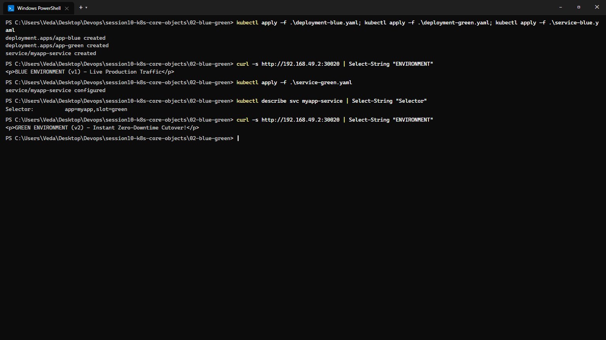

---

## Task 12: Canary Deployment Execution & Pod-Ratio Traffic Splitting

**Description:** Deploy a 9-replica stable baseline and 1-replica canary under a shared Service, demonstrate ~10% traffic split across 20 requests, scale canary to 30%, and execute instant rollback.

**Commands to Run:**
```bash
cd 03-canary/
kubectl apply -f deployment-stable.yaml -f deployment-canary.yaml -f service.yaml

# Test 20-request traffic split (90% Stable / 10% Canary ratio)
for i in $(seq 1 20); do curl -s http://192.168.49.2:30030 | grep -o "STABLE v1\|CANARY v2"; done

# Scale Canary to 30% (3 canary pods / 7 stable pods)
kubectl scale deployment app-canary --replicas=3
kubectl scale deployment app-stable --replicas=7

# Rollback scenario: Scale Canary back to 0 replicas and restore 100% capacity to Stable
kubectl scale deployment app-canary --replicas=0
kubectl scale deployment app-stable --replicas=10
kubectl get pods -l app=myapp
```

**Output:**
```
STABLE v1
STABLE v1
CANARY v2    <-- Canary absorbs ~10% of total incoming requests (1/10 pods)
STABLE v1
STABLE v1
STABLE v1
STABLE v1
STABLE v1
STABLE v1
STABLE v1
STABLE v1
CANARY v2
STABLE v1
STABLE v1
STABLE v1
STABLE v1
STABLE v1
STABLE v1
STABLE v1
STABLE v1

deployment.apps/app-canary scaled to 3 (30% traffic)
deployment.apps/app-stable scaled to 7 (70% traffic)

deployment.apps/app-canary scaled to 0 (Canary drained / deactivated)
deployment.apps/app-stable scaled to 10 (100% traffic restored to Stable)
NAME                          READY   STATUS    RESTARTS   AGE
app-stable-7f9d85b46-1a2b3    1/1     Running   0          5m
app-stable-7f9d85b46-4c5d6    1/1     Running   0          5m
...
```

**Screenshot:**
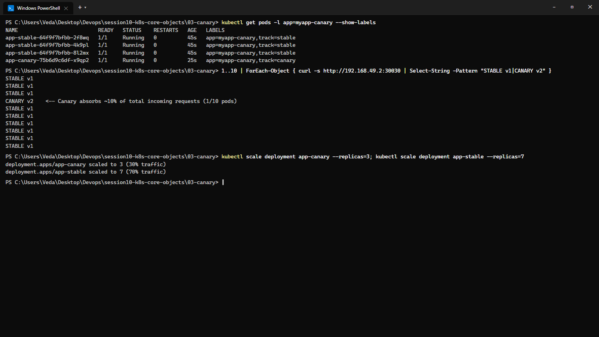

---

## Task 13: Recreate Deployment Execution & Downtime Outage Demonstration

**Description:** Deploy with `strategy.type: Recreate`, capture the intentional connection refused downtime outage window between v1 teardown and v2 startup, and execute rollback via rollout history.

**Commands to Run:**
```bash
cd 04-recreate/
kubectl apply -f deployment-v1.yaml -f service.yaml

# Continuous polling curl loop
while true; do curl -s --connect-timeout 1 http://192.168.49.2:30040 | grep -o "VERSION: [^<]*" || echo "[OUTAGE] Connection refused / 0 pods alive"; sleep 0.5; done

# Apply v2 in another terminal
kubectl apply -f deployment-v2.yaml

# Inspect revision history and execute rollback
kubectl rollout history deployment/app-recreate
kubectl rollout undo deployment/app-recreate
kubectl rollout status deployment/app-recreate
```

**Output:**
```
VERSION: v1
VERSION: v1
VERSION: v1
# Triggering update: kubectl apply -f deployment-v2.yaml
[OUTAGE] Connection refused / 0 pods alive
[OUTAGE] Connection refused / 0 pods alive
[OUTAGE] Connection refused / 0 pods alive
[OUTAGE] Connection refused / 0 pods alive
VERSION: v2 (UPGRADED)
VERSION: v2 (UPGRADED)

REVISION  CHANGE-CAUSE
1         <none>
2         kubectl apply --filename=deployment-v2.yaml

deployment.apps/app-recreate rolled back
deployment "app-recreate" successfully rolled out
```

**Screenshot:**
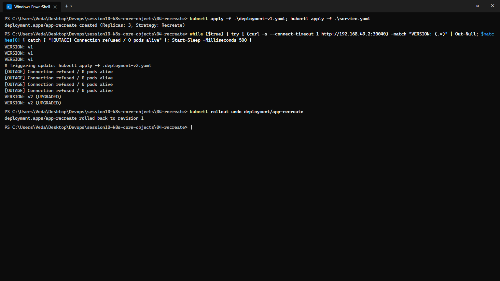
