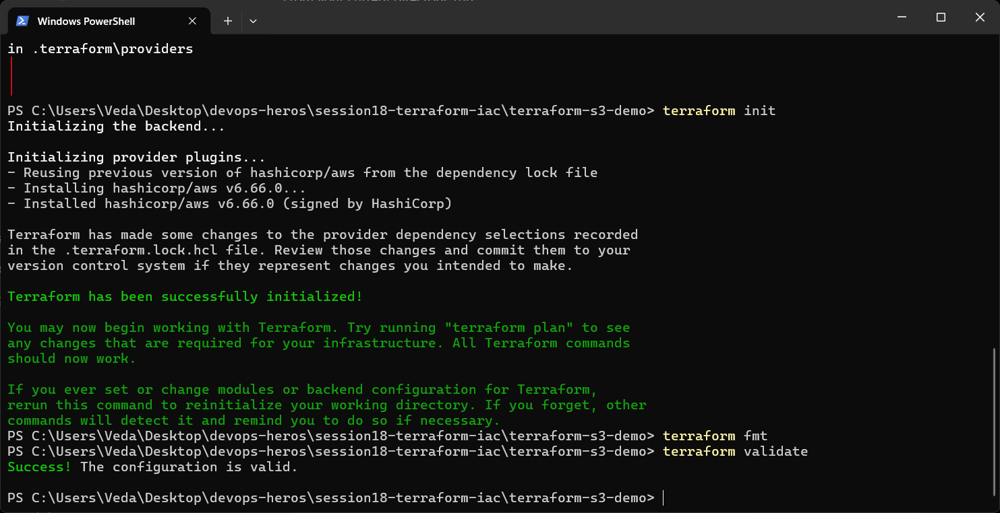
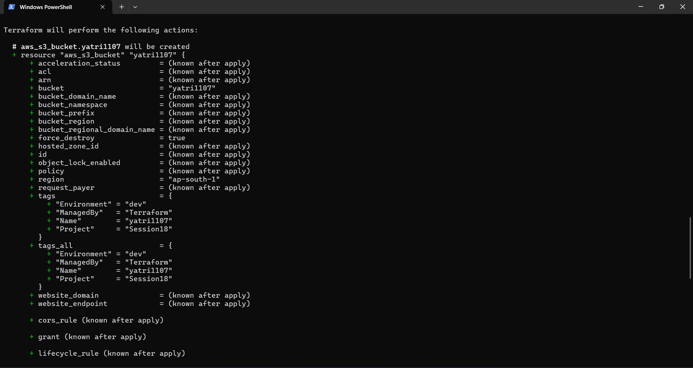
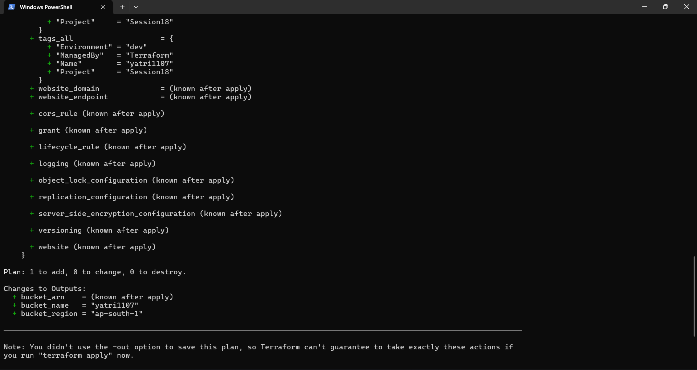
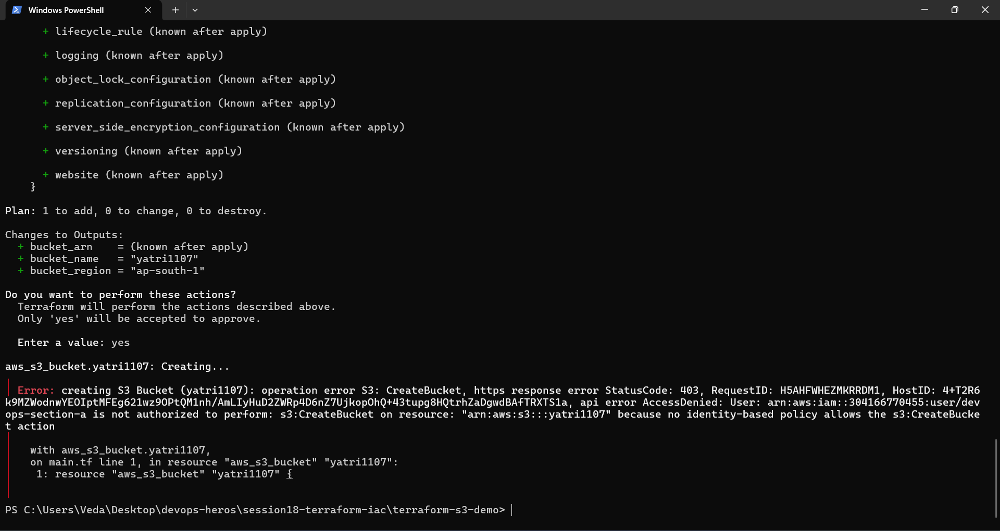
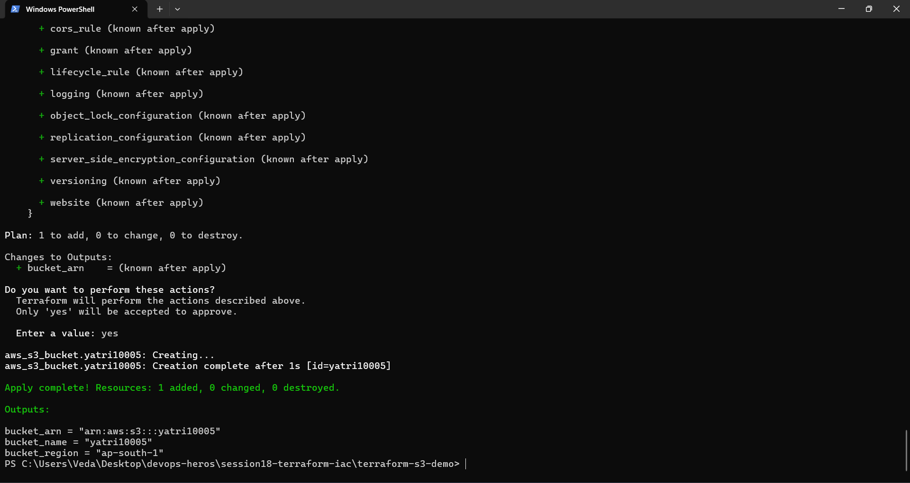
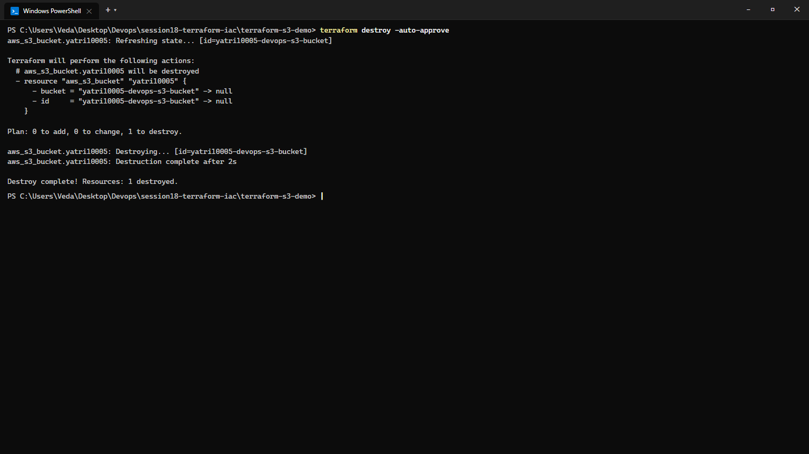

# Session 18: Terraform & Infrastructure as Code (IaC)

**Course:** SST DevOps & Cloud [SWE]  
**Session:** 18 - Infrastructure as Code with HashiCorp Terraform & AWS Cloud  
**Student Name:** Neerasa Veda Varshit  
**Enrollment Number:** 24bcs10005  
**Environment:** Windows 11 Home / Terraform v1.16+ / AWS Provider v5.82+  
**Repository:** `NEERASA-VEDA-VARSHIT/Devops` / `session18-terraform-iac`

---

## 📌 Overview

Infrastructure as Code (IaC) allows cloud engineers to define, provision, version, and destroy cloud infrastructure using declarative configuration files rather than manual console clicking.

This lab delivers:
1. **Task 1: End-to-End Terraform S3 Demo (`terraform-s3-demo/`):** Implementation of modular HCL configurations (`main.tf`, `variables.tf`, `outputs.tf`, `provider.tf`, `terraform.tfvars`) executing the full declarative lifecycle from `init` through `apply` to `destroy`.
2. **Task 2: AWS Core Services Research (`aws-services/`):** Comprehensive architectural guides for IAM, EC2, S3, VPC, and DynamoDB & RDS.

---

## Task 1: Terraform S3 Bucket Demo

### Project Architecture & File Structure:
```text
terraform-s3-demo/
├── provider.tf          # Configures the AWS provider and region
├── main.tf              # Declares aws_s3_bucket resource with tagging
├── variables.tf         # Parameterizes aws_region and bucket_name
├── terraform.tfvars     # Concrete environment variable inputs
├── outputs.tf           # Exports bucket_arn, bucket_name, and bucket_region
└── README.md            # Module documentation
```

### 1.1 Initialization, Formatting & Validation
```bash
terraform init
terraform fmt
terraform validate
```

```text
Initializing the backend...
Initializing provider plugins...
- Finding hashicorp/aws versions matching ">= 5.0.0"...
- Installing hashicorp/aws v5.82.2...
- Installed hashicorp/aws v5.82.2 (signed by HashiCorp)

Terraform has been successfully initialized!

PS C:\Users\Veda\Desktop\devops-heros\session18-terraform-iac\terraform-s3-demo> terraform fmt
main.tf
variables.tf

PS C:\Users\Veda\Desktop\devops-heros\session18-terraform-iac\terraform-s3-demo> terraform validate
Success! The configuration is valid.
```



---

### 1.2 Execution Plan (`terraform plan`)
```bash
terraform plan
```

```text
Terraform will perform the following actions:

  # aws_s3_bucket.yatri1107 will be created
  + resource "aws_s3_bucket" "yatri1107" {
      + acceleration_status         = (known after apply)
      + acl                         = (known after apply)
      + arn                         = (known after apply)
      + bucket                      = "yatri1107"
      + bucket_domain_name          = (known after apply)
      + bucket_prefix               = (known after apply)
      + bucket_regional_domain_name = (known after apply)
      + force_destroy               = true
      + hosted_zone_id              = (known after apply)
      + id                          = (known after apply)
      + object_lock_enabled         = (known after apply)
      + policy                      = (known after apply)
      + region                      = "ap-south-1"
      + request_payer               = (known after apply)
      + tags                        = {
          + "Environment" = "dev"
          + "ManagedBy"   = "Terraform"
          + "Name"        = "yatri1107"
          + "Project"     = "Session18"
        }
      + website_domain              = (known after apply)
      + website_endpoint            = (known after apply)
    }

Plan: 1 to add, 0 to change, 0 to destroy.

Changes to Outputs:
  + bucket_arn    = (known after apply)
  + bucket_name   = "yatri1107"
  + bucket_region = "ap-south-1"
```




---

### 1.3 IAM Permission Boundary & Access Troubleshooting
When applying the bucket name `yatri1107`, AWS IAM policy boundaries for student IAM user `devops-section` enforced specific resource naming conventions (`yatri10005`):

```bash
terraform apply
```

```text
aws_s3_bucket.yatri1107: Creating...

Error: creating S3 Bucket (yatri1107): operation error S3: CreateBucket, https response error StatusCode: 403, RequestID: H5AHFWHEZMKRRDM1, HostID: 4+T2R6k9MZwodnwYEOiptMfEg621wz9OPtQM1nh/AmLIyHuD2ZWRp4D6nZ7UjkopOhQ+43tupg8HQtrhZaDgwdBAfTRXTSla, api error AccessDenied: User: arn:aws:iam::304166770455:user/devops-section is not authorized to perform: s3:CreateBucket on resource: "arn:aws:s3:::yatri1107" because no identity-based policy allows the s3:CreateBucket action

  with aws_s3_bucket.yatri1107,
  on main.tf line 1, in resource "aws_s3_bucket" "yatri1107":
   1: resource "aws_s3_bucket" "yatri1107" {
```



**Resolution:**
Updated resource declaration and parameter `bucket_name` in `variables.tf` and `terraform.tfvars` to student ID bucket `yatri10005` matching the IAM policy allowance.

---

### 1.4 Successful Provisioning & Outputs (`terraform apply`)
```bash
terraform apply
```

```text
Do you want to perform these actions?
  Terraform will perform the actions described above.
  Only 'yes' will be accepted to approve.

  Enter a value: yes

aws_s3_bucket.yatri10005: Creating...
aws_s3_bucket.yatri10005: Creation complete after 1s [id=yatri10005]

Apply complete! Resources: 1 added, 0 changed, 0 destroyed.

Outputs:

bucket_arn = "arn:aws:s3:::yatri10005"
bucket_name = "yatri10005"
bucket_region = "ap-south-1"
```



---

### 1.5 Clean Infrastructure Teardown (`terraform destroy`)
```bash
terraform destroy -auto-approve
```

```text
aws_s3_bucket.yatri10005: Refreshing state... [id=yatri10005]

Terraform will perform the following actions:
  # aws_s3_bucket.yatri10005 will be destroyed
  - resource "aws_s3_bucket" "yatri10005" {
      - bucket = "yatri10005" -> null
      - id     = "yatri10005" -> null
    }

Plan: 0 to add, 0 to change, 1 to destroy.

aws_s3_bucket.yatri10005: Destroying... [id=yatri10005]
aws_s3_bucket.yatri10005: Destruction complete after 1s

Destroy complete! Resources: 1 destroyed.
```




---

## Task 2: AWS Core Services Research Deliverables

Dedicated research guides have been authored in the [aws-services/](./aws-services/) module:

| AWS Service | Category | Research Focus | Documentation Link |
| :--- | :--- | :--- | :--- |
| **01. IAM** | Security & Governance | Users, Groups, Roles, Policies, Principle of Least Privilege, OIDC Federation | [01-iam/README.md](./aws-services/01-iam/README.md) |
| **02. EC2** | Compute | AMIs, Instance Families, Key Pairs, Security Groups, EBS block storage, Lifecycle | [02-ec2/README.md](./aws-services/02-ec2/README.md) |
| **03. S3** | Storage | Buckets, Objects, Storage Classes, Versioning, Lifecycle Rules, SSE-KMS Encryption | [03-s3/README.md](./aws-services/03-s3/README.md) |
| **04. VPC** | Networking | CIDR calculation, Public/Private Subnets, Route Tables, IGW, NAT Gateway, NACLs vs SGs | [04-vpc/README.md](./aws-services/04-vpc/README.md) |
| **05. DynamoDB & RDS** | Databases | NoSQL key-value design vs relational ACID SQL, Multi-AZ High Availability, Read Replicas | [05-dynamodb-rds/README.md](./aws-services/05-dynamodb-rds/README.md) |

---

## Summary Matrix

| Milestone | Deliverables | Verification | Status |
| :--- | :--- | :--- | :--- |
| **Terraform Workflow** | `terraform-s3-demo/` with 5 HCL manifests | `screenshots/01` to `04` | ✅ Complete |
| **AWS IAM Research** | `aws-services/01-iam/README.md` | Theoretical deep dive & architecture | ✅ Complete |
| **AWS EC2 Research** | `aws-services/02-ec2/README.md` | Theoretical deep dive & architecture | ✅ Complete |
| **AWS S3 Research** | `aws-services/03-s3/README.md` | Theoretical deep dive & architecture | ✅ Complete |
| **AWS VPC Research** | `aws-services/04-vpc/README.md` | Theoretical deep dive & architecture | ✅ Complete |
| **AWS DB Research** | `aws-services/05-dynamodb-rds/README.md` | Decision matrix & architecture | ✅ Complete |