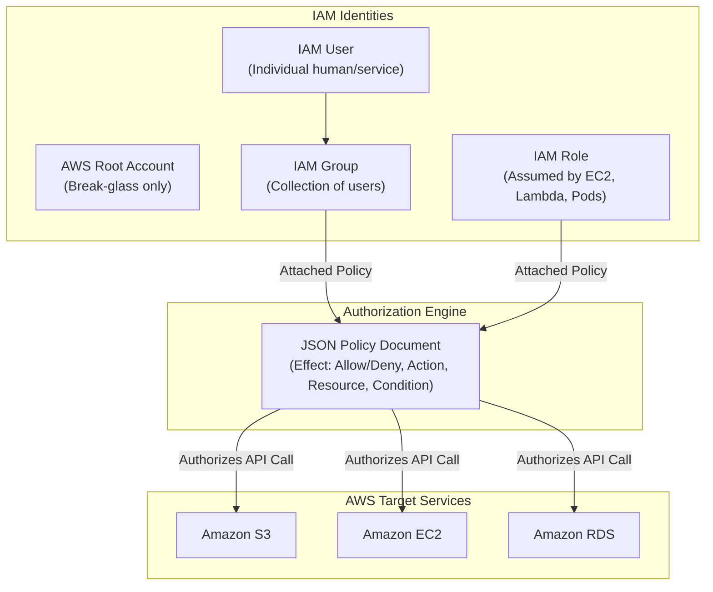

# AWS IAM: Identity and Access Management — Governance & Security

**Course:** SST DevOps & Cloud [SWE]  
**Session:** 18 - Terraform & Infrastructure as Code  
**Module:** AWS Services Research: 01 - IAM  
**Author:** Neerasa Veda Varshit (`24bcs10005`)  
**Repository:** `NEERASA-VEDA-VARSHIT/Devops` / `session18-terraform-iac/aws-services/01-iam`

---

## 1. What is AWS IAM?

**AWS Identity and Access Management (IAM)** is a foundational web service that helps you securely control authentication (who can sign in) and authorization (who has permissions) to AWS resources. IAM is a **global service** with zero geographic boundaries or region-specific deployments.

---

## 2. Core IAM Entities & Concepts



### 1. IAM Users
- Represents an individual person or service application requiring long-term credentials.
- Can have two types of credentials:
  - **Console Password:** For interactive web console access with Virtual MFA.
  - **Access Key & Secret Access Key:** For programmatic CLI / SDK / API access.

### 2. IAM Groups
- A logical collection of IAM users (e.g., `DevOpsAdmins`, `Developers`, `SecurityAuditors`).
- Allows administrators to assign permissions to multiple users at once. Groups cannot be nested and cannot be used as an identity in a policy.

### 3. IAM Roles
- An IAM identity that does not have long-term credentials (no password or static access keys).
- Intended to be **assumed** by anyone or anything that needs temporary access (AWS STS - Security Token Service).
- **Use Cases:**
  - Granting EC2 instances permissions to read S3 buckets (EC2 Instance Profile).
  - Cross-account access without sharing secret keys.
  - OIDC federation for GitHub Actions or Kubernetes Pods (IRSA - IAM Roles for Service Accounts).

### 4. IAM Policies
JSON documents defining permissions:
```json
{
  "Version": "2012-10-17",
  "Statement": [
    {
      "Sid": "AllowS3ReadSpecificBucket",
      "Effect": "Allow",
      "Action": [
        "s3:GetObject",
        "s3:ListBucket"
      ],
      "Resource": [
        "arn:aws:s3:::production-app-assets",
        "arn:aws:s3:::production-app-assets/*"
      ]
    }
  ]
}
```

- **Policy Elements:**
  - `Effect`: `Allow` or `Deny` (Explicit Deny always overrides an Allow).
  - `Action`: Specific API actions (e.g. `s3:GetObject`, `ec2:DescribeInstances`).
  - `Resource`: Amazon Resource Name (ARN) identifying the target object.
  - `Condition`: Contextual constraints (e.g., enforce IP whitelist, require MFA, enforce TLS).

---

## 3. The Principle of Least Privilege

> *"Grant only the minimum permissions necessary for an identity to perform its designated task, and nothing more."*

In practice:
- Never attach `AdministratorAccess` or wildcard `*` permissions to applications or team members.
- Separate development privileges from production mutation access.
- Restrict actions to specific target resource ARNs rather than `"Resource": "*"`.

---

## 4. IAM Best Practices for DevOps Engineers

1. **Lock Away the AWS Root Account:** Never use the root account for day-to-day administrative tasks. Lock it with hardware MFA and delete root access keys.
2. **Enforce Multi-Factor Authentication (MFA):** Mandate MFA on all human IAM console logins.
3. **Use Temporary Credentials (Roles) over Long-Term Access Keys:** Never hardcode access keys in EC2, Docker images, or Git repositories. Use IAM Instance Profiles for EC2 and OpenID Connect (OIDC) for GitHub Actions.
4. **Regular Credential Rotation:** Rotate programmatic access keys periodically (every 90 days).
5. **Use AWS IAM Access Analyzer & CloudTrail:** Continuously audit unused permissions and log all AWS API calls for security auditing.
