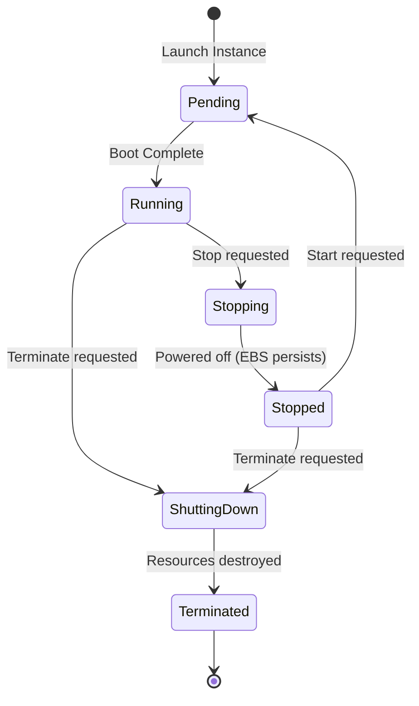

# AWS EC2: Elastic Compute Cloud — Virtual Server Architecture

**Course:** SST DevOps & Cloud [SWE]  
**Session:** 18 - Terraform & Infrastructure as Code  
**Module:** AWS Services Research: 02 - EC2  
**Author:** Neerasa Veda Varshit (`24bcs10005`)  
**Repository:** `NEERASA-VEDA-VARSHIT/Devops` / `session18-terraform-iac/aws-services/02-ec2`

---

## 1. What is Amazon EC2?

**Amazon Elastic Compute Cloud (Amazon EC2)** provides scalable computing capacity in the AWS cloud. It allows engineers to provision virtual servers (known as **instances**) on demand in seconds, scaling compute capacity up or down as business requirements change.

---

## 2. Core Concepts & Architecture

### 1. Amazon Machine Image (AMI)
An AMI is a template that contains the software configuration (operating system, application server, and pre-installed packages) required to launch an instance:
- **AWS Provided AMIs:** Official Ubuntu, Amazon Linux 2023, Debian, Red Hat Enterprise Linux, Windows Server.
- **Custom AMIs (Golden Images):** Pre-baked AMIs created using tools like HashiCorp Packer with enterprise agents and hardening applied.

### 2. Instance Types & Families
AWS groups EC2 instances into specialized families:

| Family | Prefix | Optimized For | Typical DevOps Workloads |
| :--- | :--- | :--- | :--- |
| **General Purpose** | `t4g`, `m6i`, `m7g` | Balanced compute, memory, and networking | Web applications, dev environments, microservices |
| **Compute Optimized**| `c6i`, `c7g` | High-performance CPU compute | Batch processing, video encoding, gaming servers |
| **Memory Optimized** | `r6i`, `r7g` | High RAM memory-to-vCPU ratio | In-memory databases (Redis, Memcached), Apache Spark |
| **Storage Optimized**| `i3en`, `d3` | High sequential read/write block storage | Distributed file systems, Elasticsearch, Kafka |
| **Accelerated Compute**| `g5`, `p4d` | GPU coprocessors | Machine Learning training, LLM inference, 3D rendering |

### 3. Key Pairs & Secure Shell (SSH) Access
- Public key cryptography (RSA or ED25519) used to authenticate SSH or RDP connections.
- AWS stores the **public key** in the instance metadata (`~/.ssh/authorized_keys`). The engineer retains the **private key** (`.pem` file) locally:
  ```bash
  chmod 400 my-key.pem
  ssh -i my-key.pem ubuntu@<ec2-public-ip>
  ```

### 4. Security Groups (Stateful Virtual Firewalls)
- Controls inbound and outbound network traffic at the virtual network interface (ENI) level.
- **Stateful:** If you send a request out from an instance, the response traffic is automatically allowed back in regardless of inbound rules.
- Defaults: Block all inbound traffic; allow all outbound traffic.

### 5. Elastic Block Store (EBS)
- High-performance block storage volumes attached to EC2 instances over the internal hypervisor network.
- **Volume Types:**
  - `gp3` / `gp2`: General purpose SSD (default for boot and application volumes).
  - `io2`: Provisioned IOPS SSD for latency-sensitive transactional databases.
  - `st1`: Throughput optimized HDD for large sequential big data.
- **Snapshots:** Point-in-time point-to-S3 backups of EBS volumes.

### 6. IP Addressing: Public, Private & Elastic IP
- **Private IP:** Internal IP address allocated within the VPC CIDR block. Retained for the lifetime of the instance.
- **Public IP:** Routable internet IP assigned automatically. Released and changed whenever the instance is stopped and started.
- **Elastic IP (EIP):** Static, reserved public IPv4 address that persists across instance stop/starts and can be dynamically remapped to different instances during failover.

---

## 3. The EC2 Instance Lifecycle



- **Stopped:** CPU and RAM allocation released; billing for compute stops. Underlying EBS volume storage continues to incur billing.
- **Terminated:** All allocated hardware destroyed. If EBS root volume has `DeleteOnTermination: true`, storage is deleted.

---

## 4. Common Production Use Cases
1. Microservice API hosting with Docker and Systemd daemons.
2. Self-hosted Kubernetes Worker Nodes (kubeadm / EKS node groups).
3. CI/CD Self-Hosted Runners for resource-intensive compilation and testing.
4. Database hosting for custom engine topologies (PostgreSQL, MongoDB).
