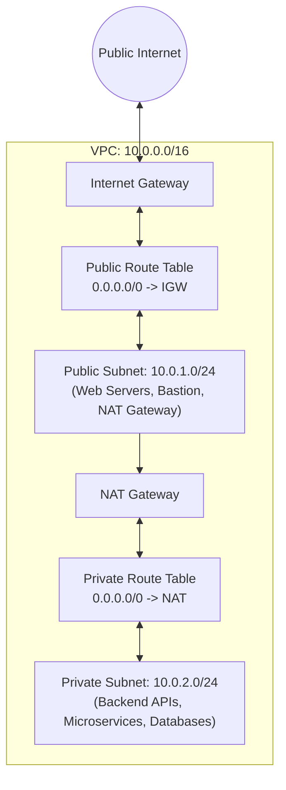

# AWS VPC: Virtual Private Cloud — Cloud Networking Architecture

**Course:** SST DevOps & Cloud [SWE]  
**Session:** 18 - Terraform & Infrastructure as Code  
**Module:** AWS Services Research: 04 - VPC  
**Author:** Neerasa Veda Varshit (`24bcs10005`)  
**Repository:** `NEERASA-VEDA-VARSHIT/Devops` / `session18-terraform-iac/aws-services/04-vpc`

---

## 1. What is Amazon VPC?

**Amazon Virtual Private Cloud (Amazon VPC)** enables you to provision a logically isolated section of the AWS Cloud where you can launch AWS resources in a virtual network that you define. You retain complete control over your virtual networking environment, including selection of your IP address range, creation of subnets, and configuration of route tables and network gateways.

---

## 2. Core VPC Networking Components

### 1. CIDR Blocks & IP Allocation
- **Classless Inter-Domain Routing (CIDR)** defines the IPv4/IPv6 block for the VPC.
- Common standard: `10.0.0.0/16` (provides 65,536 private IP addresses).
- AWS reserves **5 IP addresses** in every subnet (Network address `.0`, VPC router `.1`, DNS server `.2`, future use `.3`, and broadcast address `.255`).

### 2. Subnets: Public vs Private
- **Subnet:** A subdivision of the VPC CIDR tied to a specific single **Availability Zone (AZ)**.
- **Public Subnet:** Associated with a Route Table that has a default route (`0.0.0.0/0`) pointing directly to an **Internet Gateway (IGW)**. Resources receive public IPs and can be accessed from the Internet.
- **Private Subnet:** Associated with a Route Table without an IGW route. Resources receive only internal private IPs and cannot be directly reached from the Internet.

### 3. Gateways & Routing
- **Internet Gateway (IGW):** Horizontally scaled, redundant VPC component that enables bidirectional internet communication for public subnets.
- **NAT Gateway (Network Address Translation):** Placed in a **public subnet** with an Elastic IP. Allows instances in **private subnets** to reach the outbound internet (for security patches, docker pulls) while blocking inbound connections from the internet.
- **Route Tables:** A set of routing rules determining where network traffic from subnets or gateways is directed.

### 4. Network Security: Security Groups vs Network ACLs

| Feature | Security Groups (SG) | Network Access Control Lists (NACL) |
| :--- | :--- | :--- |
| **Operating Layer** | Virtual Network Interface (Instance Level) | Subnet Boundary Level |
| **State Tracking** | **Stateful:** Return traffic is automatically allowed regardless of inbound rules | **Stateless:** Return traffic must be explicitly allowed by outbound rules |
| **Rule Capabilities**| Allow rules only (implicit deny for unlisted traffic)| Both **Allow** and **Deny** rules evaluated numerically |
| **Evaluation Order** | All rules evaluated simultaneously | Evaluated in sequential rule number order (e.g. 100, 200) |
| **Default Configuration**| Inbound: Deny all; Outbound: Allow all | Default NACL allows all inbound and outbound traffic |

---

## 3. High-Availability Multi-Tier VPC Pattern
In modern production DevOps architectures:
1. **Tier 1 (Public Subnets):** Internet-facing Application Load Balancers (ALBs) spanning at least 2 Availability Zones.
2. **Tier 2 (Private Subnets):** Microservices and container tasks running in Amazon ECS or EKS.
3. **Tier 3 (Isolated Database Subnets):** Amazon RDS or Aurora database clusters with zero internet egress or ingress.
