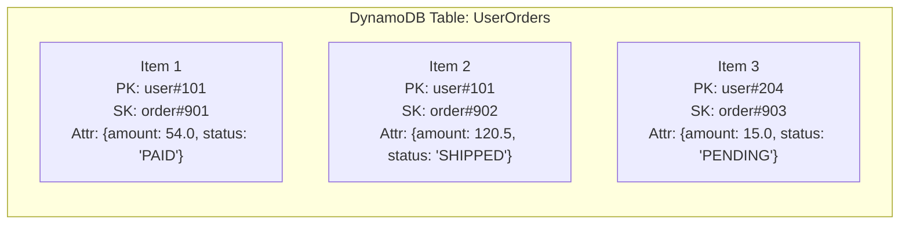
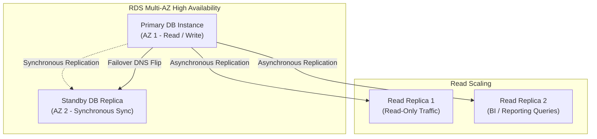

# AWS Database Services: DynamoDB (NoSQL) & RDS (Relational)

**Course:** SST DevOps & Cloud [SWE]  
**Session:** 18 - Terraform & Infrastructure as Code  
**Module:** AWS Services Research: 05 - DynamoDB & RDS  
**Author:** Neerasa Veda Varshit (`24bcs10005`)  
**Repository:** `NEERASA-VEDA-VARSHIT/Devops` / `session18-terraform-iac/aws-services/05-dynamodb-rds`

---

## 1. Overview: Choosing Cloud Database Solutions

Cloud applications require distinct database engines depending on schema flexibility, transactional guarantees (ACID), throughput demands, and query complexity:
- **Amazon RDS:** Fully managed Relational Database Service for complex multi-table SQL queries, foreign keys, and strict relational schemas.
- **Amazon DynamoDB:** Fully managed, serverless, key-value and document NoSQL database engineered for single-digit millisecond latency at any scale.

---

## 2. Amazon DynamoDB: Serverless NoSQL Database

### Core Architecture:
1. **Tables, Items, Attributes:**
   - **Table:** Collection of data items.
   - **Item:** Group of attributes uniquely identifiable among all other items (similar to a row). Items can have arbitrary dynamic schemas.
   - **Attributes:** Fundamental data element (similar to a column/field).
2. **Primary Key Schemes:**
   - **Partition Key (Single Primary Key):** Hashed internally to determine the physical storage partition.
   - **Composite Primary Key (Partition Key + Sort Key):** Allows multiple items with the same partition key stored ordered by the sort key (e.g. `CustomerID` + `OrderDate`).
3. **Capacity Modes:**
   - **On-Demand:** Scales instantly with automatic pay-per-request pricing. Zero capacity planning needed.
   - **Provisioned:** Pre-allocate Read Capacity Units (RCUs) and Write Capacity Units (WCUs) with auto-scaling to save costs.
4. **Use Cases:** Session stores, shopping carts, gaming leaderboards, IoT sensor telemetry, and serverless architectures with AWS Lambda.

---

## 3. Amazon RDS: Relational Database Service

### Supported Engines:
1. **PostgreSQL:** Industry favorite for general application microservices.
2. **MySQL & MariaDB:** Web applications and content management systems.
3. **Amazon Aurora:** Cloud-native proprietary MySQL/PostgreSQL compatible engine with 3x-5x performance and automated 6-way cross-AZ replication.
4. **Oracle & Microsoft SQL Server:** Enterprise legacy workloads with BYOL or license-included models.

### Key Operational Features:

1. **Automated Backups & Point-in-Time Recovery (PITR):**  
   Continuous transaction logs and daily snapshots allow restoring a database cluster to any second within the retention period (up to 35 days).
2. **Multi-AZ Deployments (High Availability):**  
   Synchronously replicates data to a standby instance in a different Availability Zone. In case of primary failure, AWS executes an automatic DNS failover in under 60 seconds with zero data loss.
3. **Read Replicas (Horizontal Read Scaling):**  
   Asynchronously replicates data across up to 15 read-only DB instances to offload intensive read traffic.
4. **Maintenance & Minor Version Auto-Upgrades:**  
   Automated OS and database engine patch management within configured maintenance windows.

---

## 4. DynamoDB vs RDS: Architectural Decision Matrix

| Dimension | Amazon DynamoDB | Amazon RDS |
| :--- | :--- | :--- |
| **Data Model** | Key-Value / Document (NoSQL) | Relational SQL (Tables, Columns, Rows) |
| **Schema** | Schema-less (Dynamic attributes per item)| Rigid predefined schema with migrations |
| **Transactions** | DynamoDB Transactions (ACID supported) | Full ACID relational transactions |
| **Scaling Mechanism**| Fully serverless horizontal partition scaling| Vertical compute scaling + Read Replicas |
| **Latency Profile** | Predictable **1–9 ms** at any query volume | Variable depending on JOINs and indexing |
| **Complex Queries** | Key lookups and range queries; no `JOIN`s | Full SQL syntax (`JOIN`, `GROUP BY`, CTEs) |
| **Maintenance** | Zero maintenance, zero server provisioning | Managed OS/DB engine updates, storage allocation |
