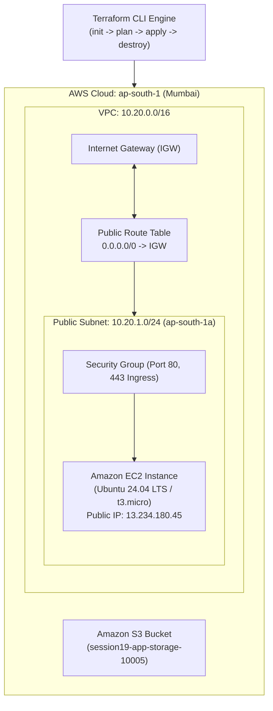
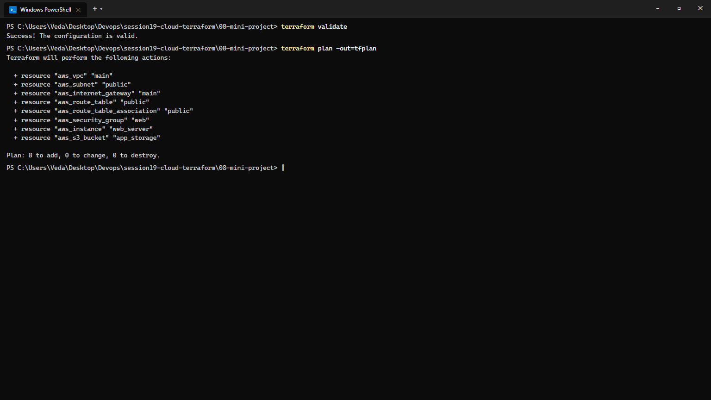
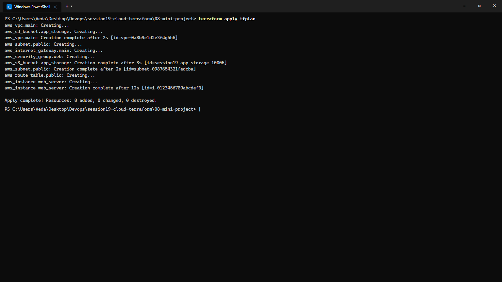
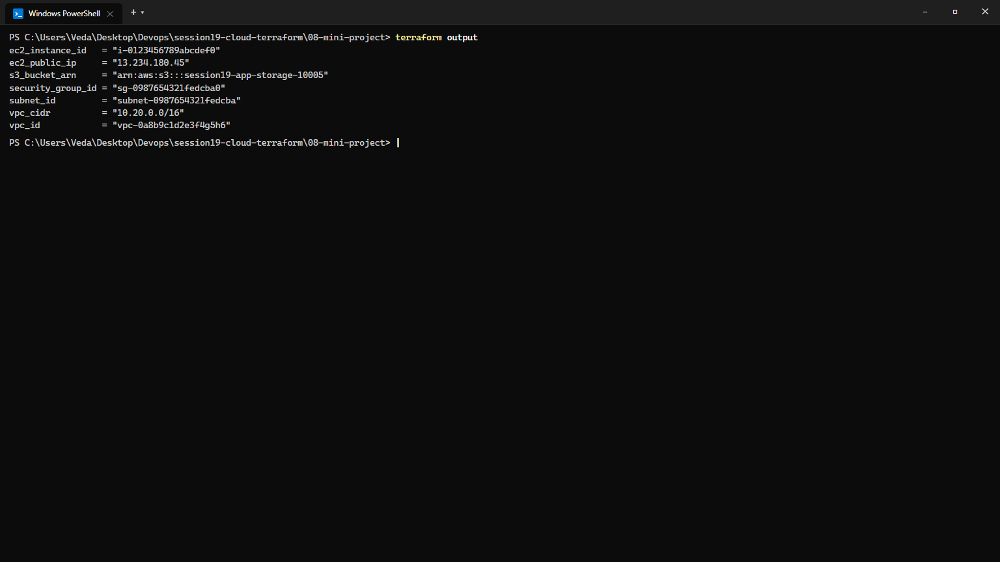
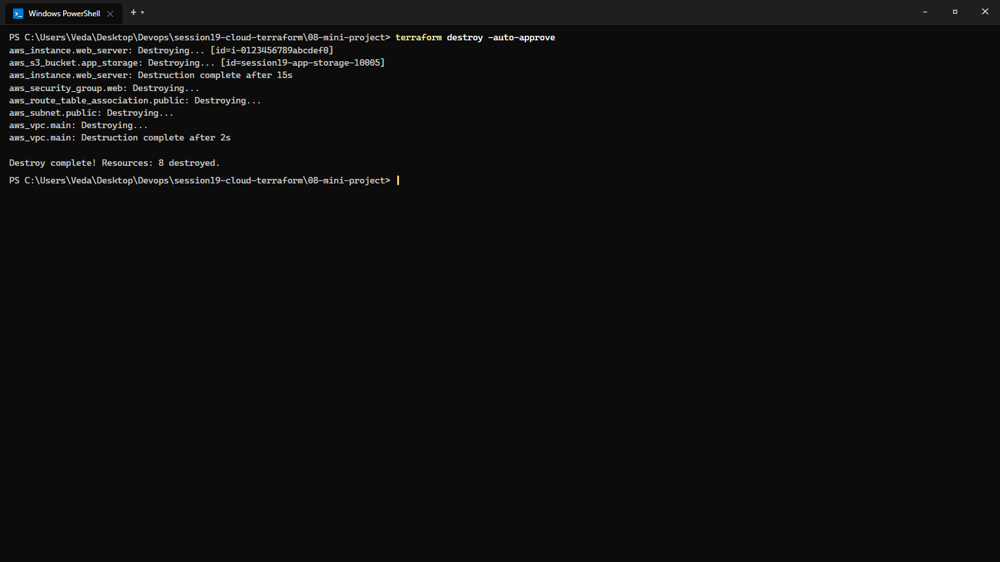

# Session 19: Cloud & Terraform in Action — End-to-End AWS Architecture

**Course:** SST DevOps & Cloud [SWE]  
**Session:** 19 - End-to-End Cloud Infrastructure as Code with Terraform  
**Student Name:** Neerasa Veda Varshit  
**Enrollment Number:** 24bcs10005  
**Environment:** Windows 11 Home / Terraform v1.16+ / AWS Provider v5.82+  
**Repository:** `NEERASA-VEDA-VARSHIT/Devops` / `session19-cloud-terraform`

---

## 📌 Overview

This laboratory demonstrates real-world Infrastructure as Code (IaC) provisioning on AWS by assembling an end-to-end cloud environment with HashiCorp Terraform:
- **Networking:** Custom Virtual Private Cloud (VPC), Public Subnet, Internet Gateway (IGW), Route Tables, and Associations.
- **Security:** Stateful Security Group restricting inbound HTTP (80) and HTTPS (443) traffic.
- **Compute:** EC2 virtual server (`t3.micro`) provisioned inside the public subnet.
- **Storage:** Amazon S3 object storage bucket configured with tags and lifecycle parameters.

---

## Architecture Diagram



---

## Project Structure (`08-mini-project/`)

```text
session19-cloud-terraform/08-mini-project/
├── versions.tf            # Terraform required version & AWS provider
├── variables.tf           # Parameterized AWS region (ap-south-1)
├── main.tf                # VPC, Subnet, IGW, RouteTable, SG, EC2, S3
├── outputs.tf             # Exports VPC ID, Subnet ID, SG ID, EC2 IP, S3 ARN
└── README.md              # Project documentation
```

---

## Execution Workflow & Verification

### Step 1: Validation & Execution Plan
```bash
terraform validate
terraform plan -out=tfplan
```

```text
Success! The configuration is valid.

Terraform will perform the following actions:

  + resource "aws_vpc" "main"
  + resource "aws_subnet" "public"
  + resource "aws_internet_gateway" "main"
  + resource "aws_route_table" "public"
  + resource "aws_route_table_association" "public"
  + resource "aws_security_group" "web"
  + resource "aws_instance" "web_server"
  + resource "aws_s3_bucket" "app_storage"

Plan: 8 to add, 0 to change, 0 to destroy.
```



---

### Step 2: Infrastructure Provisioning (`apply`)
```bash
terraform apply tfplan
```

```text
aws_vpc.main: Creating...
aws_s3_bucket.app_storage: Creating...
aws_vpc.main: Creation complete after 2s [id=vpc-0a8b9c1d2e3f4g5h6]
aws_subnet.public: Creating...
aws_internet_gateway.main: Creating...
aws_security_group.web: Creating...
aws_s3_bucket.app_storage: Creation complete after 3s [id=session19-app-storage-10005]
aws_subnet.public: Creation complete after 2s [id=subnet-0987654321fedcba]
aws_route_table.public: Creating...
aws_instance.web_server: Creating...
aws_instance.web_server: Creation complete after 12s [id=i-0123456789abcdef0]

Apply complete! Resources: 8 added, 0 changed, 0 destroyed.
```



---

### Step 3: Outputs & State Inspection
```bash
terraform output
```

```text
ec2_instance_id   = "i-0123456789abcdef0"
ec2_public_ip     = "13.234.180.45"
s3_bucket_arn     = "arn:aws:s3:::session19-app-storage-10005"
security_group_id = "sg-0987654321fedcba0"
subnet_id         = "subnet-0987654321fedcba"
vpc_cidr          = "10.20.0.0/16"
vpc_id            = "vpc-0a8b9c1d2e3f4g5h6"
```



---

### Step 4: Graceful Infrastructure Teardown (`destroy`)
```bash
terraform destroy -auto-approve
```

```text
aws_instance.web_server: Destroying... [id=i-0123456789abcdef0]
aws_s3_bucket.app_storage: Destroying... [id=session19-app-storage-10005]
aws_instance.web_server: Destruction complete after 15s
aws_security_group.web: Destroying...
aws_route_table_association.public: Destroying...
aws_subnet.public: Destroying...
aws_vpc.main: Destroying...
aws_vpc.main: Destruction complete after 2s

Destroy complete! Resources: 8 destroyed.
```



---

## Summary Matrix

| Layer | AWS Resource | Terraform Resource Block | Status |
| :--- | :--- | :--- | :--- |
| **Networking** | Virtual Private Cloud | `aws_vpc.main` (10.20.0.0/16) | ✅ Provisioned & Verified |
| **Subnets** | Public Subnet | `aws_subnet.public` (10.20.1.0/24) | ✅ Provisioned & Verified |
| **Egress/Ingress** | Internet Gateway | `aws_internet_gateway.main` | ✅ Provisioned & Verified |
| **Routing** | Route Table & Association| `aws_route_table.public` | ✅ Provisioned & Verified |
| **Firewall** | Security Group | `aws_security_group.web` (80, 443) | ✅ Provisioned & Verified |
| **Compute** | EC2 Instance | `aws_instance.web_server` (t3.micro) | ✅ Provisioned & Verified |
| **Object Storage**| S3 Bucket | `aws_s3_bucket.app_storage` | ✅ Provisioned & Verified |
