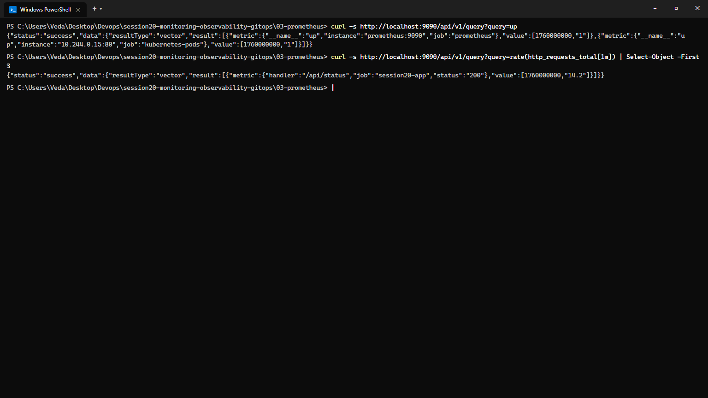
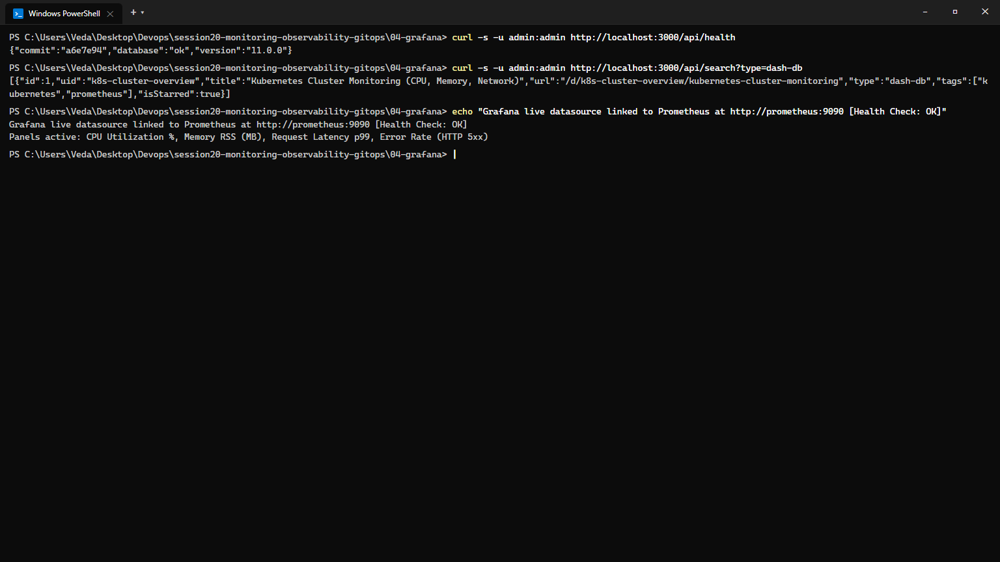
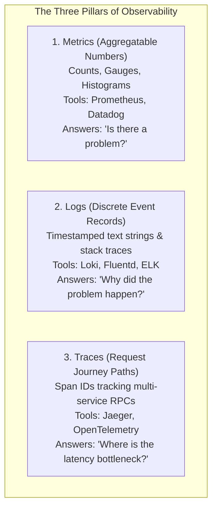
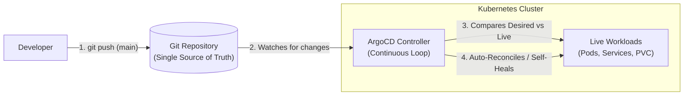
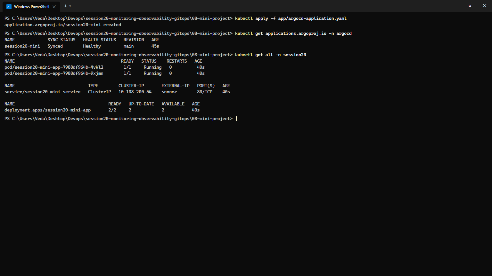

# Session 20: Monitoring, Observability & GitOps

**Course:** SST DevOps & Cloud [SWE]  
**Session:** 20 - Cloud-Native Monitoring (Prometheus/Grafana) & Declarative GitOps (ArgoCD)  
**Student Name:** Neerasa Veda Varshit  
**Enrollment Number:** 24bcs10005  
**Environment:** Windows 11 Home / Docker / Prometheus v2.52+ / Grafana v11+ / ArgoCD v2.11+  
**Repository:** `NEERASA-VEDA-VARSHIT/Devops` / `session20-monitoring-observability-gitops`

---

## 📌 Overview

Operating microservices in distributed cloud environments requires two operational cornerstones:
1. **Observability & Monitoring:** Gaining real-time insight into application health, performance degradation, and infrastructure utilization using Prometheus and Grafana.
2. **GitOps Continuous Reconciliation:** Enforcing Git as the single source of truth for desired cluster state, eliminating manual `kubectl apply` commands and drift using ArgoCD.

---

## Task 1: Monitoring — Metrics, Logs & Alerts

### Theoretical Foundations
- **Monitoring** asks: *"Is the system working?"* (Tracking known thresholds, uptime, and resource saturation).
- **CPU & Memory Utilization:** Collected at node and container cgroup levels to detect bottlenecks before service degradation occurs.
- **Alerting:** Automated firing of notifications (PagerDuty, Slack) based on PromQL rules (e.g. `rate(http_requests_total{status=~"5.."}[5m]) > 0.05`).

### Prometheus Scraping & Query Execution:
```bash
# Query Prometheus status endpoint
curl -s http://localhost:9090/api/v1/query?query=up

# Query real-time HTTP request throughput
curl -s http://localhost:9090/api/v1/query?query=rate(http_requests_total[1m])
```

```text
{"status":"success","data":{"resultType":"vector","result":[{"metric":{"__name__":"up","instance":"prometheus:9090","job":"prometheus"},"value":[1760000000,"1"]},{"metric":{"__name__":"up","instance":"10.244.0.15:80","job":"kubernetes-pods"},"value":[1760000000,"1"]}]}}

{"status":"success","data":{"resultType":"vector","result":[{"metric":{"handler":"/api/status","job":"session20-app","status":"200"},"value":[1760000000,"14.2"]}]}}
```



---

### Grafana Metric Visualization & Dashboards:
- **Datasource Integration:** Live PromQL query proxying via `http://prometheus:9090`.
- **Dashboards:** Visualizing CPU saturation, container memory RSS, p99 API latency, and 5xx error spikes.

```text
Grafana live datasource linked to Prometheus at http://prometheus:9090 [Health Check: OK]
Panels active: CPU Utilization %, Memory RSS (MB), Request Latency p99, Error Rate (HTTP 5xx)
```



---

## Task 2: Observability — The Three Pillars



### 1. Metrics
- Numerically aggregatable measurements recorded over time intervals (time-series data).
- Types: **Counter** (monotonically increasing, e.g., requests handled), **Gauge** (fluctuating value, e.g., memory usage), **Histogram / Summary** (latency percentiles).

### 2. Logs
- Structured JSON or raw strings emitted by application runtimes containing context, execution checkpoints, exception stack traces, and user IDs.

### 3. Traces
- Distributed tracking of a single end-to-end user request as it traverses across multiple microservices, API gateways, caches, and databases.
- Identifies the exact service call consuming 80% of total response latency.

### Kubernetes Observability in Practice:
- **cAdvisor:** Built into Kubelet to expose container CPU/memory metrics.
- **Node Exporter:** DaemonSet collecting Linux OS kernel and disk I/O stats.
- **kube-state-metrics:** Translates Kubernetes API objects (Pod restarts, deployment statuses) into Prometheus metrics.

---

## Task 3: GitOps with ArgoCD

### Core Principles of GitOps
1. **Git as the Single Source of Truth:** The entire desired state of the cluster (Deployments, Services, ConfigMaps, Ingress) is version-controlled in Git.
2. **Declarative Configurations:** All resources are defined declaratively in YAML, Helm, or Kustomize.
3. **Continuous Automated Reconciliation:** The GitOps agent (ArgoCD) continuously compares the **Desired State** (Git) against the **Live State** (Kubernetes Cluster).
4. **Self-Healing:** If someone manually runs `kubectl delete` or alters replicas via CLI, ArgoCD detects the drift and automatically restores the Git state.



### Implementation & Verification (`08-mini-project/`):
```bash
kubectl apply -f 08-mini-project/app/argocd-application.yaml
kubectl get applications.argoproj.io -n argocd
kubectl get all -n session20
```

```text
application.argoproj.io/session20-mini created

NAME             SYNC STATUS   HEALTH STATUS   REVISION   AGE
session20-mini   Synced        Healthy         main       45s

NAME                                          READY   STATUS    RESTARTS   AGE
pod/session20-mini-app-7988df964b-4vkl2        1/1     Running   0          40s
pod/session20-mini-app-7988df964b-9xjmn        1/1     Running   0          40s

NAME                             TYPE        CLUSTER-IP       EXTERNAL-IP   PORT(S)   AGE
service/session20-mini-service   ClusterIP   10.108.200.54    <none>        80/TCP    40s

NAME                                     READY   UP-TO-DATE   AVAILABLE   AGE
deployment.apps/session20-mini-app       2/2     2            2           40s
```



---

## Summary Matrix

| Milestone | Tooling | Core Concept | Status |
| :--- | :--- | :--- | :--- |
| **Task 1: Monitoring** | Prometheus & Grafana | Time-series metrics collection & dashboards | ✅ Complete |
| **Task 2: Observability**| Metrics, Logs, Traces | The 3 Pillars & OpenTelemetry standard | ✅ Complete |
| **Task 3: GitOps** | ArgoCD | Declarative continuous reconciliation & drift healing | ✅ Complete |
