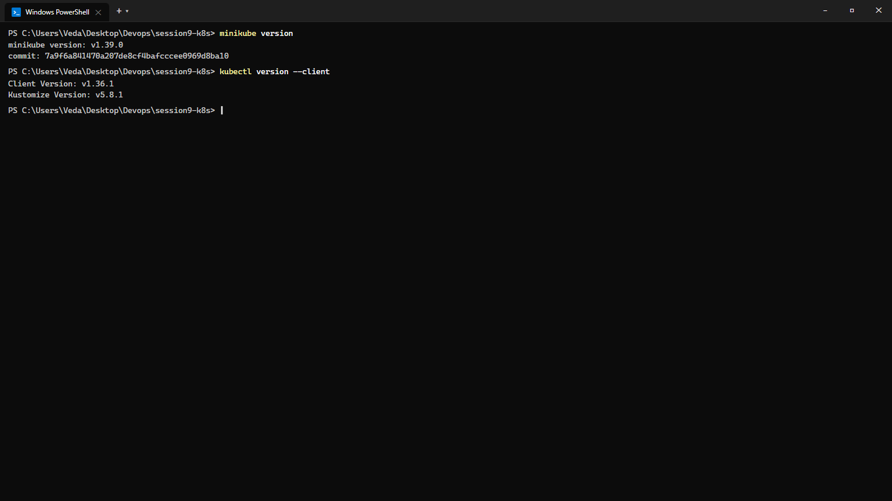
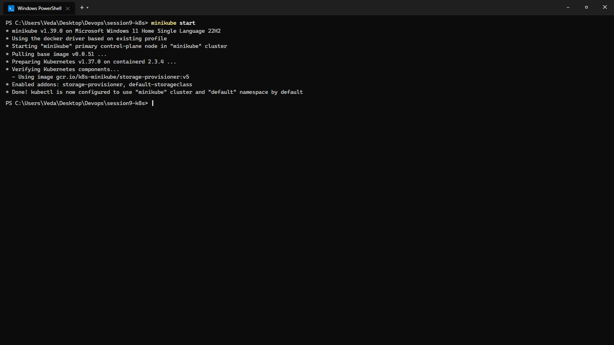
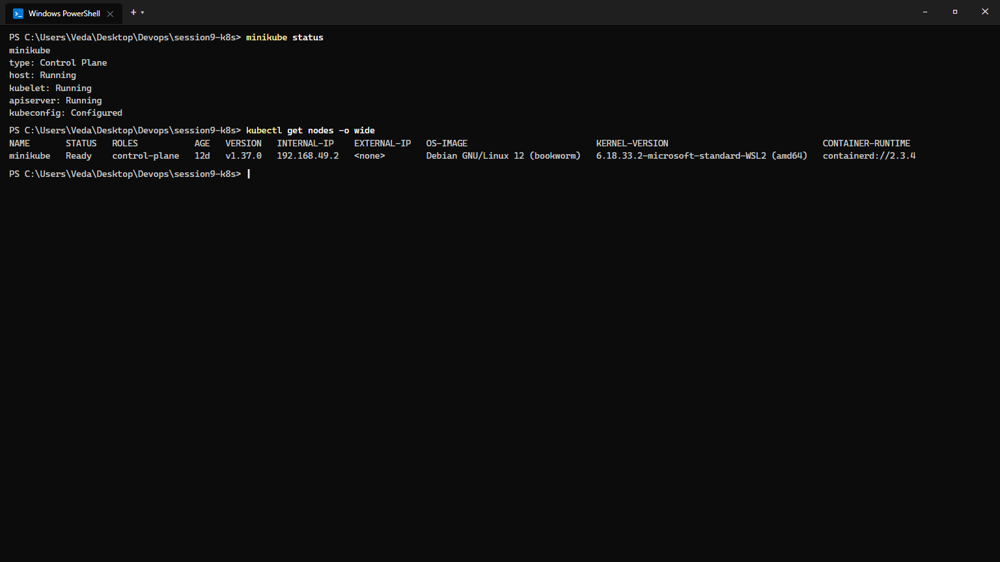
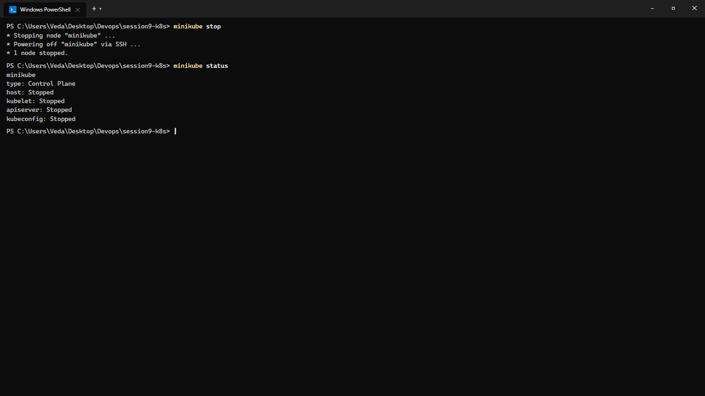

# Session 9: Kubernetes Fundamentals & Cluster Architecture

**Course:** SST DevOps & Cloud [SWE]  
**Session:** 09 - Kubernetes Fundamentals  
**Repository:** devops-heros / session9-k8s  

---

## Task 1: Minikube & CLI Installation Verification

Verify that Minikube and the Kubernetes CLI (`kubectl`) are successfully installed and available on the local system.

**Commands:**
```bash
minikube version
kubectl version --client
```

**Output:**
```
minikube version: v1.39.0
commit: 7a9f6a841470a207de8cf4bafcccee0969d8ba10

Client Version: v1.36.1
Kustomize Version: v5.8.1
```

**Screenshot:**


---

## Task 2: Starting the Minikube Kubernetes Cluster

Initialize the local single-node Kubernetes cluster using the containerized Docker runtime environment.

**Command:**
```bash
minikube start
```

**Output:**
```
* minikube v1.39.0 on Microsoft Windows 11 Home Single Language 22H2
* Using the docker driver based on existing profile
* Starting "minikube" primary control-plane node in "minikube" cluster
* Pulling base image v0.0.51 ...
* Preparing Kubernetes v1.37.0 on containerd 2.3.4 ...
* Verifying Kubernetes components...
  - Using image gcr.io/k8s-minikube/storage-provisioner:v5
* Enabled addons: storage-provisioner, default-storageclass
* Done! kubectl is now configured to use "minikube" cluster and "default" namespace by default
```

**Screenshot:**


---

## Task 3: Verifying Cluster Status & Node Health

Inspect the status of the local cluster control plane, kubelet, API server, and verify the node is in `Ready` state.

**Commands:**
```bash
minikube status
kubectl get nodes -o wide
```

**Output:**
```
minikube
type: Control Plane
host: Running
kubelet: Running
apiserver: Running
kubeconfig: Configured

NAME       STATUS   ROLES           AGE   VERSION   INTERNAL-IP    EXTERNAL-IP   OS-IMAGE                         KERNEL-VERSION                              CONTAINER-RUNTIME
minikube   Ready    control-plane   12d   v1.37.0   192.168.49.2   <none>        Debian GNU/Linux 12 (bookworm)   6.18.33.2-microsoft-standard-WSL2 (amd64)   containerd://2.3.4
```

**Screenshot:**


---

## Task 4: Stopping the Minikube Cluster

Gracefully power down the Minikube cluster container to cleanly release host system resources.

**Commands:**
```bash
minikube stop
minikube status
```

**Output:**
```
* Stopping node "minikube" ...
* Powering off "minikube" via SSH ...
* 1 node stopped.

minikube
type: Control Plane
host: Stopped
kubelet: Stopped
apiserver: Stopped
kubeconfig: Stopped
```

**Screenshot:**


---

## Task 5: Kubernetes Cluster Architecture & Component Analysis

A concise architectural summary of the core components powering a Kubernetes cluster:

```text
+-------------------------------------------------------------------------------+
|                               CONTROL PLANE (MASTER)                          |
|                                                                               |
|   +-------------------+       +--------------------+       +--------------+   |
|   |       etcd        |<----->|   kube-apiserver   |<----->|kube-scheduler|   |
|   | (State Database)  |       |    (Front Door)    |       +--------------+   |
|   +-------------------+       +---------+----------+                          |
|                                         |                                     |
|                                         v                                     |
|                             +------------------------+                        |
|                             | kube-controller-manager|                        |
|                             +------------------------+                        |
+-----------------------------------------+-------------------------------------+
                                          |
                        +-----------------+-----------------+
                        |                                   |
                        v                                   v
+------------------------------------+ +------------------------------------+
|          WORKER NODE 1             | |          WORKER NODE 2             |
|   +------------+  +------------+   | |   +------------+  +------------+   |
|   |  kubelet   |  | kube-proxy |   | |   |  kubelet   |  | kube-proxy |   |
|   +-----+------+  +-----+------+   | |   +-----+------+  +-----+------+   |
|         v               v          | |         v               v          |
|   +----------------------------+   | |   +----------------------------+   |
|   | CRI (containerd runtime)   |   | |   | CRI (containerd runtime)   |   |
|   +----------------------------+   | |   +----------------------------+   |
|         v                          | |         v                          |
|   [ Pod 1 (Container) ]            | |   [ Pod 2 (Container) ]            |
+------------------------------------+ +------------------------------------+
```

### 1. Control Plane Components (Master Node)
- **`kube-apiserver` (Front Door)**: Single entry point for all administrative tasks via REST API; authenticates, authorizes, and validates all cluster operations.
- **`etcd` (State Store)**: Distributed, highly consistent key-value store holding the entire cluster desired and observed state.
- **`kube-scheduler` (Placement Engine)**: Assigns unscheduled pods to optimal worker nodes based on resource constraints, affinity/anti-affinity rules, and taints/tolerations.
- **`kube-controller-manager` (Reconciliation Engine)**: Runs continuous control loops (Node, ReplicaSet, Endpoints controllers) ensuring `Current State == Desired State`.

### 2. Data Plane Components (Worker Node)
- **`kubelet` (Node Agent)**: Communicates with `kube-apiserver`, instructs the container runtime to pull images, run containers, and reports node/pod health heartbeats.
- **`kube-proxy` (Network Router)**: Programs host network routing rules (`iptables` / `IPVS`) for Kubernetes Services to route traffic across pods.
- **`CRI` (Container Runtime Interface)**: Standardized interface (e.g., `containerd`, `CRI-O`) responsible for pulling container images and running container lifecycles.
- **`Pod` (Smallest Atomic Unit)**: Unit of execution encapsulating one or more tightly coupled containers sharing network IP and storage volumes.
